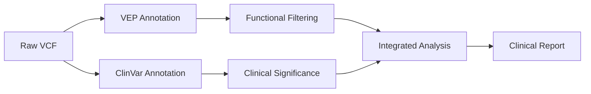

# Genomic Variant Annotation Fields: ClinVar vs VEP

## Overview
This guide provides a comprehensive comparison of annotation fields from ClinVar and VEP (Variant Effect Predictor) systems, essential for clinical genomics workflows.

## 🏥 ClinVar Annotations (`annotation.csv`)

**Location:** `attributes` field  
**Purpose:** Clinical significance and disease association

### Key Fields

| Field | Description | Example Values | Clinical Importance |
|-------|-------------|----------------|-------------------|
| `CLNSIG` | Clinical significance | `Benign`, `Likely_benign`, `Uncertain_significance`, `Pathogenic` | ⭐⭐⭐ Critical for clinical decisions |
| `CLNVC` | Variant class/type | `single_nucleotide_variant`, `Deletion`, `Insertion`, `Indel` | ⭐⭐ Structural classification |
| `CLNDN` | Disease name | `Retinitis_pigmentosa`, `SAMD11-related_disorder` | ⭐⭐⭐ Disease association |
| `GENEINFO` | Gene symbol:ID | `OR4F5:79501`, `SAMD11:148398` | ⭐⭐ Gene identification |
| `MC` | Molecular consequence | `SO:0001583\|missense_variant`, `SO:0001627\|intron_variant` | ⭐⭐ Functional impact |
| `CLNREVSTAT` | Review status | `criteria_provided`, `no_assertion_criteria_provided` | ⭐ Evidence quality |
| `ALLELEID` | ClinVar allele ID | `1003021`, `1023510` | ⭐ Unique identifier |

## 🔬 VEP Annotations (`variant.csv`)

**Location:** `annotations.vep` array  
**Purpose:** Molecular consequences and functional prediction

### Key Fields

| Field | Description | Example Values | Research Importance |
|-------|-------------|----------------|-------------------|
| `consequence` | Functional consequence | `downstream_gene_variant`, `intron_variant`, `missense_variant` | ⭐⭐⭐ Primary classification |
| `impact` | Severity rating | `HIGH`, `MODERATE`, `LOW`, `MODIFIER` | ⭐⭐⭐ Variant prioritization |
| `biotype` | Transcript type | `protein_coding`, `lncRNA`, `nonsense_mediated_decay` | ⭐⭐ Transcript classification |
| `symbol` | Gene symbol | `LINC02332`, `TRAC`, `TUSC3` | ⭐⭐ Human-readable gene ID |
| `gene` | Ensembl gene ID | `ENSG00000259054`, `ENSG00000277734` | ⭐ Stable gene identifier |
| `feature` | Transcript ID | `ENST00000557232`, `ENST00000611116` | ⭐ Specific transcript |

## 📊 Comparison Matrix

| Aspect | ClinVar | VEP |
|--------|---------|-----|
| **Data Source** | Curated clinical evidence | Computational prediction |
| **Primary Use** | Clinical interpretation | Functional annotation |
| **Update Cycle** | Manual curation | Algorithm-driven |
| **Strength** | Evidence-based significance | Comprehensive consequences |
| **Limitation** | Limited coverage | Prediction uncertainty |

## 🔄 Integration Workflow

## 💡 Best Practices

### For Clinical Genomics:
1. **Primary Filter:** Use VEP `impact` (HIGH/MODERATE) for initial variant filtering
2. **Clinical Interpretation:** Prioritize ClinVar `CLNSIG` for clinical decisions
3. **Quality Control:** Check ClinVar `CLNREVSTAT` for evidence reliability
4. **Functional Context:** Combine VEP `consequence` with ClinVar `MC` for comprehensive understanding

### For Research Applications:
1. **Variant Discovery:** Leverage VEP's comprehensive consequence prediction
2. **Pathway Analysis:** Use VEP `biotype` and `symbol` for functional enrichment
3. **Literature Mining:** Cross-reference ClinVar `CLNDN` with research databases
4. **Population Studies:** Utilize ClinVar frequency fields (`AF_ESP`, `AF_EXAC`)

## 🎯 Key Takeaways

- **ClinVar** = Clinical actionability ("Should I act on this variant?")
- **VEP** = Functional prediction ("What does this variant do?")
- **Integration** = Optimal clinical genomics workflow
- **Complementary** = Neither system alone provides complete picture

---

*This analysis is based on AWS HealthOmics annotation data and follows current genomics best practices for variant interpretation.*
