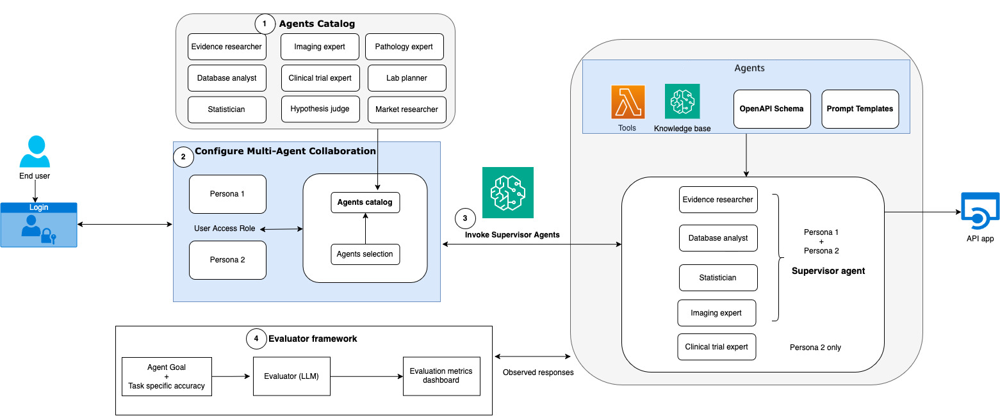

# Sample Healthcare and Life Sciences Agents on AWS

> **⚠️ Important Update (September 17, 2025):** The new recommended way to deploy agents is using the [Strands](https://strandsagents.com/) framework and [Amazon Bedrock AgentCore](https://aws.amazon.com/bedrock/agentcore/). This codebase is iteratively being updated shortly to reflect these new best practices. The existing deployment methods for individual agents and the entire stack are still functional, we also provide the following examples with the new framework.

## Bedrock AgentCore and Strands Agents

### Agent template
End to end template that includes deployment of all Bedrock AgentCore components- Runtime, Gateway, Identity, Memory and Observability. Streamlit UI available with Oauth/IAM authentication options. [agentcore-template](agentcore_template/)

### Biomarker discovery agents
Multiple agents as Strands tools with AgentCore Runtime deployment and a local Streamlit UI. [agentcore-biomarker-discovery](multi_agent_collaboration/cancer_biomarker_discovery/strands_agentcore/)

### Research agent with Biomni database tools
Research agent based on the end to end template with all Bedrock AgentCore components and 30+ database tools from [Biomni](https://github.com/snap-stanford/Biomni/tree/main) made available via a AgentCore Gateway [research-agent-biomni-tools](agents_catalog/28-Research-agent-biomni-gateway-tools/)

### Variant interpreter agent with HealthOmics 
Processing and interpretation of genomics pipelines at scale with Clinvar and VEP annotations of patient VCF data [agentcore-variant-interpreter-omics](agents_catalog/17-variant-interpreter-agent)

## Project Components

### Agents catalog

Library of specialized agents for common workflows across drug research, clinical trials, and commercialization [agent-catalog](agents_catalog/)

### Multi-agent collaboration

Framework for agent collaboration and knowledge sharing. End to end examples for cancer biomarker discovery, clinical trial protocol assistant, and competitive intelligence. [multi-agent-collaboration](multi_agent_collaboration/)

### Evaluation

Methods for assessing agent performance and result quality. Agent task and goal metrics for cancer biomarker discovery [evaluations](evaluations/)

The key components are illustrated in the diagram below:

## Contributing Guidelines

### Setting Up Your Development Environment

1. Fork the repository to your GitHub account. Ensure the fork remains public during development and testing.

2. Clone your forked repository to your local machine.

3. Update the template from 'agentcore_template' to add new agents to the `agents_catalog` folder. 

### 🤖 Kiro Power for Agent Development

This repository includes a Kiro Power to guide you through building your first AgentCore agent with best practices.

**Location:** `powers/hcls-agentcore-builder/`

**Installation:**
1. Open Kiro Powers UI (Command Palette → "Kiro: Configure Powers")
2. Click "Add Custom Power"
3. Select "Local Directory"
4. Enter full path: `/path/to/repo/powers/hcls-agentcore-builder`
5. Click "Add"

**What it provides:**
- Step-by-step guidance from POC to production
- Best practices for production-ready agents
- Direct references to agentcore_template/ and example agents
- Agent patterns for HCLS use cases
- Troubleshooting and common pitfalls

The power emphasizes `agentcore_template/` as your starting point and `agents_catalog/28-Research-agent-biomni-gateway-tools/` as your production reference.

### Submitting a Pull Request

**Follow the guidelines to contribute a new agent to the catalog here: [add-a-new-agent](https://aws-samples.github.io/amazon-bedrock-agents-healthcare-lifesciences/guides/)

1. Ensure you have forked the main repository: [amazon-bedrock-agents-healthcare-lifesciences](https://github.com/aws-samples/amazon-bedrock-agents-healthcare-lifesciences/tree/main)

2. Create a new branch in your forked repository for your changes.

3. Implement your changes, following the project's coding standards and guidelines.

4. Commit your changes with clear, concise commit messages.

5. Push your branch to your forked repository on GitHub.

6. Open a pull request from your branch to the main repository's `main` branch.

7. Provide a clear description of your changes in the pull request, including any relevant issue numbers.

8. Be prepared to address any feedback or questions during the code review process.

## License

This project is licensed under the MIT-0 License.

## Legal Notes

**Important**: This solution is for demonstrative purposes only. It is not for clinical use and is not a substitute for professional medical advice, diagnosis, or treatment. **The associated notebooks, including the trained model and sample data, are not intended for production.** It is each customers’ responsibility to determine whether they are subject to HIPAA, and if so, how best to comply with HIPAA and its implementing regulations. Before using AWS in connection with protected health information, customers must enter an AWS Business Associate Addendum (BAA) and follow its configuration requirements.
