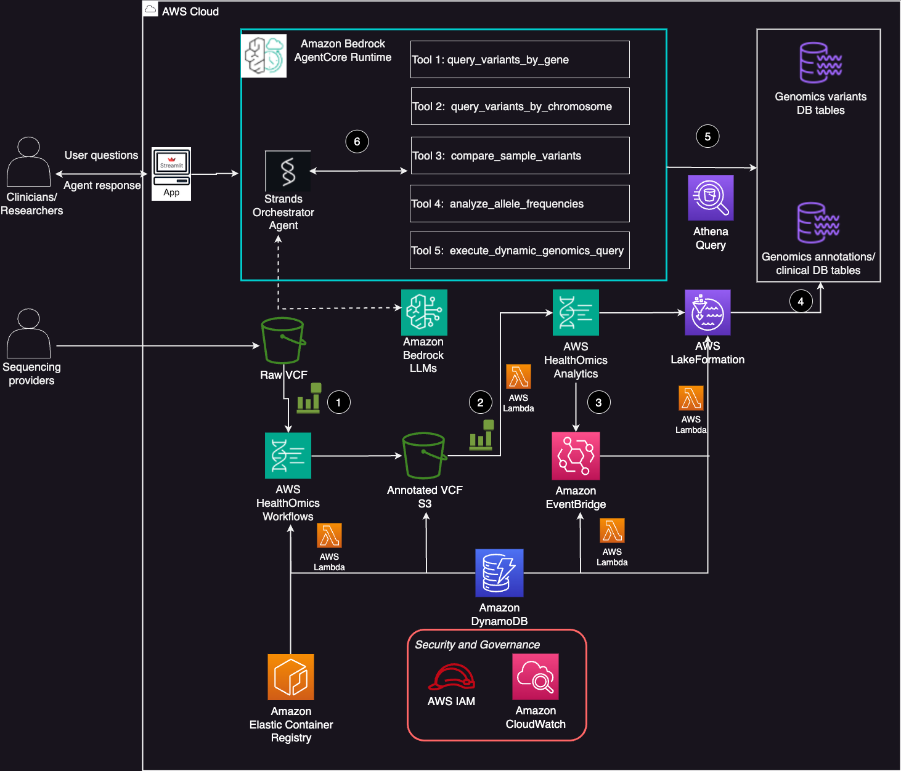
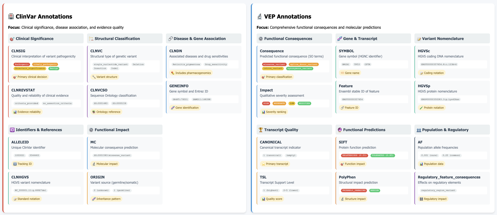

# Genomics VCF Variant Interpreter Agent with Strands and Bedrock AgentCore

This implementation demonstrates how to create an intelligent genomic variant analysis system using AWS HealthOmics, VEP (Variant Effect Predictor) annotation, and Strands agents deployed with Amazon Bedrock AgentCore.

## Architecture Overview



The system processes VCF files through AWS HealthOmics with VEP annotation, stores the results in variant and annotation stores, and provides an AI-powered agent interface for natural language queries about genomic data.

## Agent Capabilities



The **Genomics Variant Interpreter Agent** provides specialized genomic analysis capabilities:

### Core Analysis Tools
- **Gene-Specific Analysis**: Query variants in specific genes (BRCA1/2, TP53, pharmacogenes)
- **Chromosomal Analysis**: Analyze variants by chromosome or genomic regions
- **Population Frequency Analysis**: Compare with 1000 Genomes Project data
- **Sample Comparison**: Multi-sample variant profile analysis
- **Dynamic Queries**: Natural language to SQL conversion for complex genomic questions

### Clinical Decision Support
- Quality filtering (QUAL > 30, PASS filters)
- Clinical significance prioritization (ClinVar annotations)
- VEP functional impact assessment
- Population frequency context
- Actionable clinical interpretations

## Prerequisites

1. **AWS Account Setup**: SageMaker Studio domain with JupyterLab space (recommended: ml.t3.large, 50GB storage)
2. **AWS CLI**: Configured with appropriate permissions
3. **Required AWS Services**: HealthOmics, S3, DynamoDB, Lambda, Athena, Bedrock, ECR

## Setup Instructions

### 1. Deploy Infrastructure

Deploy the VEP processing pipeline and genomic data stores:

```bash
# Deploy the genomics infrastructure
aws cloudformation deploy \
  --template-file advanced-strands-agentcore/genomics-vep-pipeline-infrastructure.yaml \
  --stack-name genomics-vep-pipeline \
  --capabilities CAPABILITY_IAM
```

### 2. VEP Cache and Container Setup

**Important**: Complete before running notebooks.

```bash
# Download VEP cache
curl -O https://ftp.ensembl.org/pub/release-111/variation/indexed_vep_cache/homo_sapiens_vep_111_GRCh38.tar.gz

# Upload to S3
aws s3 cp homo_sapiens_vep_111_GRCh38.tar.gz s3://YOUR_VEP_CACHE_BUCKET/cache/

# Setup VEP Docker container in ECR
docker pull ensemblorg/ensembl-vep:113.4
aws ecr get-login-password --region us-east-1 | docker login --username AWS --password-stdin <account_id>.dkr.ecr.us-east-1.amazonaws.com
docker tag ensemblorg/ensembl-vep:113.4 <account_id>.dkr.ecr.us-east-1.amazonaws.com/genomics-vep:113.4
docker push <account_id>.dkr.ecr.us-east-1.amazonaws.com/genomics-vep:113.4
```

### 3. Agent Development and Deployment

**⚠️ Important**: Use the `advanced-strands-agentcore/` directory for the latest implementation. The `bedrock_agent/` directory contains the old implementation and will be deprecated soon.

1. **Infrastructure Setup**: Run `advanced-strands-agentcore/genomics-vep-pipeline-deployment-complete.ipynb`
2. **Agent Creation**: Execute `advanced-strands-agentcore/genomics-store-agent-supervisor-agentcore.ipynb`
3. **AgentCore Deployment**: Deploy the agent to Bedrock AgentCore Runtime

### 4. Sample Data

Use 1000 Genomes Project data for testing:

```bash
# Copy sample VCF files
aws s3 cp s3://1000genomes-dragen/data/dragen-3.5.7b/hg38_altaware_nohla-cnv-anchored/NA21135.hard-filtered.vcf.gz s3://YOUR_VCF_INPUT_BUCKET/
```

### 5. User Interface

Install and run the Streamlit interface:

```bash
# Install dependencies
pip install -r advanced-strands-agentcore/requirements.txt
pip install -r advanced-strands-agentcore/streamlit_requirements.txt

# Run Streamlit app
streamlit run advanced-strands-agentcore/app.py --server.port 8501
```

## Usage Examples

### Natural Language Queries
- "How many patients are in the present cohort?"
- "Find all pathogenic variants in BRCA1 and BRCA2 genes for patient NA21135"
- "What are the rare variants (frequency < 0.01) in patient NA21144?"
- "Compare variant profiles between samples NA21144 and NA21135"
- "Analyze chromosome 17 variants for clinical significance"

### Clinical Analysis
- Variant impact assessment with VEP annotations
- Clinical significance interpretation using ClinVar
- Population frequency analysis with 1000 Genomes context
- Gene-based variant analysis for targeted panels
- Pharmacogenomic variant identification

## Key Features

- **Automated VCF Processing**: Event-driven pipeline with VEP annotation
- **Real-time Status Tracking**: DynamoDB-based job monitoring
- **Natural Language Interface**: Strands agent with genomic expertise
- **Clinical Decision Support**: Prioritized variant analysis
- **Scalable Architecture**: AWS HealthOmics integration
- **Web Interface**: User-friendly Streamlit application

## Documentation

For detailed implementation instructions, troubleshooting, and advanced configuration, see:
- **[Detailed Documentation](advanced-strands-agentcore/README_detailed.md)** - Complete setup guide and troubleshooting
- **[Agent Notebook](advanced-strands-agentcore/genomics-store-agent-supervisor-agentcore.ipynb)** - Agent creation and deployment
- **[Infrastructure Notebook](advanced-strands-agentcore/genomics-vep-pipeline-deployment-complete.ipynb)** - AWS infrastructure setup

## Architecture Components

The system integrates multiple AWS services:
- **AWS HealthOmics**: Variant and annotation stores with analytics
- **Amazon Bedrock**: LLM integration for natural language processing
- **Amazon Athena**: SQL queries on genomic data
- **AWS Lambda**: Event-driven VCF processing
- **Amazon S3**: VCF file storage and VEP cache
- **Amazon ECR**: VEP container registry

---

**Note**: This implementation uses the latest Strands framework with Bedrock AgentCore. The `bedrock_agent/` directory contains the legacy implementation and will be deprecated in future releases.
