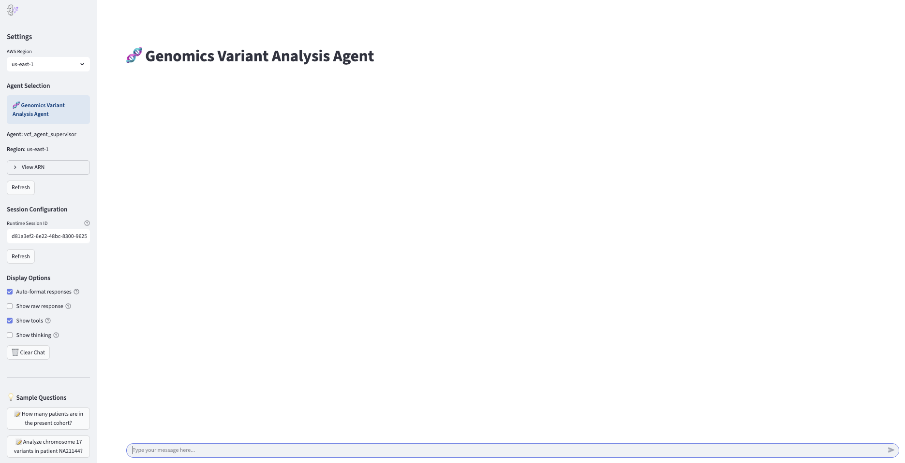

# Genomics VEP Pipeline and Variant Interpreter Agent

This repository contains a comprehensive system for processing VCF (Variant Call Format) files using AWS HealthOmics with VEP (Variant Effect Predictor) annotation and creating an intelligent genomic analysis agent using the Strands framework. The system consists of two main components:

1. **Genomics VEP Pipeline Infrastructure** - Automated pipeline for processing VCF files with VEP annotation in AWS HealthOmics
2. **Genomic Variant Interpreter Agent** - AI-powered agent for querying and analyzing annotated genomic data with Streamlit interface

## 📋 Table of Contents

- [Overview](#overview)
- [Architecture](#architecture)
- [Prerequisites](#prerequisites)
- [Initial Setup Requirements](#initial-setup-requirements)
- [Sample Data](#sample-data)
- [Complete Setup Guide](#complete-setup-guide)
- [Usage](#usage)
- [Components](#components)
- [Troubleshooting](#troubleshooting)
- [Security Considerations](#security-considerations)

## 🔍 Overview

This system enables researchers and clinicians to:
- Automatically process and annotate VCF files using VEP in AWS HealthOmics workflows
- Track processing job statuses in real-time using DynamoDB
- Query genomic data using natural language through an AI agent
- Perform complex genomic analyses including variant interpretation and clinical significance assessment
- Access data through Amazon Athena for advanced analytics
- Interact with genomic data through an intuitive Streamlit web interface

## 🏗️ Architecture


## 🔬 Agent view



The system follows this workflow:
1. **Data Preparation**: VCF files and VEP cache files are uploaded to S3 buckets
2. **Container Setup**: VEP Docker image is pushed to ECR for workflow execution
3. **Event-Driven Processing**: S3 events trigger Lambda function for automated processing
4. **HealthOmics Integration**: Lambda creates VEP annotation workflows in HealthOmics
5. **Status Tracking**: DynamoDB tracks job progress and status updates
6. **Data Analytics**: Processed data becomes available in Athena for querying
7. **AI Agent Interface**: Strands-based agent provides natural language access to genomic data
8. **Web Interface**: Streamlit app provides user-friendly interaction with the agent

## 📋 Prerequisites

### AWS Account Requirements
- AWS Account with appropriate permissions
- AWS CLI configured with credentials
- Python 3.9+ environment
- Docker installed for container operations
- Jupyter Notebook environment (for setup)

### Required AWS Services
- AWS HealthOmics
- Amazon DynamoDB
- AWS Lambda
- Amazon S3
- Amazon ECR
- Amazon Athena
- AWS Glue
- AWS Lake Formation
- Amazon Bedrock
- Amazon EventBridge
- AWS Batch
- AWS Step Functions

### IAM Permissions
Your AWS user/role needs permissions for:
- HealthOmics (create variant stores, annotation stores, workflows)
- DynamoDB (create tables, read/write items)
- Lambda (create functions, manage permissions)
- S3 (read VCF files, configure notifications)
- ECR (push/pull Docker images)
- Athena (execute queries)
- Glue (manage data catalog)
- Lake Formation (manage permissions)
- Bedrock (invoke models)
- Batch (create job definitions and queues)
- Step Functions (create and execute state machines)

## 🚀 Initial Setup Requirements

### Step 0: VEP Cache and Docker Setup

**⚠️ Important**: Complete these steps before running any notebooks.

#### 1. Download and Prepare VEP Cache Files

```bash
# Download VEP cache for GRCh38
curl -O https://ftp.ensembl.org/pub/release-111/variation/indexed_vep_cache/homo_sapiens_vep_111_GRCh38.tar.gz

# Extract cache files
tar xzf homo_sapiens_vep_111_GRCh38.tar.gz

# Upload to your S3 bucket (replace with your bucket name)
aws s3 cp homo_sapiens_vep_111_GRCh38.tar.gz s3://YOUR_VEP_CACHE_BUCKET/cache/
aws s3 sync homo_sapiens_vep_111_GRCh38/ s3://YOUR_VEP_CACHE_BUCKET/cache/homo_sapiens_vep_111_GRCh38/ --recursive
```

#### 2. Setup VEP Docker Container

```bash
# Pull the official VEP Docker image
docker pull ensemblorg/ensembl-vep:113.4

# Login to ECR (replace <account_id> and <region_info> with your values)
aws ecr get-login-password --region us-east-1 | docker login --username AWS --password-stdin <account_id>.dkr.ecr.<region_info>.amazonaws.com

# Tag the image for ECR
docker tag ensemblorg/ensembl-vep:113.4 <account_id>.dkr.ecr.<region_info>.amazonaws.com/genomics-vep:113.4

# Push to ECR
docker push <account_id>.dkr.ecr.<region_info>.amazonaws.com/genomics-vep:113.4
```

**Note**: Replace `<account_id>`, `<region_info>`, and `<docker_uri>` with your actual AWS account ID, region, and ECR repository URI.

## 📊 Sample Data

### Reference Genome
You can use the publicly available reference genome from the 1000 Genomes project:

```bash
# Reference genome location (publicly accessible)
s3://1000genomes-dragen/reference/hg38_alt_aware_nohla.fa
```

### Sample VCF Files
Sample VCF files are available from the 1000 Genomes project. Copy them to your S3 bucket:

```bash
# Copy sample VCF files to your bucket
aws s3 cp s3://1000genomes-dragen/data/dragen-3.5.7b/hg38_altaware_nohla-cnv-anchored/NA21135.hard-filtered.vcf.gz s3://YOUR_VCF_INPUT_BUCKET/

# Additional sample files (optional)
aws s3 cp s3://1000genomes-dragen/data/dragen-3.5.7b/hg38_altaware_nohla-cnv-anchored/NA21137.hard-filtered.vcf.gz s3://YOUR_VCF_INPUT_BUCKET/
aws s3 cp s3://1000genomes-dragen/data/dragen-3.5.7b/hg38_altaware_nohla-cnv-anchored/NA21141.hard-filtered.vcf.gz s3://YOUR_VCF_INPUT_BUCKET/
```

**Important**: Replace `YOUR_VCF_INPUT_BUCKET` with your actual S3 bucket name for VCF input files.

## 🚀 Complete Setup Guide

### Step 1: Infrastructure Deployment

#### Option A: Using CloudFormation Template (Recommended)

1. **Deploy Infrastructure**:
   ```bash
   aws cloudformation create-stack \
     --stack-name genomics-vep-pipeline \
     --template-body file://genomics-vep-pipeline-infrastructure.yaml \
     --parameters ParameterKey=VcfInputBucketName,ParameterValue=your-vcf-input-bucket \
                  ParameterKey=VepOutputBucketName,ParameterValue=your-vep-output-bucket \
     --capabilities CAPABILITY_IAM
   ```

2. **Monitor Stack Creation**:
   ```bash
   aws cloudformation describe-stacks --stack-name genomics-vep-pipeline
   ```

#### Option B: Using Jupyter Notebook

1. **Open the Infrastructure Notebook**:
   ```bash
   jupyter notebook genomics-vep-pipeline-deployment-complete.ipynb
   ```

2. **Configure AWS Profile** (First cell in notebook):
   ```python
   os.environ['AWS_PROFILE'] = 'your-aws-profile'  # Update with your AWS profile
   ```

3. **Update Configuration Variables**:
   - **S3 Bucket Names**: Update VCF input and VEP output bucket names
   - **AWS Account ID**: Replace `<YOUR_ACCOUNT_ID>` placeholders
   - **AWS Region**: Replace `<YOUR_REGION>` with your AWS region
   - **ECR Repository URI**: Update Docker image URI
   - **KMS Key**: Update the KMS key ARN in policies

4. **Run Infrastructure Setup**:
   Execute all cells to create:
   - S3 buckets for VCF input and VEP output
   - DynamoDB table for tracking jobs
   - IAM roles with necessary permissions
   - HealthOmics variant and annotation stores
   - Lambda function for processing
   - ECR repository for VEP container
   - Lake Formation database and permissions

### Step 2: Verify Infrastructure

1. **Check S3 Buckets**:
   ```bash
   aws s3 ls | grep genomics
   ```

2. **Verify DynamoDB Table**:
   ```bash
   aws dynamodb describe-table --table-name genomics-job-tracking
   ```

3. **Validate HealthOmics Resources**:
   ```bash
   # List variant stores
   aws omics list-variant-stores
   
   # List annotation stores
   aws omics list-annotation-stores
   ```

4. **Check ECR Repository**:
   ```bash
   aws ecr describe-repositories --repository-names genomics-vep
   ```

### Step 3: Agent and Streamlit Setup

1. **Install Dependencies**:
   ```bash
   pip install -r requirements.txt
   pip install -r streamlit_requirements.txt
   ```

2. **Open the Agent Notebook**:
   ```bash
   jupyter notebook genomics-store-agent-supervisor-agentcore.ipynb
   ```

3. **Configure Agent Settings**:
   - Update AWS region and account ID in the notebook
   - Configure Bedrock model preferences
   - Set database and table names
   - Configure S3 bucket names

4. **Create IAM Role for Agent** (if needed):
   ```bash
   python create_agent_role.py
   ```

5. **Initialize the Agent**:
   Execute the notebook cells to create the Strands agent with genomic analysis capabilities

### Step 4: Launch Streamlit Interface

1. **Start Streamlit App**:
   ```bash
   streamlit run genomics_streamlit_enhanced.py
   ```

2. **Access Web Interface**:
   - Open browser to `http://localhost:8501`
   - Configure AWS credentials and region
   - Start interacting with the genomic data

### Step 5: Test the Complete System

1. **Upload a Test VCF File**:
   ```bash
   # This should trigger the Lambda function automatically
   aws s3 cp s3://1000genomes-dragen/data/dragen-3.5.7b/hg38_altaware_nohla-cnv-anchored/NA21135.hard-filtered.vcf.gz s3://YOUR_VCF_INPUT_BUCKET/
   ```

2. **Monitor Processing**:
   ```bash
   # Check DynamoDB for job status
   aws dynamodb scan --table-name genomics-job-tracking
   
   # Check Lambda logs
   aws logs tail /aws/lambda/genomics-vep-processor --follow
   ```

3. **Test Agent Queries**:
   - Use Streamlit interface to query: "List available patients in the database"
   - Or use notebook: `response = agent.run("Show me variants for patient NA21135")`

## 📖 Usage

### Processing VCF Files

1. **Upload VCF Files**:
   - Upload `.vcf.gz` files to your configured S3 input bucket
   - Files should follow the naming convention: `{SampleID}.hard-filtered.vcf.gz`
   - The system will automatically detect and process new files with VEP annotation

2. **Monitor Processing**:
   - Check DynamoDB table for real-time status updates
   - Monitor CloudWatch logs for detailed processing information
   - Status progression: `SUBMITTED` → `RUNNING` → `COMPLETED`

3. **Query Data**:
   - Once processing completes, annotated data becomes available in Athena
   - Use the Strands agent through Streamlit interface for natural language queries
   - Access raw data through Athena workbench

### Using the Genomic Variant Interpreter Agent

#### Through Streamlit Interface (Recommended)

1. **Launch Streamlit**:
   ```bash
   streamlit run genomics_streamlit_enhanced.py
   ```

2. **Example Queries**:
   - "Show me all pathogenic variants for patient NA21135"
   - "Find variants in the BRCA1 gene across all patients"
   - "What are the clinical significance distributions for patient NA21135?"
   - "Compare variant counts between patients NA21135 and NA21137"
   - "Show me high impact variants with VEP annotations"

#### Through Jupyter Notebook

1. **Start the Agent**:
   ```python
   # In the agent notebook
   response = agent.run("List available patients in the database")
   ```

2. **Advanced Analysis**:
   - Variant impact assessment with VEP annotations
   - Clinical significance interpretation
   - Gene-based variant analysis
   - Population frequency analysis
   - Consequence type analysis

## 🔧 Components

### 1. genomics-vep-pipeline-deployment-complete.ipynb
**Purpose**: Sets up the complete AWS infrastructure for VEP-enabled genomic processing

**Key Functions**:
- Creates S3 buckets for input and output
- Sets up DynamoDB tracking table
- Deploys IAM roles and policies
- Creates HealthOmics variant and annotation stores
- Configures Lambda function for VEP processing
- Sets up ECR repository for VEP container
- Configures Lake Formation permissions
- Creates EventBridge scheduling rules

### 2. genomics-store-agent-supervisor-agentcore.ipynb
**Purpose**: Creates an AI-powered genomic variant interpreter agent with Streamlit interface

**Key Functions**:
- Initializes Strands agent framework
- Configures Bedrock model integration
- Defines genomic analysis tools with VEP annotation support
- Provides natural language interface for data queries
- Enables complex genomic analysis workflows
- Integrates with Streamlit for web-based interaction

### 3. genomics-vep-pipeline-infrastructure.yaml
**Purpose**: CloudFormation template for automated infrastructure deployment

**Key Functions**:
- Defines all AWS resources as Infrastructure as Code
- Creates S3 buckets with proper configurations
- Sets up IAM roles and policies
- Configures DynamoDB tables
- Creates Lake Formation database
- Establishes proper resource dependencies

### 4. genomics_store_functions.py
**Purpose**: Core genomic analysis functions and utilities

**Key Functions**:
- AWS client initialization and configuration
- Genomic data querying and analysis with VEP annotations
- Variant significance assessment
- Patient data management
- Athena query execution
- Clinical interpretation logic

### 5. genomics_store_interpreters.py
**Purpose**: Strands agent tools and genomic analysis functions

**Key Functions**:
- Agent tool definitions for genomic queries
- Query parsing and interpretation
- Integration with core genomic functions
- Natural language processing for genomic queries
- VEP annotation data handling

### 6. genomics_streamlit_enhanced.py
**Purpose**: Streamlit web interface for the genomic analysis agent

**Key Functions**:
- Web-based chat interface
- AWS configuration management
- Real-time agent interaction
- Query history and session management
- Responsive UI for genomic data exploration

### 7. create_agent_role.py
**Purpose**: Creates IAM roles for the Strands agent

**Key Functions**:
- Creates IAM roles with appropriate permissions
- Configures trust policies for Bedrock and Lambda
- Attaches managed and custom policies

## 🔍 Troubleshooting

### Common Issues

#### 1. VEP Container Issues
**Symptoms**: Workflow fails during VEP annotation step
**Solutions**:
- Verify ECR repository contains VEP image
- Check VEP cache files are properly uploaded to S3
- Confirm container has proper permissions
- Validate VEP cache version compatibility

#### 2. Lambda Function Errors
**Symptoms**: VEP workflows not starting, status not updating
**Solutions**:
- Check CloudWatch logs: `/aws/lambda/genomics-vep-processor`
- Verify IAM permissions for HealthOmics and DynamoDB
- Confirm environment variables are set correctly
- Check S3 event notification configuration

#### 3. Athena Query Failures
**Symptoms**: "Table not found" or permission errors
**Solutions**:
- Verify Lake Formation resource links are created
- Check Athena workgroup configuration
- Confirm analytics is enabled on variant store
- Validate Glue catalog permissions

#### 4. Streamlit Connection Issues
**Symptoms**: Agent cannot connect to AWS services
**Solutions**:
- Verify AWS credentials in Streamlit interface
- Check Bedrock model access permissions
- Confirm DynamoDB and Athena permissions
- Validate network connectivity

#### 5. VCF Processing Failures
**Symptoms**: Jobs stuck in SUBMITTED or fail immediately
**Solutions**:
- Check VCF file format and compression
- Verify S3 bucket permissions
- Confirm reference genome compatibility
- Check HealthOmics service limits
- Validate VEP cache accessibility

### Debugging Commands

```bash
# Check DynamoDB table contents
aws dynamodb scan --table-name genomics-job-tracking --output table

# Test Lambda function
aws lambda invoke --function-name genomics-vep-processor --payload '{"test": true}' response.json

# Check HealthOmics workflows
aws omics list-workflows --type PRIVATE

# Verify ECR images
aws ecr list-images --repository-name genomics-vep

# Monitor Lambda logs in real-time
aws logs tail /aws/lambda/genomics-vep-processor --follow

# Check HealthOmics annotation jobs
aws omics list-annotation-import-jobs --max-results 10

# Verify S3 bucket contents
aws s3 ls s3://YOUR_VCF_INPUT_BUCKET/ --recursive
aws s3 ls s3://YOUR_VEP_OUTPUT_BUCKET/ --recursive
```

## 🔒 Security Considerations

### Data Protection
- VCF files contain sensitive genomic information
- Ensure S3 buckets have appropriate access controls
- Use encryption at rest and in transit
- Implement proper IAM policies with least privilege
- Secure VEP cache files and container images

### Access Control
- Limit Bedrock model access to authorized users
- Use Lake Formation for fine-grained data permissions
- Implement proper authentication for agent access
- Monitor access logs and usage patterns
- Secure Streamlit interface with proper authentication

### Compliance
- Consider HIPAA compliance for healthcare data
- Implement data retention policies
- Ensure audit logging is enabled
- Follow organizational data governance policies
- Maintain container image security

## 📞 Support

For issues and questions:
1. Check the troubleshooting section above
2. Review CloudWatch logs for detailed error information
3. Verify AWS service limits and quotas
4. Consult AWS HealthOmics documentation
5. Check Strands framework documentation
6. Review VEP documentation for annotation issues

## 📝 Notes

- The system is designed for research and clinical genomics workflows
- VEP annotation processing time varies based on VCF file size and complexity
- Athena queries may take time for large datasets
- Agent responses depend on data availability and quality
- Regular monitoring of AWS costs is recommended
- Ensure VEP cache files are properly configured before processing
- Container images should be kept updated for security

## 📚 Additional Resources

- [AWS HealthOmics Documentation](https://docs.aws.amazon.com/omics/)
- [Strands Framework Documentation](https://github.com/awslabs/strands)
- [VEP Documentation](https://ensembl.org/info/docs/tools/vep/index.html)
- [VCF Format Specification](https://samtools.github.io/hts-specs/VCFv4.2.pdf)
- [1000 Genomes Project](https://www.internationalgenome.org/)
- [Ensembl VEP Cache Files](https://ftp.ensembl.org/pub/release-111/variation/indexed_vep_cache/)

---

**Last Updated**: September 2025
**Version**: 2.0
**Compatibility**: AWS HealthOmics, Python 3.9+, Strands Framework, VEP 113.4
