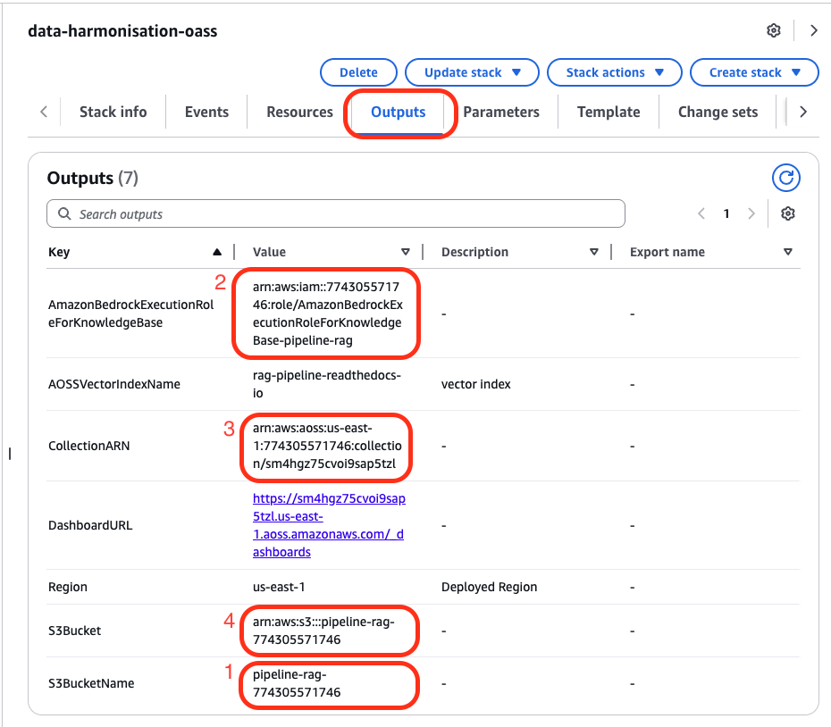
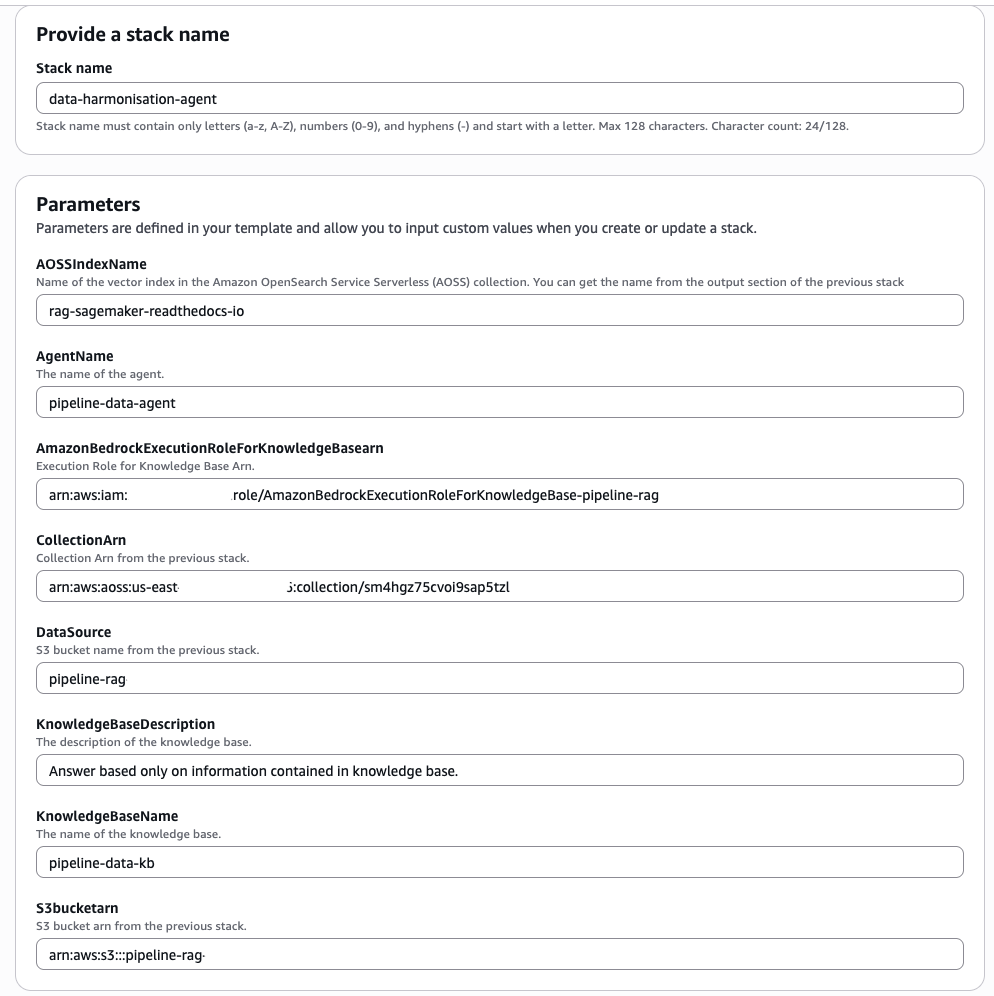

# Data Harmonisation for Drug Development Pipeline

This solution automatically collects, standardises, and enriches drug development pipeline data from pharmaceutical companies.

## Problem Statement

Harmonising data from disparate systems is time-consuming and costly. Pharmaceutical companies publish their drug/product development pipelines on their websites, but analyzing this data systematically presents several challenges:

- Manual downloading is often required
- Each company reports data in their own format
- Key data fields (indication, compound name, etc.) are reported inconsistently
- No standardized ontologies or controlled vocabularies are applied

An automated solution that retrieves, extracts, compiles to a common data model, and standardises with ontologies is essential to make the data FAIR (Findable, Accessible, Interoperable, Reusable) and ready for upstream analysis.

## Sample Questions
- "What diabetes drug candidates are in Phase 1 development?"
- "Compare the pipeline strategies of Novo Nordisk vs Pfizer"
- "Which compounds have Fast Track designation?"
- "Show me all biologics targeting oncology indications"
- "Analyze the distribution of development phases across therapeutic areas"

## Solution Overview

### Prerequisite

This project demonstrates how to extract and process pharmaceutical pipeline data using Q CLI and simple prompts. Our solution respectfully follows robots.txt directives, only collecting data from websites that permit it.

#### Data Collection Process
The data is collected and harmonized as a prerequisite step using Q CLI, which is a command line interface for Amazon Q, an AI-powered coding assistant. The implementation primarily uses Fetch MCP to crawl company pipeline webpages and download the data. Please see `pipeline_data` folder for the step by step data collection. Below are explanation of each step. 

The final data is saved as a JSON file in `pipeline_data/final_enriched_data/enriched_pipeline_data.json`, ready for downstream analysis. For implementation details, please see `./pipeline_data/PROJECT_SUMMARY.md`.

##### Step 1: Data Collection 
Using Fetch MCP to collect data from Novartis, Novo Nordisk, and Pfizer pipeline web pages, extracting the data and saving it as individual JSON objects.

##### Step 2: Common Data Model Creation
Analyzing each JSON file to create a unified data model that represents all collected data. This step combines data from the three companies into a single dataset.

##### Step 3: Data Standardisation and Enrichment
Automatically detecting appropriate ontologies to standardize the data, ensuring consistency across all entries.

##### Key Ontologies Used
This project leverages several standardized biomedical ontologies to ensure data interoperability and semantic enrichment. These ontologies provide controlled vocabularies and hierarchical relationships that enable consistent data representation across pharmaceutical pipeline information.
1. [MONDO (Monarch Disease Ontology)](https://mondo.monarchinitiative.org)
   - Comprehensive disease ontology for standardizing disease names and classifications
   - Used for harmonizing disease indications across pharmaceutical pipelines

2. [ChEBI (Chemical Entities of Biological Interest)](https://www.ebi.ac.uk/chebi/)
   - Structured classification of molecular entities focused on small chemical compounds
   - Applied to standardize compound types and mechanisms of action

3. [EFO (Experimental Factor Ontology)](https://www.ebi.ac.uk/efo/)
   - Provides systematic descriptions of experimental variables
   - Used for therapeutic area standardization and classification

4. [NCIT (NCI Thesaurus)](https://ncithesaurus.nci.nih.gov/)
   - Comprehensive cancer and biomedical terminology
   - Applied to development phases, regulatory designations, and compound classifications

5. [MeSH (Medical Subject Headings)](https://www.nlm.nih.gov/mesh/)
   - Controlled vocabulary thesaurus for indexing biomedical information
   - Used for disease and therapeutic area standardization

6. [ATC (Anatomical Therapeutic Chemical Classification)](https://www.whocc.no/atc/)
   - Hierarchical system for classifying drugs by therapeutic use
   - Applied to therapeutic area standardization

7. [ICD-10 (International Classification of Diseases)](https://icd.who.int/)
   - Standard diagnostic classification for epidemiology and clinical purposes
   - Used for disease indication standardization

8. [SNOMED CT (Systematized Nomenclature of Medicine Clinical Terms)](https://www.snomed.org/)
   - Comprehensive clinical healthcare terminology
   - Applied to disease indication standardization

#### Alternative Approaches

Alternatively, you could also:

- Create an agent to collect the data using Strands SDK (https://strandsagents.com/latest/), which has native support for MCP as tools
- Utilize the Inline agent feature in Amazon Bedrock Agents to connect to the MCP

Our current solution focuses on using Q CLI for data collection and preparation, which offers a straightforward approach to gathering pharmaceutical pipeline information.

### Pipeline Data Agent
This implementation uses Amazon Bedrock agents with knowledgebases to answer questions about pharmaceutical company new product development pipeline. The final data created in the preprocessing step `pipeline_data/final_enriched_data/enriched_pipeline_data.json` is ingested as a knowledgebase. The Amazon Bedrock agent uses the knowledgebase as a tool to answer questions from the user. 

To create the agent and the knowledgebase, use the CloudFormation template in this directory. Step by step depoyment instructions are below. 

## Deployment

The solution deployment automation script uses two parameterized CloudFormation template, 01-deploy-oass.yml and 02-deploy-kb-agent.yml, to automate provisioning of following solution resources:
- OpenSearch Service Serverless collection
- Amazon S3 Bucket (DataSource)
- Amazon Bedrock KnowledgeBase
- Amazon Bedrock Agent
- IAM Roles

There are two stacks to deploy. For the first stack, you'll need IAM ARN for the AWS account you are logged in with. After the first deployment is successful, please manually create vector index. The steps are given below. 

### Deploy 01-deploy-oass.yaml

1. You need to add the **ARN of the IAM role** with which you are currently logged into your AWS account. 

`cloudformation create-stack --stack-name <stack-name> --template-body 01-deploy-oass.yaml --parameters ParameterKey=<parameter key>,ParameterValue=<parameter value> ParameterKey=<parameter key>,ParameterValue=<parameter value> `

2. Go to AWS Consle 
	1. Go to S3 and upload `enriched_pipeline_data.json` to your bucket. You can find your bucket name marked as 1 in the image above
	`aws s3 sync /<your dir>/pipeline_data/final_enriched_data/enriched_pipeline_data.json s3://$BUCKET_NAME/`
	2. Go to Amazon OpenSearch Serverless
		- Collections
		- Find `pipeline-rag`
		- `Create index`
			- Index name: `rag-pipeline-readthedocs-io`
			- Vector field name: `vector`
			- Engine: `faiss`
			- Precision: `FP16`
			- Dimensions: `1536`
			- Distance metric: `Euclidean`

3. After the stack is deployed, go to 'Outputs' tab and make a note of the output fields highlighted in the image.

### Deploy 02-agent-with-kb.yaml
You can either use the AWS Console or AWS CLI

`aws cloudformation create-stack --stack-name <stack-name> --template-body file://02-agent-with-kb.yaml --parameters ParameterKey=<parameter key>,ParameterValue=<parameter value> ParameterKey=<parameter key>,ParameterValue=<parameter value>` 

Fill the following fields
- Stack name: name of your choice e.g. `data-harmonisation-agent`
- AmazonBedrockExecutionRoleForKnowledgeBasearn: you can find it in the Output section of the first stack, as shown in the image above
- CollectionArn: same as above
- DataSource: same as above
- S3bucketarn: same as above

After the stack is deployed, go to AWS Console
1. Nagivate to Amazon Bedrock
2. KnowledgeBases and sync the data source
3. Test both your agent and the knowledgebase
