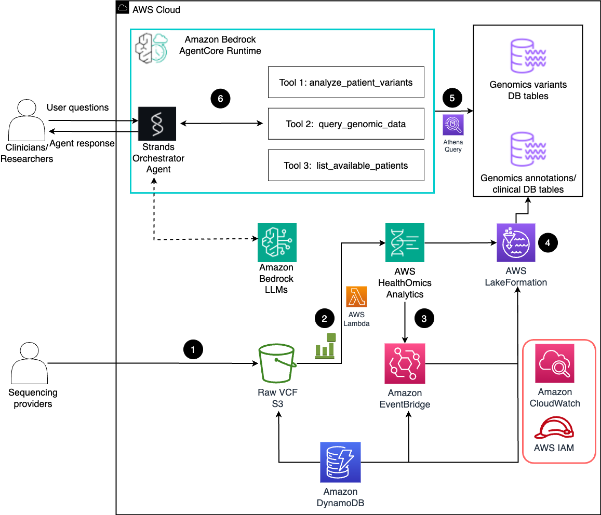

# VCF Processing and Genomic Analysis System

This repository contains a comprehensive system for processing VCF (Variant Call Format) files using AWS HealthOmics and creating an intelligent genomic analysis agent using the Strands framework. The system consists of two main components:

1. **VCF Processing Infrastructure** - Automated pipeline for importing VCF files into AWS HealthOmics
2. **Genomic Analysis Agent** - AI-powered agent for querying and analyzing genomic data

## 📋 Table of Contents

- [Overview](#overview)
- [Architecture](#architecture)
- [Prerequisites](#prerequisites)
- [Sample Data](#sample-data)
- [Complete Setup Guide](#complete-setup-guide)
- [Usage](#usage)
- [Components](#components)
- [Troubleshooting](#troubleshooting)
- [Security Considerations](#security-considerations)

## 🔍 Overview

This system enables researchers and clinicians to:
- Automatically process and import VCF files into AWS HealthOmics variant stores
- Track import job statuses in real-time using DynamoDB
- Query genomic data using natural language through an AI agent
- Perform complex genomic analyses including variant interpretation and clinical significance assessment
- Access data through Amazon Athena for advanced analytics

## 🏗️ Architecture



The system follows this workflow:
1. **Data Preparation**: VCF files are uploaded to S3 bucket (not covered in Prerequisites - see Sample Data section)
2. **Event-Driven Processing**: S3 events trigger Lambda function for automated processing
3. **HealthOmics Integration**: Lambda creates import jobs in HealthOmics variant stores
4. **Status Tracking**: DynamoDB tracks job progress and status updates
5. **Data Analytics**: Processed data becomes available in Athena for querying
6. **AI Agent Interface**: Strands-based agent provides natural language access to genomic data

## 📋 Prerequisites

### AWS Account Requirements
- AWS Account with appropriate permissions
- AWS CLI configured with credentials
- Python 3.9+ environment
- Jupyter Notebook environment (for setup)

### Required AWS Services
- AWS HealthOmics
- Amazon DynamoDB
- AWS Lambda
- Amazon S3
- Amazon Athena
- AWS Glue
- AWS Lake Formation
- Amazon Bedrock
- Amazon EventBridge

### IAM Permissions
Your AWS user/role needs permissions for:
- HealthOmics (create variant stores, import jobs)
- DynamoDB (create tables, read/write items)
- Lambda (create functions, manage permissions)
- S3 (read VCF files, configure notifications)
- Athena (execute queries)
- Glue (manage data catalog)
- Lake Formation (manage permissions)
- Bedrock (invoke models)

## 📊 Sample Data

### Reference Genome
You can use the publicly available reference genome from the 1000 Genomes project:

```bash
# Reference genome location (publicly accessible)
s3://1000genomes-dragen/reference/hg38_alt_aware_nohla.fa
```

**Note**: This reference file is already available in the public S3 bucket and can be used directly in your HealthOmics reference store setup.

### Sample VCF Files
Sample VCF files are available from the 1000 Genomes project. Copy them to your S3 bucket:

```bash
# Copy sample VCF files to your bucket
aws s3 cp s3://1000genomes-dragen/data/dragen-3.5.7b/hg38_altaware_nohla-cnv-anchored/NA21135.hard-filtered.vcf.gz s3://YOUR_S3_BUCKET/YOUR_PREFIX/

# Additional sample files (optional)
aws s3 cp s3://1000genomes-dragen/data/dragen-3.5.7b/hg38_altaware_nohla-cnv-anchored/NA21137.hard-filtered.vcf.gz s3://YOUR_S3_BUCKET/YOUR_PREFIX/
aws s3 cp s3://1000genomes-dragen/data/dragen-3.5.7b/hg38_altaware_nohla-cnv-anchored/NA21141.hard-filtered.vcf.gz s3://YOUR_S3_BUCKET/YOUR_PREFIX/
```

**Important**: Replace `YOUR_S3_BUCKET` and `YOUR_PREFIX` with your actual S3 bucket name and desired prefix/folder path.

## 🚀 Complete Setup Guide

### Step 0: Data Preparation (Prerequisites)

**⚠️ Important**: This step is NOT included in the Prerequisites notebook and must be completed first.

1. **Create S3 Bucket** (if you don't have one):
   ```bash
   aws s3 mb s3://YOUR_S3_BUCKET --region <YOUR_REGION>
   ```

2. **Copy Sample VCF Files**:
   ```bash
   # Copy sample VCF files to your bucket
   aws s3 cp s3://1000genomes-dragen/data/dragen-3.5.7b/hg38_altaware_nohla-cnv-anchored/NA21135.hard-filtered.vcf.gz s3://YOUR_S3_BUCKET/YOUR_PREFIX/
   ```

3. **Verify File Upload**:
   ```bash
   aws s3 ls s3://YOUR_S3_BUCKET/YOUR_PREFIX/ --recursive
   ```

### Step 1: Infrastructure Setup

1. **Clone/Download Repository**:
   ```bash
   git clone <repository-url>
   cd 26-advanced-vcf-interprter-agent
   ```

2. **Review Configuration Requirements**:
   ```bash
   # Check what placeholders need to be replaced
   cat CONFIGURATION_PLACEHOLDERS.md
   ```

3. **Open the Prerequisites Notebook**:
   ```bash
   jupyter notebook Prerequisites_creation.ipynb
   ```

4. **Configure AWS Profile** (First cell in notebook):
   ```python
   os.environ['AWS_PROFILE'] = 'your-aws-profile'  # Update with your AWS profile
   ```

5. **Update Configuration Variables**:
   - **IMPORTANT**: See `CONFIGURATION_PLACEHOLDERS.md` for complete list of values to replace
   - **S3 URI**: Update the S3 bucket path where your VCF files are stored
   - **AWS Account ID**: Replace `<YOUR_ACCOUNT_ID>` placeholders with your actual account ID
   - **AWS Region**: Replace `<YOUR_REGION>` with your AWS region
   - **KMS Key**: Update the KMS key ARN in the IAM policy

6. **Run Infrastructure Setup**:
   Execute all cells in the Prerequisites notebook to create:
   - DynamoDB table for tracking VCF import jobs (`VcfImportTracking3`)
   - IAM role with necessary permissions (`VcfProcessorLambdaRole3`)
   - HealthOmics reference store and variant store
   - Lambda function for processing VCF files (`VcfProcessor3`)
   - S3 event notifications
   - EventBridge rules for scheduled status checks

7. **Verify Configuration**:
   ```bash
   # Run the verification script to ensure all placeholders are replaced
   ./verify_placeholders.sh
   ```

### Step 2: Verify Infrastructure

1. **Check DynamoDB Table**:
   ```bash
   aws dynamodb describe-table --table-name VcfImportTracking3
   ```

2. **Verify Lambda Function**:
   ```bash
   aws lambda get-function --function-name VcfProcessor3
   ```

3. **Validate HealthOmics Resources**:
   ```bash
   # List variant stores
   aws omics list-variant-stores
   
   # List reference stores
   aws omics list-reference-stores
   ```

4. **Test S3 Event Configuration**:
   ```bash
   # Check S3 bucket notification configuration
   aws s3api get-bucket-notification-configuration --bucket YOUR_S3_BUCKET
   ```

### Step 3: Agent Setup

1. **Install Dependencies**:
   ```bash
   pip install strands-agents strands-agents-tools
   pip install boto3>=1.37.1
   ```

2. **Open the Agent Notebook**:
   ```bash
   jupyter notebook vcf-agent-supervisor-agentcore.ipynb
   ```

3. **Configure Agent Settings**:
   - Update AWS region and account ID in the notebook
   - Configure Bedrock model preferences
   - Set database and table names

4. **Create IAM Role for Agent** (if needed):
   ```bash
   python create_agent_role.py
   ```

5. **Initialize the Agent**:
   Execute the notebook cells to create the Strands agent with genomic analysis capabilities

### Step 4: Test the Complete System

1. **Upload a Test VCF File**:
   ```bash
   # This should trigger the Lambda function automatically
   aws s3 cp s3://1000genomes-dragen/data/dragen-3.5.7b/hg38_altaware_nohla-cnv-anchored/NA21135.hard-filtered.vcf.gz s3://YOUR_S3_BUCKET/YOUR_PREFIX/
   ```

2. **Monitor Processing**:
   ```bash
   # Check DynamoDB for job status
   aws dynamodb scan --table-name VcfImportTracking3
   
   # Check Lambda logs
   aws logs tail /aws/lambda/VcfProcessor3 --follow
   ```

3. **Test Agent Queries**:
   ```python
   # In the agent notebook
   response = agent.run("List available patients in the database")
   ```

## 📖 Usage

### Processing VCF Files

1. **Upload VCF Files**:
   - Upload `.hard-filtered.vcf.gz` files to your configured S3 bucket
   - Files should follow the naming convention: `{SampleID}.hard-filtered.vcf.gz`
   - The system will automatically detect and process new files

2. **Monitor Processing**:
   - Check DynamoDB table for real-time status updates
   - Monitor CloudWatch logs for detailed processing information
   - Status progression: `SUBMITTED` → `IN_PROGRESS` → `COMPLETED`

3. **Query Data**:
   - Once processing completes, data becomes available in Athena
   - Use the Strands agent for natural language queries
   - Access raw data through Athena workbench

### Using the Genomic Analysis Agent

1. **Start the Agent**:
   ```python
   # In the agent notebook
   response = agent.run("List available patients in the database")
   ```

2. **Example Queries**:
   - "Show me all pathogenic variants for patient NA21135"
   - "Find variants in the BRCA1 gene across all patients"
   - "What are the clinical significance distributions for patient NA21135?"
   - "Compare variant counts between patients NA21135 and NA21137"

3. **Advanced Analysis**:
   - Variant impact assessment
   - Clinical significance interpretation
   - Gene-based variant analysis
   - Population frequency analysis

## 🔧 Components

### 1. Prerequisites_creation.ipynb
**Purpose**: Sets up the complete AWS infrastructure for VCF processing

**Key Functions**:
- Creates DynamoDB tracking table
- Sets up IAM roles and policies
- Deploys Lambda function for VCF processing
- Configures HealthOmics variant and reference stores
- Sets up S3 event notifications
- Creates EventBridge scheduling rules
- Configures Lake Formation permissions

### 2. vcf-agent-supervisor-agentcore.ipynb
**Purpose**: Creates an AI-powered genomic analysis agent

**Key Functions**:
- Initializes Strands agent framework
- Configures Bedrock model integration
- Defines genomic analysis tools
- Provides natural language interface for data queries
- Enables complex genomic analysis workflows

### 3. vcf_genomic_functions.py
**Purpose**: Core genomic analysis functions and utilities

**Key Functions**:
- AWS client initialization and configuration
- Genomic data querying and analysis
- Variant significance assessment
- Patient data management
- Athena query execution
- Clinical interpretation logic

### 4. lambda_function_fixed_final.py
**Purpose**: Lambda function for processing VCF import jobs

**Key Functions**:
- Handles S3 upload events
- Starts HealthOmics import jobs
- Tracks job status in DynamoDB
- Manages Lake Formation permissions
- Provides status checking and updates

### 5. vcf_interpreters.py
**Purpose**: Strands agent tools and genomic analysis functions

**Key Functions**:
- Agent tool definitions for genomic queries
- Query parsing and interpretation
- Integration with core genomic functions
- Natural language processing for genomic queries

### 6. create_agent_role.py
**Purpose**: Creates IAM roles for the Strands agent

**Key Functions**:
- Creates IAM roles with appropriate permissions
- Configures trust policies for Bedrock and Lambda
- Attaches managed and custom policies

## 🔍 Troubleshooting

### Common Issues

#### 1. Lambda Function Errors
**Symptoms**: Import jobs not starting, status not updating
**Solutions**:
- Check CloudWatch logs: `/aws/lambda/VcfProcessor3`
- Verify IAM permissions for HealthOmics and DynamoDB
- Confirm environment variables are set correctly
- Check S3 event notification configuration

#### 2. Athena Query Failures
**Symptoms**: "Table not found" or permission errors
**Solutions**:
- Verify Lake Formation resource links are created
- Check Athena workgroup uses Engine Version 3
- Confirm analytics is enabled on variant store
- Validate Glue catalog permissions

#### 3. Agent Connection Issues
**Symptoms**: Agent cannot connect to AWS services
**Solutions**:
- Verify AWS credentials and region configuration
- Check Bedrock model access permissions
- Confirm DynamoDB and Athena permissions
- Validate network connectivity

#### 4. VCF Import Failures
**Symptoms**: Jobs stuck in SUBMITTED or fail immediately
**Solutions**:
- Check VCF file format and compression
- Verify S3 bucket permissions
- Confirm reference genome compatibility
- Check HealthOmics service limits

#### 5. S3 Event Trigger Issues
**Symptoms**: Files uploaded but Lambda not triggered
**Solutions**:
- Verify S3 event notification configuration
- Check Lambda function permissions
- Confirm file naming convention matches filter
- Review CloudTrail logs for S3 events

### Debugging Commands

```bash
# Check DynamoDB table contents
aws dynamodb scan --table-name VcfImportTracking3 --output table

# Test Lambda function
aws lambda invoke --function-name VcfProcessor3 --payload '{"check_status": true}' response.json

# Check EventBridge rule
aws events describe-rule --name VcfStatusCheckSchedule

# Verify S3 notifications
aws s3api get-bucket-notification-configuration --bucket YOUR_S3_BUCKET

# Check Athena workgroups
aws athena list-work-groups

# Monitor Lambda logs in real-time
aws logs tail /aws/lambda/VcfProcessor3 --follow

# Check HealthOmics import jobs
aws omics list-variant-import-jobs --max-results 10
```

## 🔒 Security Considerations

### Data Protection
- VCF files contain sensitive genomic information
- Ensure S3 buckets have appropriate access controls
- Use encryption at rest and in transit
- Implement proper IAM policies with least privilege

### Access Control
- Limit Bedrock model access to authorized users
- Use Lake Formation for fine-grained data permissions
- Implement proper authentication for agent access
- Monitor access logs and usage patterns

### Compliance
- Consider HIPAA compliance for healthcare data
- Implement data retention policies
- Ensure audit logging is enabled
- Follow organizational data governance policies

## 📞 Support

For issues and questions:
1. Check the troubleshooting section above
2. Review CloudWatch logs for detailed error information
3. Verify AWS service limits and quotas
4. Consult AWS HealthOmics documentation
5. Check Strands framework documentation

## 📝 Notes

- The system is designed for research and clinical genomics workflows
- Processing time varies based on VCF file size and complexity
- Athena queries may take time for large datasets
- Agent responses depend on data availability and quality
- Regular monitoring of AWS costs is recommended
- **Step 0 (Data Preparation) is not included in the Prerequisites notebook** - you must manually upload VCF files to S3 first

## 📚 Additional Resources

- [AWS HealthOmics Documentation](https://docs.aws.amazon.com/omics/)
- [Strands Framework Documentation](https://github.com/awslabs/strands)
- [VCF Format Specification](https://samtools.github.io/hts-specs/VCFv4.2.pdf)
- [1000 Genomes Project](https://www.internationalgenome.org/)

---

**Last Updated**: August 2025
**Version**: 2.0
**Compatibility**: AWS HealthOmics, Python 3.9+, Strands Framework
