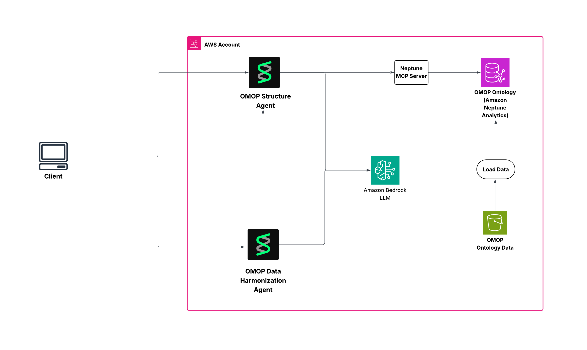

# OMOP Structure and Harmonization Agents

This project provides **AI-powered harmonization of healthcare data to the OMOP Common Data Model** using advanced semantic similarity and embeddings technology. The solution consists of two specialized agents that work together to understand OMOP CDM structure and intelligently map source healthcare data fields to appropriate OMOP targets.

## 🎯 **Overview**




### **OMOP Structure Agent**
An intelligent query agent that provides **real-time access to OMOP CDM knowledge** through natural language interactions. This agent serves as your OMOP expert, capable of answering complex questions about the Common Data Model structure, relationships, and field specifications.

**Key Capabilities:**
- **Interactive OMOP Exploration**: Ask natural language questions about OMOP tables, fields, and relationships
- **Real-time Graph Queries**: Direct access to Neptune Analytics graph database containing complete OMOP CDM v5.4 structure
- **Relationship Discovery**: Understand foreign key relationships and table connections
- **Field Specifications**: Get detailed information about data types, constraints, and usage guidelines

### **OMOP Harmonization Agent**
An advanced AI agent that **automatically maps source healthcare data fields to OMOP CDM targets** using state-of-the-art semantic similarity and embedding technology. This agent combines machine learning with OMOP domain expertise to provide intelligent harmonization recommendations.

**Key Capabilities:**
- **Semantic Field Matching**: Uses Amazon Bedrock Titan embeddings to find semantically similar OMOP fields
- **Contextual Analysis**: Considers source data context and descriptions for more accurate mappings
- **Confidence Scoring**: Provides similarity scores and confidence levels for each recommendation
- **Batch Processing**: Processes entire data dictionaries automatically
- **Structured Output**: Generates comprehensive JSON reports with detailed reasoning

## Project Setup

### Prerequisites

- Python 3.11+
- uv (Python package manager)
- AWS CLI configured with appropriate credentials
- Node.js and npm (for CDK)
- AWS CDK CLI

### Install Prerequisites

#### 1. Install uv (Python package manager)
```bash
# macOS/Linux
curl -LsSf https://astral.sh/uv/install.sh | sh

```

#### 2. Install Node.js and npm
```bash

brew install node

```

#### 3. Install AWS CLI
```bash

brew install awscli

```

#### 4. Install AWS CDK CLI

**Option 1: Install via npm (Recommended)**
```bash
# Install globally via npm
npm install -g aws-cdk

# Verify installation
cdk --version
```

**Option 2: Install via pip (Python)**
```bash
# Install via pip
pip install aws-cdk-lib

# For CDK v1 (legacy)
pip install aws-cdk
```

**Verify CDK Installation**
```bash
# Check CDK version
cdk --version

# Should output something like: 2.x.x (build xxxxxxx)

# Check CDK help
cdk --help
```

**CDK Prerequisites Check**
```bash
# Ensure Node.js version is compatible (14.x or later)
node --version

# Ensure npm is available
npm --version

# Check AWS CLI is configured
aws sts get-caller-identity
```

#### 5. Configure AWS CLI
```bash
# Configure your AWS credentials if you are running this in local or enviroment where no aws role is attached
aws configure

# Or set environment variables
export AWS_ACCESS_KEY_ID=your_access_key
export AWS_SECRET_ACCESS_KEY=your_secret_key
export AWS_DEFAULT_REGION=us-east-1
```

#### 6. Enable Amazon Bedrock Model Access

**Important**: Before running the agents, you must enable access to the required AI models in Amazon Bedrock.

**Required Models:**
- **Amazon Titan Text Embeddings v2** (`amazon.titan-embed-text-v2:0`) - For semantic similarity
- **Anthropic Claude 3.5 Sonnet** (`us.anthropic.claude-3-5-sonnet-20240620-v1:0`) - For harmonization analysis

**Enable Model Access:**

1. **Via AWS Console:**
   ```bash
   # Open Bedrock console
   https://console.aws.amazon.com/bedrock/
   ```
   - Navigate to "Model access" in the left sidebar
   - Click "Request model access"
   - Select the following models:
     - ✅ **Amazon Titan Text Embeddings v2**
     - ✅ **Anthropic Claude 3.5 Sonnet**
   - Click "Request model access" and wait for approval (usually instant)

2. **Via AWS CLI:**
   ```bash
   # Check current model access
   aws bedrock list-foundation-models --region us-east-1
   
   # Request access to Titan Embeddings
   aws bedrock put-model-invocation-logging-configuration \
     --region us-east-1 \
     --logging-config '{
       "cloudWatchConfig": {
         "logGroupName": "/aws/bedrock/modelinvocations",
         "roleArn": "arn:aws:iam::YOUR_ACCOUNT:role/service-role/AmazonBedrockExecutionRoleForCloudWatchLogs"
       }
     }'
   ```

**Note**: Model access is region-specific. Ensure you enable access in the same region where you'll run the agents (default: `us-east-1`).

### 1. UV Project Setup

```bash
# Clone the repository
git clone <repository-url>
cd agents_catalog/28-OMOP-data-harmonization-agents

# Install dependencies using uv
uv sync

```

### 2. CDK Infrastructure Setup

```bash
# Navigate to infrastructure directory
cd infra

# Bootstrap CDK (first time only)
uv run cdk bootstrap

# Deploy the OMOP ontology stack
uv run cdk deploy 

# Note the Neptune Graph ID from the output
```

### 3. Populate Neptune database with OMOP ontology data
```
cd ..
uv run python omop-ontology/load_omop.py --graph-id <your-neptune-graph-id> --table-file omop-ontology/data/OMOP_CDMv5.4_Table_Level.csv --field-file omop-ontology/data/OMOP_CDMv5.4_Field_Level.csv --region <your-region>
```

**Important**: After CDK deployment, you must run `load_omop.py` to populate the Neptune database with OMOP ontology data before using the agents.

## 🚀 **Running the Agents**

### **OMOP Structure Agent - Interactive OMOP Expert**

The Structure Agent provides an **interactive command-line interface** for exploring OMOP CDM structure and answering questions about the data model.

```bash
uv run python agents/omop_structure_agent.py --neptune-endpoint <your-neptune-graph-id> --region <your-region>
```

**Use Cases & Example Queries:**

**📊 Data Model Exploration:**
- "What tables are in the OMOP CDM?"
- "Show me all fields in the person table"
- "What are the primary keys in the condition_occurrence table?"

**🔗 Relationship Analysis:**
- "What are the relationships between condition_occurrence and person?"
- "Show me all foreign key relationships for the drug_exposure table"
- "How is the measurement table connected to other tables?"

**📋 Field Specifications:**
- "What data type is person_id in the person table?"
- "What are the required fields in the visit_occurrence table?"
- "Show me the ETL conventions for the condition_concept_id field"

**🎯 Domain-Specific Queries:**
- "Which tables store medication information?"
- "How do I represent laboratory results in OMOP?"
- "What's the difference between condition_occurrence and condition_era?"

### **OMOP Harmonization Agent - Intelligent Field Mapping**

The Harmonization Agent performs **automated semantic mapping** of source healthcare data fields to appropriate OMOP CDM targets using AI-powered analysis.

```bash
uv run python agents/omop_harmonization_agent.py --input-source test-data/CMS_PDE_Data_Dictionary.csv --neptune-endpoint <your-neptune-graph-id> --region <your-region>
```

**Harmonization Workflow:**
1. **Data Ingestion**: Load source data dictionary (CSV format)
2. **Semantic Analysis**: Generate embeddings for source field names and descriptions
3. **Similarity Matching**: Find top OMOP field candidates using vector similarity
4. **Contextual Evaluation**: Analyze matches considering source data context
5. **Recommendation Generation**: Provide ranked recommendations with confidence scores
6. **Results Export**: Save detailed harmonization report as JSON

**Output Example:**
```json
{
  "Recommendation": {
    "SourceField": "Patient_ID",
    "OMOPField": "person_id", 
    "OMOPTable": "person",
    "SimilarityScore": 0.95,
    "Confidence": "High",
    "ForeignKeyRelationships": ["person.person_id -> visit_occurrence.person_id"],
    "Reasoning": "Direct semantic match for patient identifier, primary key in person table"
  }
}
```

### **Input Data Format**

The harmonization agent expects CSV files with the following structure:

| Column | Description | Example |
|--------|-------------|---------|
| `Label` | Source field name to harmonize | "Patient_ID", "Diagnosis_Code", "Admission_Date" |
| `Table Description` | Context about the source data/table | "CMS Inpatient Claims", "Electronic Health Records", "Insurance Claims Data" |

**📁 Sample Data Files:**
The `test-data/` directory contains real-world examples:
- **`CMS_PDE_Data_Dictionary.csv`** - Medicare Part D prescription drug events
- **`CMS_Inpatient_Claims_Data_Dictionary.csv`** - Medicare inpatient hospital claims  
- **`CMS_Outpatient_Claims_Data_Dictionary.csv`** - Medicare outpatient facility claims

**🎯 Supported Data Sources:**
- Electronic Health Records (EHR) systems
- Claims and billing data (CMS, commercial payers)
- Clinical trial databases
- Registry and surveillance systems
- Laboratory information systems
- Pharmacy management systems

## Project Structure

```
├── agents/
│   ├── omop_harmonization_agent.py    # Main harmonization agent
│   └── omop_structure_agent.py        # OMOP structure query agent
├── omop-ontology/
│   ├── OMOP_ontology.py              # OMOP ontology class
│   └── load_omop.py                  # Data loading utilities
├── infra/
│   └── omop_ontology_stack.py        # CDK infrastructure
├── test-data/                        # Sample data files
├── pyproject.toml                    # UV project configuration
└── README.md                         # This file
```

## 🔥 **Key Features & Capabilities**

### **🤖 AI-Powered Harmonization Agent**

**Advanced Semantic Matching:**
- **🧠 Titan Embeddings**: Leverages Amazon Bedrock's Titan Text Embeddings v2 for deep semantic understanding
- **📊 Vector Similarity**: Uses cosine similarity in high-dimensional embedding space for precise field matching
- **🎯 Contextual Analysis**: Considers both field names and source data descriptions for enhanced accuracy
- **📈 Confidence Scoring**: Provides quantitative similarity scores (0-1 scale) for each recommendation

**Intelligent Analysis:**
- **🔗 Relationship Detection**: Automatically identifies foreign key relationships and table connections
- **📋 Batch Processing**: Processes entire data dictionaries (hundreds of fields) in minutes
- **🎨 Structured Output**: Generates comprehensive JSON reports with detailed reasoning and metadata
- **⚡ Performance Optimized**: Reuses connections and resources for efficient large-scale processing

**Domain Expertise:**
- **🏥 Healthcare Focus**: Trained on OMOP CDM v5.4 with deep understanding of healthcare data patterns
- **📚 ETL Guidance**: Provides transformation recommendations and data mapping insights
- **🔍 Quality Assurance**: Flags potential mapping issues and provides alternative suggestions

### **🗣️ Interactive Structure Agent**

**Natural Language Interface:**
- **💬 Conversational AI**: Ask questions in plain English about OMOP structure and relationships
- **🔍 Real-time Queries**: Instant responses from Neptune Analytics graph database
- **📖 Comprehensive Knowledge**: Access to complete OMOP CDM v5.4 specification and metadata

**Advanced Query Capabilities:**
- **🌐 Graph Traversal**: Explore complex relationships across multiple tables and domains
- **📊 Schema Analysis**: Get detailed field specifications, data types, and constraints
- **🎯 Domain Exploration**: Navigate clinical domains (conditions, drugs, procedures, measurements)
- **🔗 Lineage Tracking**: Understand data flow and dependencies across the model

**Developer-Friendly:**
- **⚡ Fast Responses**: Optimized graph queries with sub-second response times
- **🛠️ Tool Integration**: Can be embedded in ETL pipelines and data mapping workflows
- **📝 Documentation**: Provides authoritative OMOP guidance with source references

## 🏗️ **Technology Stack**

### **🧠 AI & Machine Learning**
- **Amazon Bedrock Titan Embeddings v2**: State-of-the-art text embeddings for semantic similarity
- **Anthropic Claude 3.5 Sonnet**: Advanced reasoning and analysis for harmonization recommendations
- **Vector Similarity Search**: Cosine similarity in high-dimensional embedding space
- **Semantic Understanding**: Deep contextual analysis of healthcare terminology

### **📊 Data & Storage**
- **Amazon Neptune Analytics**: Serverless graph database storing complete OMOP CDM v5.4 structure
- **Graph Data Model**: Optimized representation of tables, fields, relationships, and metadata
- **Vector Indexing**: Efficient storage and retrieval of field embeddings
- **OMOP CDM v5.4**: Latest version with comprehensive healthcare data standards

### **🤖 Agent Framework**
- **Strands Framework**: Modern Python framework for AI agent development and orchestration
- **Tool Integration**: Seamless integration between structure queries and harmonization analysis
- **MCP (Model Context Protocol)**: Efficient communication with Neptune Analytics
- **Resource Optimization**: Shared connections and intelligent resource management

### **☁️ Infrastructure**
- **AWS CDK**: Infrastructure as Code for reproducible deployments
- **Serverless Architecture**: Auto-scaling Neptune Analytics and Bedrock services
- **UV Package Management**: Fast, modern Python dependency management
- **Cross-Platform Support**: Works on macOS, Linux, and Windows environments

### **🔄 Data Flow Architecture**
```
Source Data (CSV) → Embedding Generation → Similarity Search → 
OMOP Structure Queries → AI Analysis → Harmonization Recommendations → JSON Output
```

**Performance Characteristics:**
- **Embedding Generation**: ~100ms per field
- **Similarity Search**: ~50ms per query  
- **Structure Queries**: ~200ms per query
- **End-to-End Processing**: ~2-5 seconds per field mapping

## Troubleshooting

### Common Issues

1. **Neptune connection errors**: Ensure your AWS credentials are configured and the Neptune graph is accessible
2. **Embedding errors**: Verify Bedrock access and model availability in your region
3. **Import errors**: Make sure all dependencies are installed with `uv sync`

### Logging

The agents use structured logging:
- Strands framework: DEBUG level
- Other components: INFO level

Check logs for detailed error information and processing status.

## Contributing

1. Fork the repository
2. Create a feature branch
3. Make your changes
4. Test with sample data
5. Submit a pull request

## License

[Add your license information here]