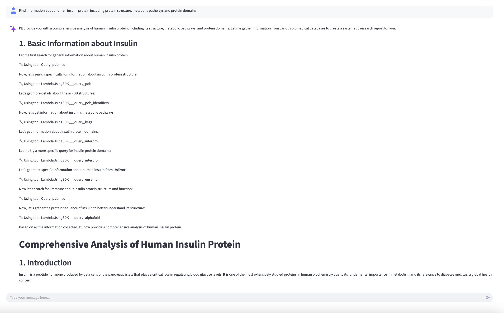

# Research agent with Biomni gateway on Amazon Bedrock AgentCore

> [!IMPORTANT]
> This is a biomedical research agent with multiple tools using Amazon Bedrock AgentCore framework with Strands. The agent can connect to your own data infrastructure with your own local tools like PubMed and knowledge base, includes a sample public tools gateway, Amazon Cognito identity, memory, observability and a local Streamlit UI.
NOTE: The public tools gateway includes all the database tools from Biomni https://github.com/snap-stanford/Biomni/tree/main/biomni/tool

he template provides you two options for authentication with the AgentCore Runtime - you can either deploy the runtime with OAuth authentication or IAM authentication. Based on your choice, you can run a local streamlit app with /without Cogntio authentication. The runtime internally will use M2M auth flow to connect with the AgentCore Gateway.


## Table of Contents

- [AgentCore Strands Template](#agentcore-strands-template)
  - [Table of Contents](#table-of-contents)
  - [Prerequisites](#prerequisites)
    - [AWS Account Setup](#aws-account-setup)
  - [Deploy](#deploy)
  - [Sample Queries](#sample-queries)
  - [Scripts](#scripts)
    - [Amazon Bedrock AgentCore Gateway](#amazon-bedrock-agentcore-gateway)
    - [Amazon Bedrock AgentCore Memory](#amazon-bedrock-agentcore-memory)
    - [Cognito Credentials Provider](#cognito-credentials-provider)
    - [Agent Runtime](#agent-runtime)
  - [Cleanup](#cleanup)
  - [🤝 Contributing](#-contributing)
  - [📄 License](#-license)

## Prerequisites

### AWS Account Setup

1. **AWS Account**: You need an active AWS account with appropriate permissions
   - [Create AWS Account](https://aws.amazon.com/account/)
   - [AWS Console Access](https://aws.amazon.com/console/)

2. **AWS Command Line Interface (AWS CLI)**: Install and configure AWS Command Line Interface (AWS CLI) with your credentials
   - [Install AWS Command Line Interface (AWS CLI)](https://docs.aws.amazon.com/cli/latest/userguide/getting-started-install.html)
   - [Configure AWS Command Line Interface (AWS CLI)](https://docs.aws.amazon.com/cli/latest/userguide/cli-configure-quickstart.html)

   ```bash
   aws configure
   ```

3. **Bedrock Model Access**: Enable access to Amazon Bedrock Anthropic Claude models in your AWS region
   - Navigate to [Amazon Bedrock](https://console.aws.amazon.com/bedrock/)
   - Go to "Model access" and request access to:
     - Anthropic Claude 3.7 Sonnet model
     - Anthropic Claude 3.5 Haiku model
   - [Bedrock Model Access Guide](https://docs.aws.amazon.com/bedrock/latest/userguide/model-access.html)

4. **Python 3.10+**: Required for running the application
   - [Python Downloads](https://www.python.org/downloads/)

## Deploy

0. **Setup agent tools**
    - Review the sample agent local tools under 'agent_config/tools/research_tools.py' and add/modify your own tools if required. We provide PubMed as a local tool. 
    - Clone the Biomni code repository and copy the schema files for the database tools from https://github.com/snap-stanford/Biomni/tree/main/biomni/tool/schema_db to 'prerequisite/lambda/python/schema_db'. Note, we provide the Biomni database tools adapted with Bedrock Converse API in 'prerequisite/lambda/python/database.py' and have removed the following commercial license tools 'kegg', 'iucn', and 'remap'.   You can review the gateway lambda tools under 'prerequisite/lambda' and add/modify your own lambda tools if required. 

1. **Create infrastructure**

    ```bash
    python -m venv .venv
    source .venv/bin/activate
    uv pip install -r dev-requirements.txt

    chmod +x scripts/prereq.sh
    ./scripts/prereq.sh

    chmod +x scripts/list_ssm_parameters.sh
    ./scripts/list_ssm_parameters.sh
    ```

    > [!CAUTION]
    > Please prefix all the resource names with your chosen prefix (e.g., `researchapp`).

2. **Create Agentcore Gateway**
    The agentcore gateway will be installed with a lambda target to the deployed lambda functions from 'prerequisite/lambda' 

    ```bash
    python scripts/agentcore_gateway.py create --name researchapp-gw
    ```

2a. **Deploy Cancer Biology Tools (Optional)**
    
    The Cancer Biology Gateway provides 6 specialized tools for cancer research:
    - `analyze_ddr_network_in_cancer` - DNA damage response network analysis
    - `analyze_cell_senescence_and_apoptosis` - Cell senescence and apoptosis analysis
    - `detect_and_annotate_somatic_mutations` - Somatic mutation detection
    - `detect_and_characterize_structural_variations` - Structural variation analysis
    - `perform_gene_expression_nmf_analysis` - NMF gene expression analysis
    - `analyze_copy_number_purity_ploidy_and_focal_events` - Copy number variation analysis

    **Package and Deploy:**
    
    ```bash
    # Package Lambda function and layer
    cd prerequisite
    python3 create_cancer_biology_lambda_zip.py
    
    # Upload to S3 (replace with your bucket name)
    export S3_BUCKET="your-lambda-deployment-bucket"
    aws s3 cp cancer-biology-lambda-layer.zip s3://${S3_BUCKET}/
    aws s3 cp cancer-biology-lambda-function.zip s3://${S3_BUCKET}/
    
    # The Lambda resources are already included in infrastructure.yaml
    # They will be created when you deploy the CloudFormation stack in step 1
    
    # Create gateway target
    cd ../scripts
    python3 create_cancer_biology_target.py create
    ```
    
    **Verify deployment:**
    ```bash
    # List gateway targets
    python3 -c "
    import boto3
    client = boto3.client('bedrock-agentcore-control', region_name='us-east-1')
    ssm = boto3.client('ssm', region_name='us-east-1')
    gateway_id = ssm.get_parameter(Name='/app/researchapp/agentcore/gateway_id')['Parameter']['Value']
    targets = client.list_gateway_targets(gatewayIdentifier=gateway_id)
    print('Gateway Targets:')
    for t in targets.get('items', []):
        print(f\"  - {t['name']} ({t['targetId']})\")
    "
    ```

3. **Setup Agentcore Identity**
    You can look to reuse the credentials provider user pool across multiple deployments if required.
    
    ```bash
    python scripts/cognito_credentials_provider.py create --name researchapp-cp
    
    python tests/test_gateway.py --prompt "Hello, can you help me?"
    ```
     For the current implementation, we do not use the decorator function to get the access token for the gateway. Rather we fetch it by directly retrieving the cognito domain, resource server, user pool. 

4. **Create Memory**

    ```bash
    python scripts/agentcore_memory.py create --name researchapp

    python tests/test_memory.py load-conversation
    python tests/test_memory.py load-prompt "My preferred response format is detailed explanations"
    python tests/test_memory.py list-memory
    ```

5. **Setup Agent Runtime**

> [!CAUTION]
> Please ensure the name of the agent starts with your chosen prefix.
Note : We have decoupled the OAuth authentication of the Gateway from the Runtime. This means that you can use the Runtime either with IAM or OAuth authentication. The gateway bearer token will be retrieved using M2M authentication internally. 

  ```bash
  agentcore configure --entrypoint agent/main.py -er arn:aws:iam::<Account-Id>:role/<Role> --name researchapp<AgentName>
  ```
If you want to use OAuth authentication, enter 'yes' for OAuth. 

  Use `./scripts/list_ssm_parameters.sh` to fill:
  - `Role = ValueOf(/app/researchapp/agentcore/runtime_iam_role)`
  - `OAuth Discovery URL = ValueOf(/app/researchapp/agentcore/cognito_discovery_url)`
  - `OAuth client id = ValueOf(/app/researchapp/agentcore/web_client_id)`.

  > [!CAUTION]
  > Please make sure to delete `.agentcore.yaml` before running agentcore launch.

  ```bash
  rm .agentcore.yaml

  agentcore launch
  ```
  If you are using IAM based authenticaiton, invoke directly
  ```
  agentcore invoke '{"prompt": "Hello"}'
  ```
  If you are using OAuth authentication, invoke via HTTPS endpoint like the script below 
  ```
  python tests/test_agent.py researchapp<AgentName> -p "Hi"
  ```

6. **Local Host Streamlit UI**

> [!CAUTION]
> Streamlit app should only run on port `8501`.
If you are using IAM based authenticaiton, run streamlit and select the agent runtime you would like to use
```bash
streamlit run app.py --server.port 8501 
```
If you are using OAuth authentication, specify the particular agent app, and authenticate yourself 
```bash
streamlit run app_oauth.py --server.port 8501 -- --agent=researchapp<AgentName>
```


## Sample Queries

1. Conduct a comprehensive analysis of trastuzumab (Herceptin) mechanism of action, and resistance mechanisms. 
    I need:
    1. HER2 protein structure and binding sites
    2. Downstream signaling pathways affected
    3. Known resistance mechanisms from clinical data and adverse events from OpenFDA data
    4. Current clinical trials investigating combination therapies
    5. Biomarkers for treatment response prediction
    
    Please query relevant databases to provide a comprehensive research report.

2. Analyze the clinical significance of BRCA1 variants in breast cancer risk and treatment response.
    Please investigate:
    1. Population frequencies of pathogenic BRCA1 variants
    2. Clinical significance and pathogenicity classifications
    3. Associated cancer risks and penetrance estimates
    4. Treatment implications (PARP inhibitors, platinum agents)
    5. Current clinical trials for BRCA1-positive patients
    
    Use multiple databases to provide comprehensive evidence.

3. Investigate the PI3K/AKT/mTOR pathway in cancer and identify potential therapeutic targets.
    Research focus:
    1. Key proteins and their interactions in the pathway
    2. Pathway alterations in different cancer types
    3. Current therapeutic agents targeting this pathway
    4. Resistance mechanisms and combination strategies
    5. Biomarkers for pathway activation and drug response
    
    Synthesize data from pathway, protein, and clinical databases.

4. What can you tell me about your capabilities?

### Cancer Biology Analysis Queries (if deployed)

5. Analyze the DNA damage response network in my tumor samples. 
   Expression data: s3://my-bucket/expression.csv
   Mutation data: s3://my-bucket/mutations.csv

6. Detect somatic mutations in my tumor-normal pair.
   Tumor BAM: s3://my-bucket/tumor.bam
   Normal BAM: s3://my-bucket/normal.bam
   Reference: s3://my-bucket/reference.fa

7. Identify gene expression patterns using NMF analysis.
   Expression data: s3://my-bucket/expression_matrix.csv
   Number of components: 10

7. **Setup AgentCore Observability dashboard**
You are able to view all your Agents that have observability in them and filter the data based on time frames as described [here](https://aws.amazon.com/blogs/machine-learning/build-trustworthy-ai-agents-with-amazon-bedrock-agentcore-observability/)
You will need to Enable Transaction Search on Amazon CloudWatch as described [here](https://docs.aws.amazon.com/AmazonCloudWatch/latest/monitoring/Enable-TransactionSearch.html)

## Scripts

### Amazon Bedrock AgentCore Gateway

```bash
# Create gateway
python scripts/agentcore_gateway.py create --name researchapp-gw

# Delete gateway
python scripts/agentcore_gateway.py delete
```

### Cancer Biology Gateway Target

```bash
# Create cancer biology target
python scripts/create_cancer_biology_target.py create

# Delete cancer biology target
python scripts/create_cancer_biology_target.py delete --confirm
```

### Amazon Bedrock AgentCore Memory

```bash
# Create memory
python scripts/agentcore_memory.py create --name MyMemory

# Delete memory
python scripts/agentcore_memory.py delete
```

### Cognito Credentials Provider

```bash
# Create provider
python scripts/cognito_credentials_provider.py create --name researchapp-cp

# Delete provider
python scripts/cognito_credentials_provider.py delete
```

### Agent Runtime

```bash
# Delete agent runtime
python scripts/agentcore_agent_runtime.py researchapp<AgentName>
```

## Cleanup

```bash
chmod +x scripts/cleanup.sh
./scripts/cleanup.sh

# Delete cancer biology target (if deployed)
python scripts/create_cancer_biology_target.py delete --confirm

# Delete other resources
python scripts/cognito_credentials_provider.py delete
python scripts/agentcore_memory.py delete
python scripts/agentcore_gateway.py delete
python scripts/agentcore_agent_runtime.py researchapp<AgentName>

rm .agentcore.yaml
rm .bedrock_agentcore.yaml
```

## 🤝 Contributing

We welcome contributions! Please see our [Contributing Guidelines](../../CONTRIBUTING.md) for details.

## 📄 License

This project is licensed under the MIT License - see the [LICENSE](../../LICENSE) file for details.
