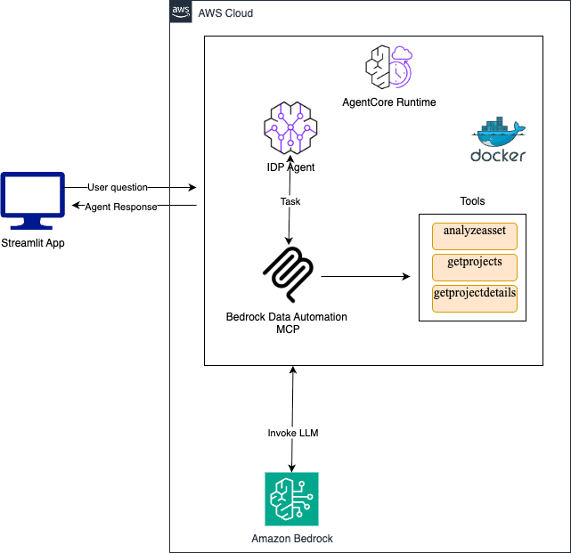
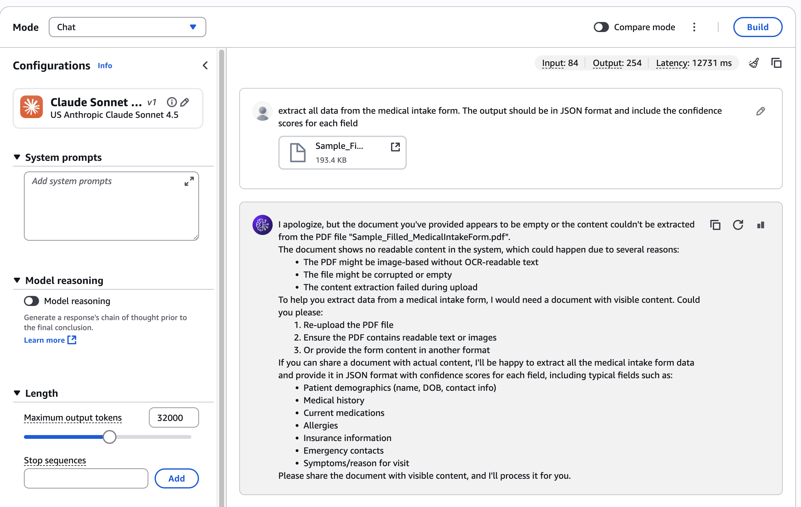

# IDP Agent for Handwritten Documents

## Problem Statement

Intelligent Document Processing (IDP) extracts structured data from unstructured text. Unstructured data comprises 80% of enterprise data and remains largely untapped due to its complexity. This content represents a rich source of insights that can drive better decision-making, enhance customer experiences, and uncover new business opportunities. Yet only about 18% of organizations are able to take advantage of their unstructured data at scale.

Organizations process hundreds of handwritten forms daily, requiring manual data validation and extraction that is:
- **Time-consuming**: Processing 200-300 forms/day with manual review takes 10-15 minutes per form. Manual processing consumes 50-70% of employee time with error rates up to 4%
- **Costly and Insufficient**: Current OCR solutions achieve only 70% accuracy at a cost of $5-15 per document
- **Inefficient**: Incomplete workflows force employees to search for information across different systems with no ability to ask follow-up questions without re-reading entire documents


## Solution Overview

A Bedrock Data Automation-powered IDP agent that:
1. **Extracts structured data** from handwritten forms with confidence scores
2. **Enables natural language queries** - ask follow-up questions without reprocessing
3. **Maintains conversation context** - remembers extracted data across questions
4. **Processes multimodal content** - handles checkboxes, handwriting, and printed text

### Key Features
- ✅ Handwritten text recognition
- ✅ Checkbox detection
- ✅ Confidence scoring per field
- ✅ JSON structured output
- ✅ Conversational follow-up questions

## Demo

[▶️ Watch Demo Video](demo/IDP_Agent_Demo.mp4)

*Click the link above to download and view the demo video showing the IDP agent extracting data from a handwritten medical intake form.*

## Technology Stack

### Amazon Bedrock AgentCore
Serverless runtime for deploying and scaling AI agents with:
- Automatic scaling and load balancing
- Built-in observability and monitoring
- IAM-based security and access control

### Strands Agent SDK
Multi-agent orchestration framework providing:
- Agent loop with reasoning and tool use
- Conversation state management
- Flexible tool integration (Python, MCP, community tools)

### Bedrock Data Automation (BDA) MCP
Multimodal document processing via Model Context Protocol:
- PDF to structured data conversion
- Handwriting recognition
- Visual element extraction (checkboxes, tables, signatures)

## Architecture

```
User Question → Streamlit UI → AgentCore Runtime → Strands Agent
                                                         ↓
                                                   BDA MCP Server
                                                         ↓
                                                  Extract Data
                                                         ↓
                                                  Cache Results (for follow-up questions)
                                                         ↓
                                                Return JSON and the answer
```


## Deployment Steps
- Upload your input file to your S3 Bucket

### Prerequisites
- AWS CLI configured with credentials
- Python 3.11+
- `uv` package manager installed
- Access to Amazon Bedrock AgentCore

### 1. Configure Agent

```bash
cd agent
uv run agentcore configure -e agent.py
```

### 2. Deploy to AgentCore

```bash
uv run agentcore launch
```

This will:
- Build ARM64 container in AWS CodeBuild
- Push to Amazon ECR
- Deploy to AgentCore Runtime
- Configure IAM roles and permissions

### 3. Run Streamlit UI

```bash
cd ..
streamlit run app.py
```

The UI will open at `http://localhost:8501`

### 4. Test the Agent

**First message**: "extract all data from the medical intake form. The output should be in JSON format and include the confidence scores for each field"
- Processes document (~20-30 seconds)
- Returns structured JSON with confidence scores
- Caches results for session

**Follow-up questions**: "what is the patient name?" or "does the patient have diabetes?"
- Instant responses (<2 seconds)
- Uses cached extraction data
- No document reprocessing needed

## Project Structure

```
.
├── streamlit-chat/
│   ├── app.py                          # Streamlit chat interface
│   ├── example/
│   │   ├── agent.py                    # Main agent implementation
│   │   ├── Dockerfile                  # Container configuration
│   │   ├── requirements.txt            # Python dependencies
│   │   └── .bedrock_agentcore.yaml    # AgentCore configuration
│   └── static/                         # UI assets
├── data/                               # Sample input documents
└── README.md                           # This file
```

## Key Implementation Details

### Why is Bedrock Data Automation MCP Required?
Testing showed that even the latest LLMs cannot extract handwritten notes from forms without specialized tools. We tested with Claude Sonnet 3.5 and Haiku 3.5 models via the Bedrock Playground, and both returned the same response indicating the PDF file was empty or unreadable.

This demonstrates that standard LLM vision capabilities are insufficient for processing complex handwritten documents, making Bedrock Data Automation MCP essential for accurate data extraction.

 

### Input File
The IDP agent processes documents from your S3 bucket. To use a different file:
- Upload the new file to your S3 bucket
- Update the SOURCE_FILE environment variable with the S3 URI"
 
### File Caching
Files are downloaded from S3 once and cached in `/tmp/` for reuse across invocations within the same container instance.

### Conversation Memory
Extracted data is stored in-memory per session ID, enabling instant follow-up questions without reprocessing.

### Error Handling
- Automatic retry logic for transient failures
- Graceful fallback for missing data
- Detailed error messages for debugging

## Performance Metrics

- **Initial extraction**: 20-30 seconds (includes S3 download + BDA processing)
- **Follow-up questions**: <2 seconds (uses cached data)
- **Throughput**: Supports 200-300 documents/day
- **Accuracy**: Confidence scores provided per field

## Cost Optimization

1. **File caching** reduces S3 API calls
2. **Conversation memory** eliminates redundant LLM invocations
3. **Serverless runtime** scales to zero when idle
4. **Efficient prompting** minimizes token usage

## Next Steps

- [ ] Add support for multiple document types
- [ ] Implement batch processing for high-volume scenarios
- [ ] Add human-in-the-loop review workflow
- [ ] Export extracted data to database/API
- [ ] Add audit logging and compliance features

## Resources

- [Amazon Bedrock AgentCore Documentation](https://docs.aws.amazon.com/bedrock-agentcore/)
- [Strands Agents Framework](https://github.com/awslabs/strands-agents)
- [Bedrock Data Automation](https://aws.amazon.com/bedrock/data-automation/)
- [Model Context Protocol (MCP)](https://modelcontextprotocol.io/)
