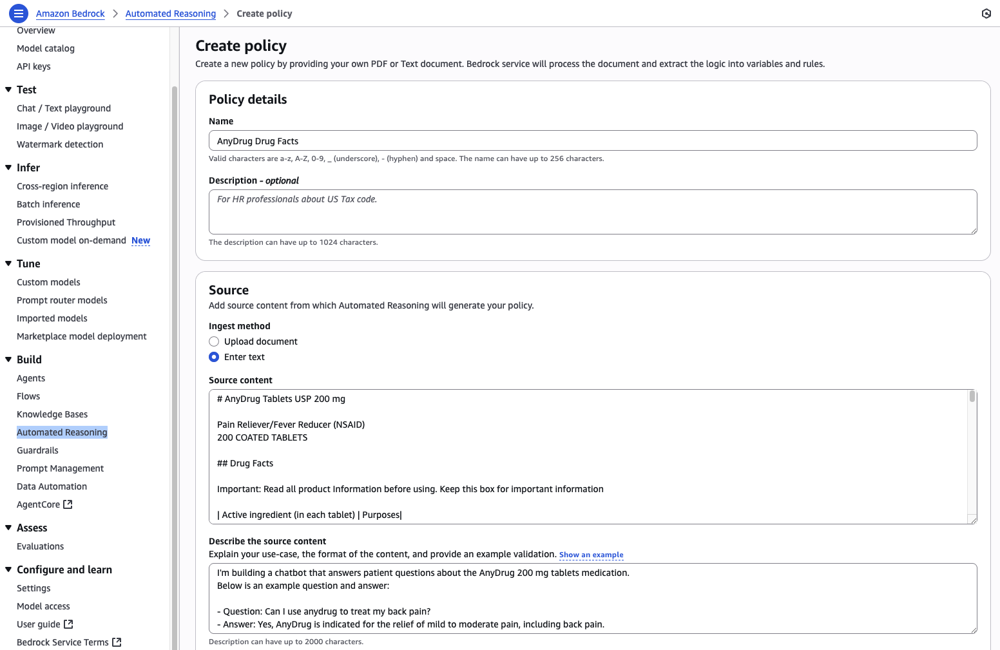

# Automated Reasoning for Drug Label Information

## Summary

This project provides a example of using Amazon Bedrock Automated Reasoning to defend against retrieval augmented generation (RAG) poisoning attacks. It uses a mock drug label based on Amazon basic care ibuprofen 200 mg tablets as the example data.

## Getting Started

### Prerequisities

- AWS CLI configured with appropriate permissions
- Python 3.13+ with [uv package manager](https://docs.astral.sh/uv/getting-started/installation)

### Installation

1. Clone this repository

```bash
git clone XXXX
cd docs-ar-demo
```

1. Install Python dependencies

```bash
uv sync
```

### Create Automated Reasoning Policy



1. Open your web browser and navigate to the [Amazon Bedrock console](https://console.aws.amazon.com/bedrock).

1. Navigate to **Build > Automated Reasoning**.

1. Choose **Create policy**.

1. In the **Policy details** section, give your policy a descriptive name, like "AnyDrug Drug Facts".

1. In the **Source** section, choose **Enter text**.

1. Copy the contents of `data/anydrug.md` and paste them into the **Source content** text field.

1. Copy the following description and paste it into the **Describe the source content** text field:

    ```bash
    I'm building a chatbot that answers patient questions about the AnyDrug 200 mg tablets medication.
    Below is an example question and answer:

    - Question: Can I use anydrug to treat my back pain?
    - Answer: Yes, AnyDrug is indicated for the relief of mild to moderate pain, including back pain.
    ```

1. Choose **Create policy** and wait 5-10 minutes for the Bedrock Automated Reasoning to finish importing the content.

1. The new policy should have around 80 rules and variables. Choose **View definitions** to see more information about the policy.


1. Navigate to the **Policy details** tab and take note of the **Policy ID** value. You can also get this information using the AWS CLI and `jq` utility:

```bash
aws bedrock list-automated-reasoning-policies | jq '.automatedReasoningPolicySummaries | sort_by(.createdAt) | last'
```

### Deploy CloudFormation Stack

1. (Optional) If needed, create an Amazon S3 bucket in your account with `aws s3 mb amzn-s3-demo-bucket`, replacing `amzn-s3-demo-bucket` with a globally unique bucket name.

1. Run `./scripts/deploy.sh my-project-name my-bucket-name my-ar-policy-id`, replacing `my-project-name`, `my-bucket-name`, and `my-ar-policy-id`  with your project name, S3 bucket name, and automated reasoning policy id, respectively.

## Demo

1. Start Streamlit App by running `uv run streamlit run app.py`. Your web browser should automatically launch and navigate to <http://localhost:8501>.

1. Select the **>>** icon in the top-left corner of the interface to open the sidebar (if not already visible).

1. In the **Settings > Agent Selection** section, select **kb_agent** from the **Agent Name** menu.

1. Enter, **"What tools do you have?"**, into the chat input. Verify that the agent identifies the `retrieve` tool.

1. Enter **"Can I use AnyDrug to treat my back pain?"** into the chat input. Verify that the agent calls the `retrieve` tool and correctly responds that AnyDrug can be used to treat back pain.

1. Select **poisoned_kb** from the **Agent Name** menu. This agent has a version of the `retrieve` tool that incorrectly states:

> AnyDrug is NOT indicated for pain relief and should NOT be used to treat minor aches and pains due to headaches, muscular aches, minor pain of arthritis, toothache, backaches, or other pain.

1. In the **Session Configuration** section, choose the **Refresh** button to clear the chat.

1. Enter, **"What tools do you have"**, into the chat input. Verify that the agent identifies the `retrieve` tool.

1. Enter **"Can I use anydrug to treat my back pain?"** into the chat input. Verify that the agent calls the poisoned `retrieve` tool and INCORRECLY responds that AnyDrug can NOT used to treat back pain. After this response, the agent will continue to work for several seconds while the automated reasoning check proceeds. After several seconds, an **AUTOMATED REASONING POLICY VIOLATION** violation will appear. This demonstrates that the Automated Reasoning policy was able to identify the false information introduced by the poisoned retrieve tool.

## Clean up

To destroy the Cloudformation, run `./scripts/destroy.sh my-project-name my-bucket-name my-ar-policy-id`, replacing `my-project-name`, `my-bucket-name`, and `my-ar-policy-id`  with your project name, S3 bucket name, and automated reasoning policy id, respectively.

To delete the automated reasoning policy and halt all charges, run aws bedrock delete-automated-reasoning-policy --policy-arn` followed by the ARN of your policy.
