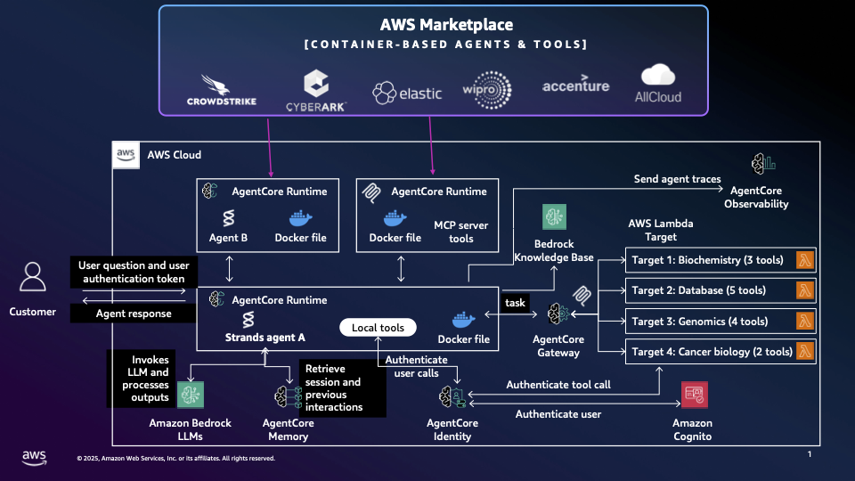

# Integrating Container based agents and tools from the AWS Marketplace

> [!IMPORTANT]
> This is a example  for deploying agents and tools from AWS Marketplace on Amazon Bedrock AgentCore Runtime and then integrating them with other agents on Bedrock AgentCore. 

> There are two parts to this example to keep it simple. 

1. Setup the vanilla AgentCore template for your local agents and tools. See [agentcore template](../../agentcore_template/README.md)

2. Subscribe, launch and host a agent or tool from AWS Marketplace on AgentCore Runtime. Then connect it with your agent via MCP. You can run the [notebook](notebooks/hosting_mcp_server.ipynb) that includes an example with Tavily MCP server.

