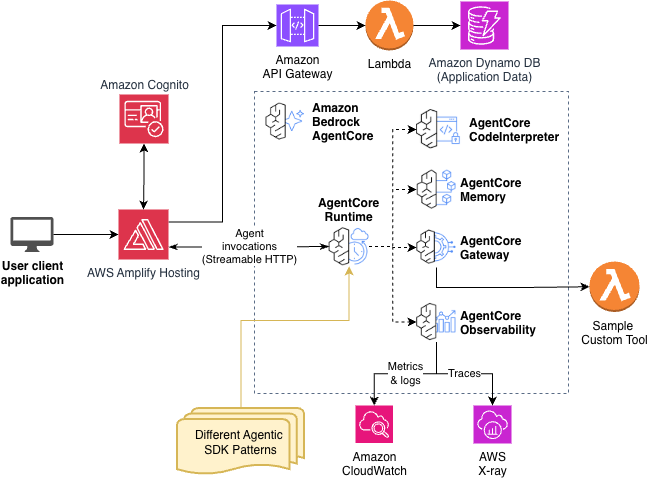

# Terminology Agent with OLS Integration

> **Based on**: [Fullstack AgentCore Solution Template (FAST)](https://github.com/awslabs/fullstack-solution-template-for-agentcore)
> **License**: Apache-2.0

## Overview

This Terminology Agent is a specialized medical terminology standardization agent built on top of the FAST template. It demonstrates how to extend FAST with domain-specific capabilities for healthcare and life sciences applications.

**📖 For complete agent details, capabilities, and deployment instructions, see [TERMINOLOGY_AGENT_GUIDE.md](TERMINOLOGY_AGENT_GUIDE.md)**

### What is the Terminology Agent?

The Terminology Agent standardizes medical and biological terminology using:
- **200+ Ontologies via EBI OLS** - Authoritative lookups for MONDO, ChEBI, HPO, GO, and more
- **LLM-Powered Entity Extraction** - Automatic identification and classification of medical entities
- **Multi-Ontology Search** - Cross-domain terminology mapping and hierarchical exploration
- **Standardized Query Generation** - Structured output for downstream agents

### Key Modifications from FAST Baseline

This agent extends FAST with the following customizations:

1. **New MCP Server Integration** - OLS (Ontology Lookup Service) MCP Server
   - Provides access to 200+ biomedical ontologies from EBI
   - OAuth2 M2M authentication via Cognito
   - 7 OLS tools for terminology lookup and exploration
   - See [README_OLS_MCP.md](README_OLS_MCP.md) for OLS-specific details

2. **Custom Agent Implementation** - [`patterns/strands-single-agent/terminology_agent_with_ols.py`](patterns/strands-single-agent/terminology_agent_with_ols.py)
   - Specialized system prompt for medical terminology standardization
   - Integration with both Gateway and OLS MCP servers
   - Graceful fallback when OLS unavailable
   - Entity extraction and classification tools

3. **LLM-Powered Tools** - [`patterns/strands-single-agent/terminology_tools.py`](patterns/strands-single-agent/terminology_tools.py)
   - `extract_entities` - Extract medical/scientific entities from natural language
   - `classify_entity_type` - Classify entities (DISEASE, DRUG, GENE, etc.)
   - `suggest_ontology_codes` - LLM knowledge for MedDRA, SNOMED CT, ICD-10/11, RxNorm, LOINC
   - `generate_standardized_query` - Create structured output for downstream agents

4. **Deployment Scripts** - Automated OLS MCP server deployment
   - [`deploy_ols_mcp_server.py`](deploy_ols_mcp_server.py) - Deploy OLS MCP server with Cognito auth
   - [`test_ols_client.py`](test_ols_client.py) - Test OLS MCP server connectivity
   - [`check_ols_mcp_deployment.py`](check_ols_mcp_deployment.py) - Verify deployment status

5. **Enhanced Testing** - [`test-scripts/test-agent.py`](test-scripts/test-agent.py)
   - Automated test suite for medical terminology queries
   - Interactive chat mode for manual testing
   - OLS integration verification

6. **Updated Frontend** - Branded for Terminology Agent
   - Title: "Terminology Agent" (was "Fullstack AgentCore Solution Template")
   - Welcome message: "Search with 200+ ontologies" (was "Welcome to FAST Chat")

### Sample Queries

Try these queries to see the agent in action:

**Ontology Lookup:**
```
"What is the MONDO ID for diabetes mellitus?"
"Search for 'insulin' across ChEBI and GO ontologies"
"Show me parent and child terms for myocardial infarction"
```

**Entity Extraction:**
```
"Extract entities from: Patient with diabetes on metformin presenting with chest pain"
"Find standardized codes for: heart attack, MI, myocardial infarction"
```

**Multi-Ontology Mapping:**
```
"Map diabetes to all relevant ontologies (MedDRA, ICD-10, MONDO)"
"What's the MedDRA code for myocardial infarction?"
```

See [TERMINOLOGY_AGENT_GUIDE.md](TERMINOLOGY_AGENT_GUIDE.md#sample-queries) for 40+ more example queries.

### Quick Start

```bash
# Install development dependencies
pip install -r requirements-dev.txt

# Step 1: Deploy backend (creates Cognito resources)
cd infra-cdk
npm install
cdk bootstrap  # Only needed once per AWS account/region
cdk deploy

# Step 2: Deploy OLS MCP Server (uses Cognito from backend)
cd ..
python deploy_ols_mcp_server.py --stack-name terminology-agent

# Step 3: Deploy frontend
python scripts/deploy-frontend.py

# Step 4: Test the agent
uv run test-scripts/test-agent.py --test-suite
```

For detailed deployment instructions, see [TERMINOLOGY_AGENT_GUIDE.md](TERMINOLOGY_AGENT_GUIDE.md#deployment-instructions).

---

# About FAST (Fullstack AgentCore Solution Template)

_The remainder of this README describes the FAST template that this agent is built upon._

The Fullstack AgentCore Solution Template (FAST) is a starter project repository that enables users (delivery scientists and engineers) to quickly deploy a secured, web-accessible React frontend connected to an AgentCore backend. Its purpose is to accelerate building full stack applications on AgentCore from weeks to days by handling the undifferentiated heavy lifting of infrastructure setup and to enable vibe-coding style development on top.

**Original FAST Repository**: https://github.com/awslabs/fullstack-solution-template-for-agentcore

FAST is designed with security and vibe-codability as primary tenets. Best practices and knowledge from experts are codified in _documentation_ rather than in _code_. By including this documentation in an AI coding assistant's context, developers can quickly build AgentCore applications for any use case.

## FAST Baseline System

The baseline FAST system provides:

1. **Gateway Tools** - Lambda-based tools behind AgentCore Gateway with authentication
2. **Code Interpreter** - Direct integration with Amazon Bedrock AgentCore Code Interpreter
3. **Memory Integration** - AgentCore Memory for conversation history
4. **Authentication** - Cognito-based authentication for frontend and agent-to-service communication

**The Terminology Agent replaces the basic agent with a specialized medical terminology standardization agent while keeping the FAST infrastructure intact.**


## Deployment Instructions

> **For Terminology Agent deployment**, see [TERMINOLOGY_AGENT_GUIDE.md](TERMINOLOGY_AGENT_GUIDE.md#deployment-instructions)
>
> **IMPORTANT**: Deploy the backend stack **first** (creates Cognito), then deploy the OLS MCP Server (uses Cognito).

## FAST User Setup (General FAST Template Instructions)

If you are a delivery scientist or engineer who wants to use FAST to build a full stack application, this is the section for you.

FAST is designed to be forked and deployed out of the box with a security-approved baseline system working. Your task will be to customize it to create your own full stack application to to do (literally) anything on AgentCore.

Deploying the full stack out-of-the-box FAST baseline system is only a few cdk commands once you have forked the repo, namely:

```bash
cd infra-cdk
npm install
cdk bootstrap # Once ever
cdk deploy
cd ..
python scripts/deploy-frontend.py
```

**Note**: The Terminology Agent has additional deployment steps. See [TERMINOLOGY_AGENT_GUIDE.md](TERMINOLOGY_AGENT_GUIDE.md) for complete instructions.

For general FAST template deployment, see the [deployment guide](docs/DEPLOYMENT.md).

### Local Development

Local development requires a deployed FAST stack because the agent depends on AWS services that cannot run locally:
- **AgentCore Memory** - stores conversation history
- **AgentCore Gateway** - provides tool access via MCP
- **SSM Parameters** - stores configuration (Gateway URL, client IDs)
- **Secrets Manager** - stores Gateway authentication credentials

You must first deploy the stack with `cdk deploy`, then you can run the frontend and agent locally using Docker Compose while connecting to these deployed AWS resources:

```bash
# Set required environment variables (see below for how to find these)
export MEMORY_ID=your-memory-id
export STACK_NAME=your-stack-name  
export AWS_DEFAULT_REGION=us-east-1

# Start the full stack locally
cd docker
docker-compose up --build
```

**Finding the environment variable values:**
- `STACK_NAME`: Use the `stack_name_base` value from `infra-cdk/config.yaml`
- `MEMORY_ID`: Extract from the `MemoryArn` CloudFormation output (the ID is the last segment after `/`)
  ```bash
  aws cloudformation describe-stacks --stack-name <your-stack-name> \
    --query 'Stacks[0].Outputs[?OutputKey==`MemoryArn`].OutputValue' --output text
  # Returns: arn:aws:bedrock-agentcore:region:account:memory/MEMORY_ID
  ```
- `AWS_DEFAULT_REGION`: The region where you deployed the stack (e.g., `us-east-1`)

See the [local development guide](docs/LOCAL_DEVELOPMENT.md) for detailed setup instructions.

What comes next? That's up to you, the developer. With your requirements in mind, open up your coding assistant, describe what you'd like to do, and begin. The steering docs in this repository help guide coding assistants with best practices, and encourage them to always refer to the documentation built-in to the repository to make sure you end up building something great.


## Architecture



The base FAST architecture is shown above. **The Terminology Agent adds an OLS MCP Server** that connects to the agent via MCP protocol for ontology lookups.

**Terminology Agent Architecture:**
```
┌─────────────────────────────────────────────────────────────┐
│                    Terminology Agent                         │
│                                                              │
│  ┌──────────────┐  ┌──────────────┐  ┌─────────────────┐  │
│  │   Gateway    │  │  OLS MCP     │  │      Code       │  │
│  │   MCP Tools  │  │   Server     │  │  Interpreter    │  │
│  └──────────────┘  └──────────────┘  └─────────────────┘  │
│         │                 │                    │            │
│         └─────────────────┴────────────────────┘            │
│                           │                                 │
│                  ┌────────▼────────┐                        │
│                  │ Claude Sonnet   │                        │
│                  │     4.5         │                        │
│                  └─────────────────┘                        │
└─────────────────────────────────────────────────────────────┘
```

See [TERMINOLOGY_AGENT_GUIDE.md](TERMINOLOGY_AGENT_GUIDE.md#architecture) for detailed Terminology Agent architecture.

Note that Amazon Cognito is used in four places:
1. User-based login to the frontend web application on CloudFront
2. Token-based authentication for the frontend to access AgentCore Runtime
3. Token-based authentication for the agents in AgentCore Runtime to access AgentCore Gateway
4. Token-based authentication for the OLS MCP Server (M2M OAuth2)

### Tech Stack

- **Frontend**: React with TypeScript, Vite, Tailwind CSS, and shadcn components - infinitely flexible and ready for coding assistants
- **Agent Providers**: Multiple agent providers supported (Strands, LangGraph, etc.) running within AgentCore Runtime
- **Authentication**: AWS Cognito User Pool with OAuth support for easy swapping out Cognito
- **Infrastructure**: CDK deployment with Amplify Hosting for frontend and AgentCore backend

## Project Structure

```
fullstack-agentcore-solution-template/
├── frontend/                 # React frontend application
│   ├── src/
│   │   ├── app/            # app router pages
│   │   ├── components/     # React components (shadcn/ui)
│   │   ├── hooks/          # Custom React hooks
│   │   ├── lib/            # Utility libraries
│   │   │   └── agentcore-client/ # AgentCore streaming client
│   │   ├── services/       # API service layers
│   │   └── types/          # TypeScript type definitions
│   ├── public/             # Static assets and aws-exports.json
│   ├── components.json     # shadcn/ui configuration
│   ├── Dockerfile.dev      # Development container configuration
│   └── package.json
├── infra-cdk/               # CDK infrastructure code
│   ├── lib/                # CDK stack definitions
│   ├── bin/                # CDK app entry point
│   ├── lambdas/            # Lambda function code
│   └── config.yaml         # Deployment configuration
├── patterns/               # Agent pattern implementations
│   ├── strands-single-agent/ # Basic strands agent pattern
│   │   ├── basic_agent.py  # Agent implementation
│   │   ├── strands_code_interpreter.py # Code Interpreter wrapper
│   │   ├── requirements.txt # Agent dependencies
│   │   └── Dockerfile      # Container configuration
│   └── langgraph-single-agent/ # LangGraph agent pattern
│       ├── langgraph_agent.py # Agent implementation
│       ├── requirements.txt # Agent dependencies
│       └── Dockerfile      # Container configuration
├── tools/                  # Reusable tools (framework-agnostic)
│   └── code_interpreter/   # AgentCore Code Interpreter integration
│       └── code_interpreter_tools.py # Core implementation
├── gateway/                # Gateway utilities and tools
│   ├── tools/              # Gateway tool implementations
│   └── utils/              # Gateway utility functions
├── scripts/                # Deployment and test scripts
│   ├── deploy-frontend.py  # Cross-platform frontend deployment
│   └── test-*.py          # Various test utilities
├── docs/                   # Documentation source files
│   ├── .nav.yml            # Navigation configuration
│   ├── index.md            # Documentation landing page
│   ├── DEPLOYMENT.md       # Deployment guide
│   ├── LOCAL_DEVELOPMENT.md # Local development guide
│   ├── AGENT_CONFIGURATION.md # Agent setup guide
│   ├── MEMORY_INTEGRATION.md # Memory integration guide
│   ├── GATEWAY.md          # Gateway integration guide
│   ├── STREAMING.md        # Streaming implementation guide
│   ├── TOOL_AC_CODE_INTERPRETER.md # Code Interpreter guide
│   ├── VERSION_BUMP_PLAYBOOK.md # Version management
│   └── architecture-diagram/ # Architecture diagrams
├── .mkdocs/                # MkDocs build configuration
│   ├── mkdocs.yml          # MkDocs configuration
│   ├── requirements.txt    # Documentation dependencies
│   ├── Makefile            # Build and deployment commands
│   └── README.md           # Documentation system overview
├── public/                 # Generated documentation site (MkDocs output)
├── tests/                  # Test suite
│   ├── unit/               # Unit tests
│   ├── integration/        # Integration tests
│   └── conftest.py         # Pytest configuration
├── vibe-context/           # AI coding assistant context and rules
│   ├── AGENTS.md           # Rules for AI assistants
│   ├── coding-conventions.md # Code style guidelines
│   └── development-best-practices.md # Development guidelines
├── .kiro/                  # Kiro CLI configuration
├── docker-compose.yml      # Local development stack
└── README.md
```

## Learning from This Implementation

This Terminology Agent demonstrates a complete pattern for building specialized agents on FAST:

**Key Patterns You Can Reuse:**
1. **Adding MCP Servers** - See how the OLS MCP Server was integrated with OAuth2 authentication
2. **Custom LLM Tools** - Study [`terminology_tools.py`](patterns/strands-single-agent/terminology_tools.py) for Bedrock Converse API integration
3. **Specialized System Prompts** - Review [`terminology_agent_with_ols.py`](patterns/strands-single-agent/terminology_agent_with_ols.py) for domain-specific agent design
4. **Deployment Automation** - Adapt [`deploy_ols_mcp_server.py`](deploy_ols_mcp_server.py) for your own MCP servers
5. **Testing Strategies** - See [`test-scripts/test-agent.py`](test-scripts/test-agent.py) for automated test suites

**To Build Your Own Specialized Agent:**
1. Fork this repository or start from the original FAST template
2. Replace `terminology_agent_with_ols.py` with your agent logic
3. Add your domain-specific tools (MCP servers, LLM tools, etc.)
4. Update the system prompt for your use case
5. Customize the frontend branding
6. Deploy following the same pattern

The FAST infrastructure (Cognito, Gateway, Memory, CDK) remains unchanged—you only modify the agent implementation and tools.

## Attribution

This agent is built on the [Fullstack AgentCore Solution Template (FAST)](https://github.com/awslabs/fullstack-solution-template-for-agentcore) and demonstrates how to extend it for healthcare and life sciences applications.

**Credits:**
- **Base Template**: AWS Labs - Fullstack AgentCore Solution Template (FAST)
- **OLS Integration**: EBI Ontology Lookup Service (https://www.ebi.ac.uk/ols4/)
- **Agent Framework**: Amazon Bedrock AgentCore with Strands SDK

## Security

Note: this asset represents a proof-of-value for the services included and is not intended as a production-ready solution. You must determine how the AWS Shared Responsibility applies to their specific use case and implement the needed controls to achieve their desired security outcomes. AWS offers a broad set of security tools and configurations to enable our customers.

Ultimately it is your responsibility as the developer of a full stack application to ensure all of its aspects are secure. We provide security best practices in repository documentation and provide a secure baseline but Amazon holds no responsibility for the security of applications built from this tool.

## License

This project is licensed under the Apache-2.0 License, maintaining compatibility with the original FAST template.
