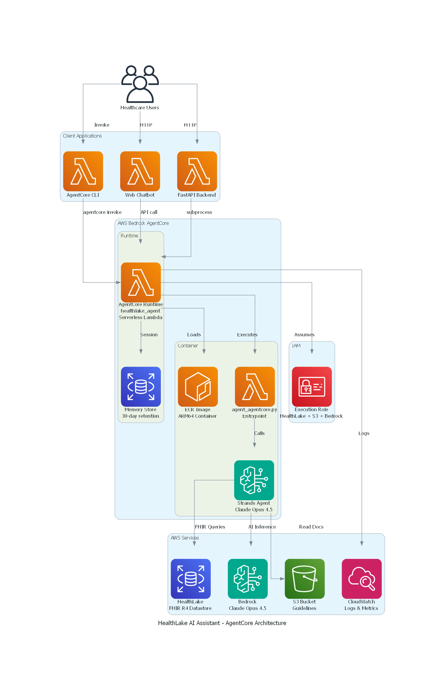

# HealthLake AI Assistant - AgentCore Implementation

An intelligent healthcare agent built on AWS Bedrock AgentCore, providing natural language access to FHIR R4 clinical data and healthcare documents stored in AWS HealthLake.

## Overview

The HealthLake AI Assistant enables healthcare professionals to query patient records, search clinical data, and access medical guidelines through conversational AI, eliminating the need for technical FHIR expertise.

**Key Features:**
- Natural language queries for FHIR resources (Patients, Conditions, Observations, Medications, etc.)
- Complete patient record retrieval with `$patient-everything` operation
- Clinical document access from S3 with presigned URL generation
- Session-based conversation memory (30-day retention)
- Role-based access control (patient, doctor, nurse, admin)
- Real-time streaming responses with tool execution visibility

## Architecture



The solution uses AWS Bedrock AgentCore with a serverless Lambda runtime, providing:
- Zero infrastructure management
- Automatic scaling
- Built-in observability with CloudWatch
- Cost-effective pay-per-invocation model

### Architecture Layers

**Client Layer:**
- AgentCore CLI for command-line invocation
- Web Chatbot for browser-based interaction
- FastAPI Backend for REST API integration

**AgentCore Runtime:**
- Serverless Lambda execution (ARM64)
- 30-day session memory retention
- Container image stored in Amazon ECR
- IAM-based access control

**Data & AI Layer:**
- AWS HealthLake for FHIR R4 clinical data
- Amazon Bedrock with Claude Opus 4.5
- Amazon S3 for clinical documents
- CloudWatch for logging and metrics

For detailed architecture documentation, see [docs/ARCHITECTURE.md](docs/ARCHITECTURE.md).

## Prerequisites

- AWS CLI configured with appropriate credentials
- AWS Bedrock AgentCore CLI installed: `pip install bedrock-agentcore`
- Docker installed and running
- Python 3.11 or higher
- AWS HealthLake datastore with FHIR R4 data

## Quick Start

### 1. Configure Environment

Create a `.env` file:

```bash
# AWS Configuration
AWS_PROFILE=your-aws-profile
AWS_REGION=us-west-2

# HealthLake Configuration
HEALTHLAKE_DATASTORE_ID=your-datastore-id

# Bedrock Configuration
BEDROCK_MODEL_ID=anthropic.claude-opus-4-5-20250514
BEDROCK_TEMPERATURE=0.7
BEDROCK_MAX_TOKENS=4096

# S3 Configuration (optional)
S3_BUCKET_NAME=your-s3-bucket-name
```

### 2. Install Dependencies

```bash
pip install -r requirements.txt
```

### 3. Configure AgentCore

```bash
agentcore configure --entrypoint agent_agentcore.py --name healthlake_agent
```

### 4. Deploy to AWS

```bash
agentcore deploy --agent healthlake_agent
```

### 5. Add IAM Permissions

Run the provided script or manually add permissions:

```bash
.\add_healthlake_permissions.ps1
```

### 6. Test the Agent

```bash
agentcore invoke '{"prompt": "What is the HealthLake datastore information?"}' --agent healthlake_agent
```

## Project Structure

```
healthlake-agent/
├── agent.py                      # Strands agent with 7 tools
├── agent_agentcore.py            # AgentCore entrypoint wrapper
├── config.py                     # Configuration management
├── requirements.txt              # Python dependencies
├── Dockerfile                    # AgentCore container image
├── .bedrock_agentcore.yaml       # AgentCore configuration
│
├── models/
│   ├── session.py                # SessionContext and UserRole
│   ├── agent_response.py         # Response models
│   └── interaction_log.py        # Logging models
│
├── utils/
│   ├── auth_helpers.py           # Authorization validation
│   ├── retry_handler.py          # Retry logic for AWS calls
│   └── fhir_code_translator.py   # FHIR code translation
│
├── prompts/
│   └── healthcare_assistant_prompt.py  # System prompt
│
├── scripts/
│   ├── deploy_agentcore.ps1      # Deployment script
│   ├── configure_agent.ps1       # Configuration script
│   ├── add_healthlake_permissions.ps1  # IAM permissions
│   └── test_agentcore_agent.ps1  # Testing script
│
├── docs/
│   ├── ARCHITECTURE.md           # Architecture documentation
│   ├── DEPLOYMENT.md             # Deployment guide
│   └── QUICKSTART.md             # Quick reference
│
└── examples/
    ├── chatbot_agentcore.html    # Web chatbot interface
    └── api.py                    # FastAPI integration example
```

## Usage Examples

### CLI Invocation

```bash
# Basic query
agentcore invoke '{"prompt": "Search for patients with diabetes"}' --agent healthlake_agent

# With session context
agentcore invoke '{"prompt": "Show me patient details", "context": {"user_id": "doctor-001", "user_role": "doctor"}}' --agent healthlake_agent

# With session ID for conversation continuity
agentcore invoke '{"prompt": "Tell me more about the first patient", "session_id": "session-123"}' --agent healthlake_agent
```

### Web Chatbot

Open `examples/chatbot_agentcore.html` in a browser for an interactive interface.

### API Integration

See `examples/api.py` for FastAPI integration example.

## Available Tools

The agent includes 7 specialized tools:

**FHIR Tools:**
- `get_datastore_info` - Retrieve datastore metadata
- `search_fhir_resources` - Search for FHIR resources with filters
- `read_fhir_resource` - Read complete resource by ID
- `patient_everything` - Get all resources for a patient

**S3 Tools:**
- `list_s3_documents` - List documents in S3 bucket
- `read_s3_document` - Read document content (up to 50MB)
- `generate_presigned_url` - Create secure download link

## Monitoring

### View Logs

```bash
aws logs tail /aws/bedrock-agentcore/runtimes/healthlake_agent-UNIQUE_ID-DEFAULT --follow --region REGION --profile YOUR_PROFILE
```

### Check Agent Status

```bash
agentcore status --agent healthlake_agent --verbose
```

### CloudWatch Dashboard

Access the GenAI Observability dashboard in AWS Console:
- Navigate to CloudWatch → GenAI Observability → Agent Core

## Security

- IAM-based access control with least-privilege permissions
- Role-based authorization at application layer
- Encryption at rest and in transit
- HIPAA-eligible services (HealthLake, Bedrock, S3, Lambda)
- CloudTrail logging for audit compliance

## Cost Estimate

**Monthly costs for moderate usage (~1,000 queries):**
- AgentCore Runtime: ~$0.02
- Memory (STM): ~$0.03
- CloudWatch Logs: ~$2.50
- ECR Storage: ~$0.20
- Bedrock (Claude Opus 4.5): ~$27.50
- **Total: ~$30/month**

## Troubleshooting

See [docs/ARCHITECTURE.md](docs/ARCHITECTURE.md) for detailed troubleshooting guide.

## License

This project is licensed under the MIT License - see the LICENSE file for details.

## Contributing

Contributions are welcome! Please read the contributing guidelines before submitting pull requests.

## Support

- AWS Documentation: Refer to AWS Bedrock AgentCore documentation
- CloudWatch Dashboard: Monitor agent performance and costs
- AWS Support: Contact AWS Support for infrastructure issues
