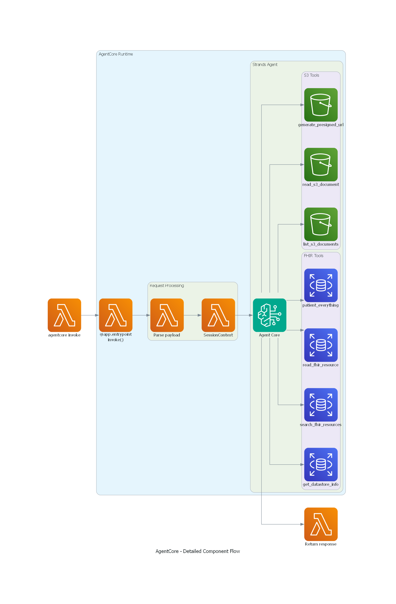

# HealthLake AI Assistant - AgentCore Architecture

## Overview

Healthcare professionals face significant challenges in accessing and analyzing FHIR (Fast Healthcare Interoperability Resources) clinical data. Traditional methods require technical expertise in FHIR query syntax, understanding complex data structures, and manually correlating information across multiple resources. Research scientists and clinicians need to quickly search patient records, analyze clinical observations, review medication histories, and access relevant medical guidelines—all while maintaining focus on patient care rather than data retrieval mechanics.

The HealthLake AI Assistant addresses these challenges by providing a natural language interface to FHIR R4 clinical data stored in AWS HealthLake. Built on **AWS Bedrock AgentCore**, this solution enables healthcare professionals to query patient information, search clinical resources, and access medical documents using conversational AI, eliminating the need for technical FHIR expertise.

**Key Capabilities:**
- Natural language queries for FHIR resources (Patients, Conditions, Observations, Medications, etc.)
- Complete patient record retrieval with `$patient-everything` operation
- Clinical document access from S3 with presigned URL generation
- Session-based conversation memory (30-day retention)
- Role-based access control (patient, doctor, nurse, admin)
- Real-time streaming responses with tool execution visibility

**Example User Queries:**
- "Find all patients diagnosed with diabetes in the last 6 months"
- "Show me the complete medical record for patient John Doe"
- "What are the latest treatment guidelines for hypertension?"
- "List all medications prescribed to patients with chronic kidney disease"

## Solution Architecture

The solution uses an **agentic workflow** pattern with AWS Bedrock AgentCore, enabling the AI agent to automatically orchestrate interactions between foundation models, FHIR data sources, document repositories, and user conversations. The agent breaks down complex queries into step-by-step analyses and transparently displays the chain of thought behind responses.


### Architecture Layers

The solution consists of three main layers:

**1. Client Layer**
Multiple interfaces for agent interaction:
- **AgentCore CLI**: Direct command-line invocation for testing and automation
- **Web Chatbot**: Browser-based interface with streaming responses
- **FastAPI Backend**: REST API for application integration

**2. AgentCore Runtime Layer**
Serverless execution environment managed by AWS:
- **Lambda Runtime**: ARM64-based container execution with automatic scaling
- **Memory Service**: Short-term memory (STM) for 30-day session retention
- **Container Image**: Stored in Amazon ECR with agent code and dependencies
- **IAM Execution Role**: Fine-grained permissions for HealthLake, S3, and Bedrock

**3. Data & AI Layer**
Backend services providing clinical data and AI capabilities:
- **AWS HealthLake**: FHIR R4 datastore with clinical records
- **Amazon Bedrock**: Claude Opus 4.5 foundation model for natural language understanding
- **Amazon S3**: Clinical guidelines, protocols, and medical documents
- **CloudWatch**: Comprehensive logging and metrics for observability

## Dataset Description

The solution works with FHIR R4 (Fast Healthcare Interoperability Resources) data stored in AWS HealthLake. FHIR is a standard for healthcare data exchange that defines a set of resources representing clinical concepts.

### FHIR Resources

The agent can query and analyze the following FHIR resource types:

**Clinical Resources:**
- **Patient**: Demographics, contact information, identifiers
- **Condition**: Diagnoses, problems, health concerns
- **Observation**: Vital signs, lab results, clinical measurements
- **Procedure**: Surgical procedures, diagnostic procedures
- **MedicationRequest**: Prescriptions and medication orders
- **AllergyIntolerance**: Allergies and adverse reactions

**Administrative Resources:**
- **Encounter**: Hospital visits, appointments, admissions
- **Coverage**: Insurance coverage information
- **Claim**: Billing and claims data

### Example FHIR Patient Resource

```json
{
  "resourceType": "Patient",
  "id": "example-patient-123",
  "name": [{
    "family": "Doe",
    "given": ["John"]
  }],
  "gender": "male",
  "birthDate": "1970-05-15",
  "address": [{
    "city": "Seattle",
    "state": "WA"
  }]
}
```

### Clinical Documents

In addition to structured FHIR data, the solution provides access to unstructured clinical documents stored in Amazon S3:
- Clinical practice guidelines
- Treatment protocols
- Medical research papers
- Policy documents
- Patient education materials

These documents are accessible through natural language queries, with the agent generating presigned URLs for secure download when needed.

## Tool Invocation Architecture



The agent uses a **multi-tool orchestration** pattern where Claude Opus 4.5 intelligently selects and chains tools based on user queries:

### Request Flow

```
1. User Query → AgentCore Entrypoint
   ├─ Parse payload (prompt, session_id, context)
   ├─ Validate user role and permissions
   └─ Create SessionContext

2. AgentCore Entrypoint → Strands Agent
   ├─ Initialize Claude Opus 4.5 model
   ├─ Load system prompt with healthcare context
   └─ Inject session state

3. Strands Agent → Tool Selection
   ├─ Analyze user intent
   ├─ Select appropriate tool(s)
   └─ Generate tool parameters

4. Tool Execution → AWS Services
   ├─ FHIR Tools → HealthLake API (signed requests)
   ├─ S3 Tools → S3 API (with IAM permissions)
   └─ Return structured results

5. Response Generation → User
   ├─ Synthesize tool results
   ├─ Generate natural language response
   └─ Stream or return complete response
```

### Tool Catalog

The agent has **7 specialized tools** organized by function:

#### FHIR Data Access Tools

| Tool | Purpose | Example Use Case |
|------|---------|------------------|
| `get_datastore_info` | Retrieve HealthLake datastore metadata | "What FHIR version is the datastore?" |
| `search_fhir_resources` | Search for FHIR resources with filters | "Find all patients with diabetes" |
| `read_fhir_resource` | Read complete resource by ID | "Show me details for Patient/123" |
| `patient_everything` | Get all resources for a patient | "Get complete record for patient John Doe" |

#### Document Access Tools

| Tool | Purpose | Example Use Case |
|------|---------|------------------|
| `list_s3_documents` | List documents in S3 bucket | "What clinical guidelines are available?" |
| `read_s3_document` | Read document content (up to 50MB) | "Show me the diabetes treatment protocol" |
| `generate_presigned_url` | Create secure download link | "Give me a link to download the PDF" |

### Tool Chaining Examples

**Example 1: Patient Search → Detail Retrieval**
```
User: "Find patients with hypertension and show me the first one's details"

Tool Chain:
1. search_fhir_resources(resource_type="Patient", search_params={"condition": "hypertension"})
   → Returns list of patient IDs
2. read_fhir_resource(resource_type="Patient", resource_id="<first_id>")
   → Returns complete patient record
3. Response: Synthesized patient information
```

**Example 2: Document Discovery → Content Access**
```
User: "What diabetes guidelines do we have and show me the latest one"

Tool Chain:
1. list_s3_documents(bucket_name="your-bucket-name", prefix="guidelines/")
   → Returns list of documents
2. read_s3_document(bucket_name="your-bucket-name", document_key="guidelines/diabetes-2024.pdf")
   → Returns document content
3. Response: Summary of guideline content
```

## Project Structure

```
backend/
├── agent.py                      # Strands agent with 7 tools
├── agent_agentcore.py            # AgentCore entrypoint wrapper
├── config.py                     # Configuration management
├── api.py                        # FastAPI REST API
├── Dockerfile                    # AgentCore container image
├── requirements.txt              # Python dependencies
├── .bedrock_agentcore.yaml       # AgentCore configuration
│
├── models/
│   └── session.py                # SessionContext and UserRole models
│
├── utils/
│   ├── auth_helpers.py           # Authorization validation
│   ├── retry_handler.py          # Retry logic for AWS calls
│   └── fhir_code_translator.py   # FHIR code translation
│
├── prompts/
│   └── healthcare_assistant_prompt.py  # System prompt
│
├── chatbot_agentcore.html        # Web chatbot interface
├── deploy_agentcore.ps1          # Deployment script
├── configure_agent.ps1           # Configuration script
└── test_agentcore_agent.ps1      # Testing script
```

### Key Files

**agent.py**
- Defines all 7 tools (FHIR + S3)
- Implements AWS SDK calls with SigV4 signing
- Handles retry logic and error handling
- Creates Strands Agent with Claude Opus 4.5

**agent_agentcore.py**
- AgentCore entrypoint decorated with `@app.entrypoint`
- Parses payload and creates SessionContext
- Invokes Strands agent with session state
- Returns structured response

**config.py**
- Loads configuration from environment variables
- Defines HealthLake datastore ID, region, model settings
- Manages AWS profile and credentials

**models/session.py**
- `SessionContext`: User context with role-based access
- `UserRole`: Enum for patient, doctor, nurse, admin roles
- Authorization helpers for patient scope validation

## Deployment Configuration

```yaml
Agent Name: healthlake_agent
Agent ARN: arn:aws:bedrock-agentcore:REGION:ACCOUNT_ID:runtime/healthlake_agent-UNIQUE_ID
Region: Your AWS region
Deployment Type: Container
Platform: linux/arm64
Runtime: Serverless Lambda
```

### Memory Configuration

```yaml
Memory ID: healthlake_agent_mem-UNIQUE_ID
Memory ARN: arn:aws:bedrock-agentcore:REGION:ACCOUNT_ID:memory/healthlake_agent_mem-UNIQUE_ID
Mode: STM_ONLY (Short-term memory)
Retention: 30 days
Purpose: Session management and conversation history
```

### Container Configuration

```yaml
ECR Repository: ACCOUNT_ID.dkr.ecr.REGION.amazonaws.com/bedrock-agentcore-healthlake_agent
Image Tag: latest
Architecture: linux/arm64
Base Image: Python 3.11
Entrypoint: agent_agentcore.py
```

### IAM Configuration

```yaml
Execution Role: AmazonBedrockAgentCoreSDKRuntime-REGION-UNIQUE_ID

Permissions:
  HealthLake:
    - healthlake:DescribeFHIRDatastore
    - healthlake:ReadResource
    - healthlake:SearchWithGet
    - healthlake:SearchWithPost
    Resource: arn:aws:healthlake:REGION:ACCOUNT_ID:datastore/fhir/YOUR_DATASTORE_ID
  
  S3:
    - s3:GetObject
    - s3:ListBucket
    Resource: arn:aws:s3:::YOUR_BUCKET_NAME/*
  
  Bedrock:
    - bedrock:InvokeModel
    Resource: arn:aws:bedrock:*::foundation-model/anthropic.claude-opus-4-5*
  
  CloudWatch:
    - logs:CreateLogGroup
    - logs:CreateLogStream
    - logs:PutLogEvents
    Resource: arn:aws:logs:REGION:ACCOUNT_ID:log-group:/aws/bedrock-agentcore/*

CodeBuild Role: AmazonBedrockAgentCoreSDKCodeBuild-REGION-UNIQUE_ID
Purpose: Build and push container images to ECR
```

## Observability

### CloudWatch Logs

```yaml
Log Group: /aws/bedrock-agentcore/runtimes/healthlake_agent-UNIQUE_ID-DEFAULT
Retention: 7 days (configurable)
Log Streams:
  - Runtime logs
  - Agent execution logs
  - Tool invocation logs
  - Error logs
```

### Monitoring Commands

```powershell
# Tail logs in real-time
aws logs tail /aws/bedrock-agentcore/runtimes/healthlake_agent-UNIQUE_ID-DEFAULT --follow --region REGION --profile YOUR_PROFILE

# View recent logs
aws logs tail /aws/bedrock-agentcore/runtimes/healthlake_agent-UNIQUE_ID-DEFAULT --since 1h --region REGION --profile YOUR_PROFILE

# Check agent status
agentcore status --agent healthlake_agent --verbose
```

### GenAI Observability Dashboard

Access the built-in dashboard:
```
https://console.aws.amazon.com/cloudwatch/home?region=REGION#gen-ai-observability/agent-core
```

Features:
- Request/response metrics
- Latency tracking
- Error rates
- Token usage
- Cost analysis

## Deployment Guide

### Prerequisites

1. **AWS CLI** configured with your AWS profile
2. **AgentCore CLI** installed (`pip install bedrock-agentcore`)
3. **Docker** installed and running
4. **Python 3.11+** with required packages

### Step 1: Configure Environment

Create `.env` file in `backend/` directory:

```bash
# AWS Configuration
AWS_PROFILE=your-aws-profile
AWS_REGION=us-west-2

# HealthLake Configuration
HEALTHLAKE_DATASTORE_ID=your-datastore-id

# Bedrock Configuration
BEDROCK_MODEL_ID=anthropic.claude-opus-4-5-20250514
BEDROCK_TEMPERATURE=0.7
BEDROCK_MAX_TOKENS=4096

# S3 Configuration (optional)
S3_BUCKET_NAME=your-s3-bucket-name
```

### Step 2: Configure AgentCore

```powershell
cd backend
agentcore configure --entrypoint agent_agentcore.py --name healthlake_agent
```

This creates `.bedrock_agentcore.yaml` with:
- Entrypoint: `agent_agentcore.py`
- Agent name: `healthlake_agent`
- Deployment type: Container
- Platform: linux/arm64

### Step 3: Deploy to AWS

```powershell
agentcore deploy --agent healthlake_agent
```

Deployment process:
1. Builds Docker image with ARM64 architecture
2. Pushes image to ECR repository
3. Creates AgentCore runtime (Lambda)
4. Creates memory resource (30-day STM)
5. Sets up CloudWatch logging
6. Configures IAM roles

**Expected output:**
```
✓ Building container image...
✓ Pushing to ECR...
✓ Creating AgentCore runtime...
✓ Creating memory resource...
✓ Deployment complete!

Agent ARN: arn:aws:bedrock-agentcore:REGION:ACCOUNT_ID:runtime/healthlake_agent-UNIQUE_ID
```

### Step 4: Add IAM Permissions

The execution role needs HealthLake and S3 permissions:

```powershell
.\add_healthlake_permissions.ps1
```

Or manually add inline policy to the AgentCore execution role (found in deployment output):

```json
{
  "Version": "2012-10-17",
  "Statement": [
    {
      "Effect": "Allow",
      "Action": [
        "healthlake:DescribeFHIRDatastore",
        "healthlake:ReadResource",
        "healthlake:SearchWithGet",
        "healthlake:SearchWithPost"
      ],
      "Resource": "arn:aws:healthlake:REGION:ACCOUNT_ID:datastore/fhir/YOUR_DATASTORE_ID"
    },
    {
      "Effect": "Allow",
      "Action": [
        "s3:GetObject",
        "s3:ListBucket"
      ],
      "Resource": [
        "arn:aws:s3:::YOUR_BUCKET_NAME",
        "arn:aws:s3:::YOUR_BUCKET_NAME/*"
      ]
    }
  ]
}
```

### Step 5: Test Deployment

```powershell
# Basic test
agentcore invoke '{"prompt": "What is the HealthLake datastore information?"}' --agent healthlake_agent

# Test with context
agentcore invoke '{"prompt": "Search for patients", "context": {"user_id": "doctor-001", "user_role": "doctor"}}' --agent healthlake_agent
```

### Step 6: Monitor Logs

```powershell
# Tail logs in real-time
aws logs tail /aws/bedrock-agentcore/runtimes/healthlake_agent-UNIQUE_ID-DEFAULT --follow --region REGION --profile YOUR_PROFILE

# View recent logs
aws logs tail /aws/bedrock-agentcore/runtimes/healthlake_agent-UNIQUE_ID-DEFAULT --since 1h --region REGION --profile YOUR_PROFILE
```

### Updating the Agent

After making code changes:

```powershell
agentcore deploy --agent healthlake_agent
```

This rebuilds and redeploys the container automatically.

## Agent Details

### CLI Invocation

```powershell
# Basic query
agentcore invoke '{"prompt": "What is the HealthLake datastore information?"}' --agent healthlake_agent

# With session context
agentcore invoke '{"prompt": "Search for patients with diabetes", "context": {"user_id": "doctor-001", "user_role": "doctor"}}' --agent healthlake_agent

# With session ID for conversation continuity
agentcore invoke '{"prompt": "Tell me more about the first patient", "session_id": "session-123"}' --agent healthlake_agent
```

### Web Chatbot

```html
<!-- Open in browser -->
file:///C:/Users/masingm/MyRepos/himms-healthlake-demo/backend/chatbot_agentcore.html
```

### FastAPI Integration

```python
# Start FastAPI server
cd backend
python api.py

# Call AgentCore endpoint
POST http://localhost:8000/chat/agentcore
{
  "message": "Search for patients with hypertension",
  "user_id": "web-user",
  "user_role": "admin"
}
```

## Usage Examples

| Metric | Value | Notes |
|--------|-------|-------|
| **Cold Start** | 2-5 seconds | First invocation after idle |
| **Warm Start** | <1 second | Subsequent invocations |
| **Simple Query** | 3-8 seconds | e.g., datastore info |
| **Complex Query** | 10-20 seconds | e.g., patient search with analysis |
| **Concurrent Requests** | Auto-scaled | No manual configuration |
| **Memory Retention** | 30 days | Automatic cleanup |

## Cost Analysis

### Monthly Cost Estimate

| Component | Cost | Calculation |
|-----------|------|-------------|
| **AgentCore Runtime** | $0.20/1M requests | ~100K requests = $0.02 |
| **Memory (STM)** | $0.03/GB-month | ~1GB = $0.03 |
| **CloudWatch Logs** | $0.50/GB | ~5GB = $2.50 |
| **ECR Storage** | $0.10/GB-month | ~2GB = $0.20 |
| **Data Transfer** | Minimal | Within region |
| **Infrastructure Total** | **~$3-5/month** | For moderate usage |
| **Bedrock (Claude Opus 4.5)** | Variable | $5/M input tokens<br/>$25/M output tokens |

### Example Usage Costs

**Scenario: 1,000 queries/month**
- Infrastructure: $3
- Bedrock (avg 500 tokens in, 1000 tokens out): $27.50
- **Total: ~$30/month**

**Scenario: 10,000 queries/month**
- Infrastructure: $5
- Bedrock (avg 500 tokens in, 1000 tokens out): $275
- **Total: ~$280/month**

## Deployment Operations

### Initial Deployment

```powershell
# Configure agent
agentcore configure --entrypoint agent_agentcore.py --name healthlake_agent

# Deploy
agentcore deploy --agent healthlake_agent
```

### Update Deployment

```powershell
# Make code changes to agent.py or agent_agentcore.py

# Redeploy
agentcore deploy --agent healthlake_agent
```

### View Deployment History

```powershell
# List ECR images
aws ecr describe-images --repository-name bedrock-agentcore-healthlake_agent --region REGION --profile YOUR_PROFILE

# View CodeBuild history
aws codebuild list-builds-for-project --project-name bedrock-agentcore-healthlake_agent-builder --region REGION --profile YOUR_PROFILE
```

### Cleanup

```powershell
# Destroy agent (keeps ECR repo)
agentcore destroy --agent healthlake_agent

# Destroy agent and ECR repo
agentcore destroy --agent healthlake_agent --delete-ecr-repo
```

## Security Considerations

### Authentication & Authorization

**IAM-based Access Control**
- All AWS service calls use IAM roles
- No hardcoded credentials in code
- Execution role has least-privilege permissions
- Resource-level access control for HealthLake and S3

**Role-Based Access (Application Layer)**
```python
class UserRole(Enum):
    PATIENT = "patient"        # Can only access own records
    SERVICE_REP = "service_rep"  # Limited access
    DOCTOR = "doctor"          # Full clinical access
    NURSE = "nurse"            # Clinical access
    ADMIN = "admin"            # Full system access
```

**Patient Scope Validation**
- Patients can only access their own records
- Enforced in `validate_patient_scope()` function
- Requires `active_member_id` for patient role

### Data Protection

**Encryption at Rest**
- ECR images encrypted with AWS-managed keys
- CloudWatch logs encrypted
- HealthLake data encrypted by default
- S3 documents encrypted (SSE-S3 or SSE-KMS)

**Encryption in Transit**
- All AWS API calls use TLS 1.2+
- HealthLake FHIR API uses HTTPS
- SigV4 signed requests for authentication

**Data Retention**
- Memory: 30-day automatic cleanup
- CloudWatch logs: 7-day retention (configurable)
- No persistent data in Lambda runtime

### Network Security

**VPC Configuration (Optional)**
```powershell
agentcore configure --entrypoint agent_agentcore.py --name healthlake_agent --vpc --subnets subnet-026c3f14dfe982db4,subnet-03eb3c4ca581fbfa9 --security-groups sg-029ee008aec2e8a6e
```

**Benefits of VPC deployment:**
- Private communication with HealthLake
- No internet gateway required
- Security group controls
- VPC Flow Logs for audit

**Without VPC:**
- Agent uses public HealthLake endpoint
- Still encrypted and authenticated
- Suitable for most use cases

### Compliance & Audit

**CloudTrail Logging**
- All API calls logged to CloudTrail
- Includes agent invocations, tool executions
- Searchable for compliance audits

**CloudWatch Audit Logs**
- Request/response logging
- Tool invocation tracking
- Error and exception logging
- User context in logs

**HIPAA Eligibility**
- HealthLake is HIPAA-eligible
- Bedrock is HIPAA-eligible
- S3 is HIPAA-eligible
- Lambda is HIPAA-eligible
- Requires BAA with AWS

### Security Best Practices

1. **Least Privilege IAM**
   - Grant only required permissions
   - Use resource-level restrictions
   - Avoid wildcard permissions

2. **Secrets Management**
   - Use AWS Secrets Manager for sensitive data
   - Never hardcode credentials
   - Rotate credentials regularly

3. **Monitoring & Alerting**
   - Set up CloudWatch alarms for errors
   - Monitor unauthorized access attempts
   - Track unusual usage patterns

4. **Regular Updates**
   - Keep dependencies updated
   - Review security advisories
   - Patch vulnerabilities promptly

5. **Access Logging**
   - Enable S3 access logging
   - Review CloudTrail logs regularly
   - Set up anomaly detection

## Advantages Over ECS Fargate

| Feature | AgentCore | ECS Fargate |
|---------|-----------|-------------|
| **Infrastructure Management** | Zero | Manual |
| **Scaling** | Automatic | Configure auto-scaling |
| **Cold Start** | 2-5 seconds | N/A (always warm) |
| **Cost (low usage)** | $3-5/month | $42-54/month |
| **Deployment** | Single command | Multi-step process |
| **Load Balancer** | Not needed | Required ($16/month) |
| **VPC** | Optional | Required |
| **Monitoring** | Built-in dashboard | Manual setup |
| **Memory Management** | Managed (30 days) | Manual implementation |
| **Updates** | `agentcore deploy` | Docker build + push + update |

## Troubleshooting

### Common Issues and Solutions

#### Issue 1: Agent Returns Permission Errors

**Symptoms:**
```
Error: AccessDeniedException - User is not authorized to perform: healthlake:SearchWithGet
```

**Solution:**
1. Verify IAM role has HealthLake permissions:
```powershell
aws iam get-role-policy --role-name YOUR_EXECUTION_ROLE_NAME --policy-name HealthLakeAccessPolicy --profile YOUR_PROFILE
```

2. Add missing permissions using `add_healthlake_permissions.ps1`

3. Check CloudWatch logs for detailed error:
```powershell
aws logs tail /aws/bedrock-agentcore/runtimes/healthlake_agent-UNIQUE_ID-DEFAULT --since 1h --region REGION --profile YOUR_PROFILE
```

#### Issue 2: Deployment Fails

**Symptoms:**
```
Error: Failed to build container image
```

**Solution:**
1. Check Docker is running:
```powershell
docker ps
```

2. Verify AWS credentials:
```powershell
aws sts get-caller-identity --profile YOUR_PROFILE
```

3. Check CodeBuild logs:
```powershell
aws codebuild list-builds-for-project --project-name bedrock-agentcore-healthlake_agent-builder --region REGION --profile YOUR_PROFILE
```

4. Review build logs in CloudWatch:
```
/aws/codebuild/bedrock-agentcore-healthlake_agent-builder
```

#### Issue 3: Slow Response Times

**Symptoms:**
- First request takes 5+ seconds
- Subsequent requests are fast

**Diagnosis:**
This is normal cold start behavior. AgentCore uses Lambda which has cold starts.

**Solutions:**
1. **Accept cold starts** - First request after idle period will be slower
2. **Keep warm** - Schedule periodic invocations (e.g., every 5 minutes)
3. **Monitor metrics** - Check CloudWatch for actual latency patterns

**Cold start optimization:**
```powershell
# Schedule keep-warm invocation (EventBridge)
aws events put-rule --name keep-healthlake-agent-warm --schedule-expression "rate(5 minutes)" --profile YOUR_PROFILE

aws events put-targets --rule keep-healthlake-agent-warm --targets "Id"="1","Arn"="<agent-arn>" --profile YOUR_PROFILE
```

#### Issue 4: Tool Execution Errors

**Symptoms:**
```
Error: Tool 'search_fhir_resources' failed with error: ...
```

**Solution:**
1. Check tool-specific logs in CloudWatch
2. Verify resource exists in HealthLake:
```powershell
aws healthlake describe-fhir-datastore --datastore-id YOUR_DATASTORE_ID --region REGION --profile YOUR_PROFILE
```

3. Test tool directly in Python:
```python
from agent import search_fhir_resources
result = search_fhir_resources("Patient", {"name": "Smith"})
print(result)
```

#### Issue 5: Memory/Session Issues

**Symptoms:**
- Agent doesn't remember previous conversation
- Session context lost

**Solution:**
1. Verify memory resource exists:
```powershell
agentcore status --agent healthlake_agent --verbose
```

2. Check session_id is being passed:
```powershell
agentcore invoke '{"prompt": "...", "session_id": "my-session-123"}' --agent healthlake_agent
```

3. Memory retention is 30 days - older sessions are auto-deleted

#### Issue 6: Web Chatbot Not Connecting

**Symptoms:**
- Chatbot shows "Connection failed"
- No response from backend

**Solution:**
1. Start FastAPI server:
```powershell
cd backend
python api.py
```

2. Verify server is running:
```powershell
curl http://localhost:8000/health
```

3. Check browser console for errors (F12)

4. Verify CORS settings in `api.py`

### Debugging Commands

**Check agent status:**
```powershell
agentcore status --agent healthlake_agent --verbose
```

**View recent invocations:**
```powershell
aws logs tail /aws/bedrock-agentcore/runtimes/healthlake_agent-UNIQUE_ID-DEFAULT --since 30m --region REGION --profile YOUR_PROFILE
```

**List ECR images:**
```powershell
aws ecr describe-images --repository-name bedrock-agentcore-healthlake_agent --region REGION --profile YOUR_PROFILE
```

**Check IAM role:**
```powershell
aws iam get-role --role-name YOUR_EXECUTION_ROLE_NAME --profile YOUR_PROFILE
```

**Test HealthLake connectivity:**
```powershell
aws healthlake describe-fhir-datastore --datastore-id YOUR_DATASTORE_ID --region REGION --profile YOUR_PROFILE
```

### Performance Optimization

**Reduce cold starts:**
- Use provisioned concurrency (additional cost)
- Schedule periodic invocations
- Accept 2-5s cold start as normal

**Optimize tool execution:**
- Use specific search parameters to reduce data transfer
- Limit result counts with `count` parameter
- Cache frequently accessed data in application layer

**Monitor costs:**
- Check CloudWatch dashboard for token usage
- Review Bedrock costs in Cost Explorer
- Set up billing alerts for unexpected usage

## Performance Metrics

## Related Documentation

- [AgentCore Deployment Guide](backend/AGENTCORE_DEPLOYMENT.md) - Complete setup instructions
- [AgentCore Quickstart](backend/AGENTCORE_QUICKSTART.md) - Quick reference
- [Deployment Success Summary](AGENTCORE_DEPLOYMENT_SUCCESS.md) - Deployment results
- [Chatbot Testing](backend/CHATBOT_TESTING.md) - Testing guide
- [Backend README](backend/README.md) - Application documentation

## Support Resources

- **AWS Documentation**: [Bedrock AgentCore](https://docs.aws.amazon.com/bedrock/latest/userguide/agents.html)
- **CloudWatch Dashboard**: Monitor agent performance and costs
- **AWS Support**: For infrastructure and service issues

---

**Last Updated**: February 23, 2026  
**Agent Version**: 1.0.0  
**Status**: ✅ Production Ready
