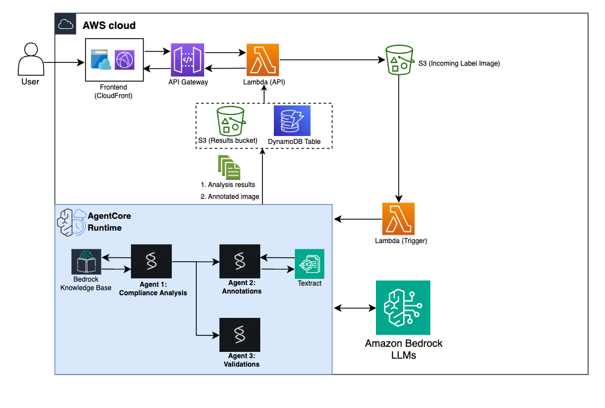
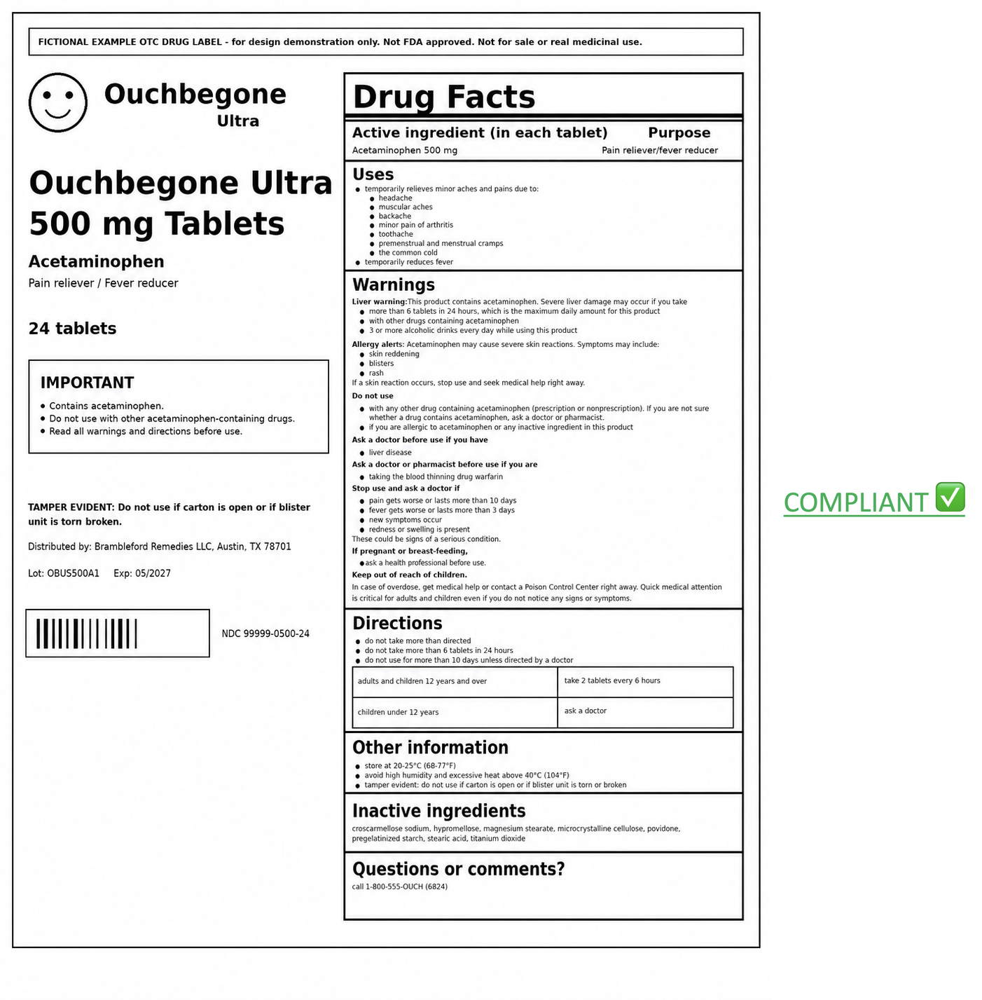
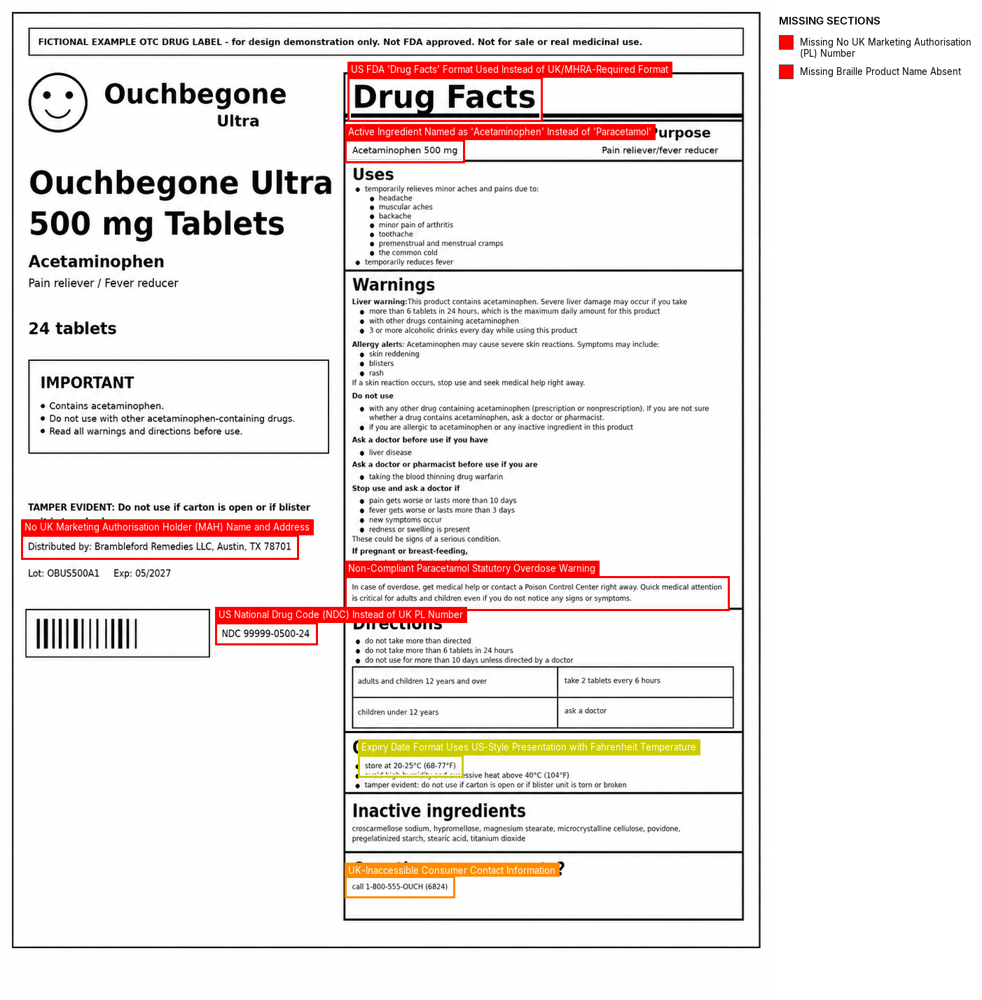
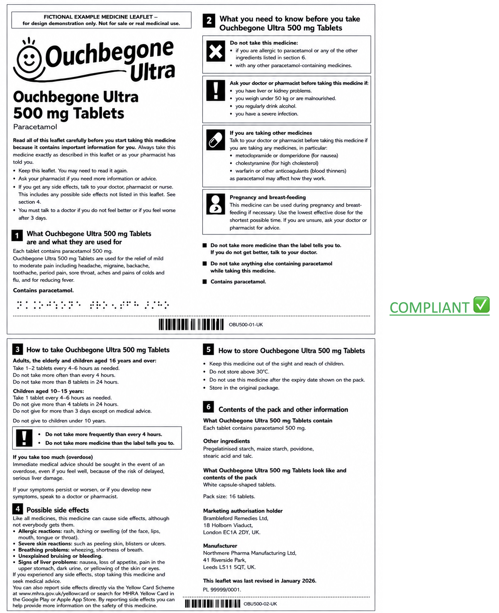
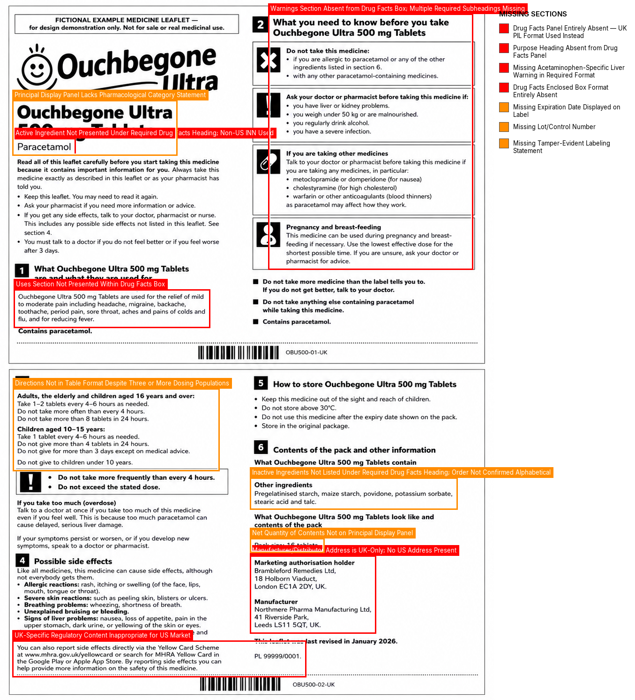

# Agentic Compliance Lab

An AI-powered medicine label compliance analysis system built on AWS. Upload an OTC medicine label image, and a multi-agent pipeline automatically analyzes it against FDA or MHRA regulatory requirements, visually annotates violations, validates the results, and produces a compliance report.

## Architecture



## How It Works

1. **Upload** a medicine label image through the web dashboard.
2. **Agent 1 (Compliance Analysis)** reads the label image using Claude Sonnet's vision capabilities, retrieves relevant regulations from a Bedrock Knowledge Base using RAG, and produces a structured compliance report with violations categorized by severity.
3. **Agent 2 (Visual Annotation)** maps each violation to the label image by drawing colored bounding boxes on existing content issues and listing missing sections in a sidebar panel. It uses Amazon Textract coordinates for precise placement.
4. **Agent 3 (Validation)** uses Claude's vision capabilities to verify that every violation has a corresponding annotation and no false positives exist. If validation fails, Agent 2 re-annotates using specific feedback from the validator.
5. **View results** in the dashboard: annotated image, violation list, compliance score, and exportable PDF report.

The pipeline retries up to 3 times if validation rejects the annotated image. If no attempt is fully approved, the best attempt (the one with the fewest issues) is selected as the final output.

## Prerequisites

- **AWS CLI** configured with credentials that have admin-level permissions
- **AWS CDK v2** installed globally: `npm install -g aws-cdk`
- **Python 3.12+**
- **Bedrock model access** enabled in your AWS account for the following models:
  - Anthropic Claude Sonnet 4 (`us.anthropic.claude-sonnet-4-6`) - used by Agent 1 for compliance analysis
  - Anthropic Claude Opus 4 (`us.anthropic.claude-opus-4-7`) - used by Agents 2 and 3 for annotation and validation
  - Amazon Titan Text Embeddings V2 (`amazon.titan-embed-text-v2:0`) - used by the Knowledge Base for document embeddings

> To enable model access, go to the [Amazon Bedrock console](https://console.aws.amazon.com/bedrock/), navigate to Model access, and request access for the models listed above.

## Deployment

```bash
# Create and activate a virtual environment
python3 -m venv .venv
source .venv/bin/activate

# Install CDK dependencies
pip install -r requirements.txt

# Install agent runtime dependencies
pip install -r agent_runtime_requirements.txt -t agent_package

# Install custom resource dependencies
pip install -r custom_resources/runtime_resource_policy/requirements.txt -t custom_resources/runtime_resource_policy
pip install -r custom_resources/aoss_index_creator/requirements.txt -t custom_resources/aoss_index_creator

# Bootstrap CDK (first time only, per account/region)
cdk bootstrap

# Deploy the stack
cdk deploy
```

Deployment takes approximately 10-15 minutes. When complete, CDK outputs:

- **FrontendUrl**: The CloudFront URL for the web dashboard
- **ApiEndpoint**: The API Gateway endpoint (auto-configured in the frontend)

## Usage

1. Open the **FrontendUrl** in your browser.
2. Click **New Analysis** to create a project. Give it a name and select a regulatory region (US FDA or UK MHRA).
3. Upload a medicine label image (JPG or PNG, max 10 MB).
4. Review the preview and click **Start Analysis**.
5. Watch the pipeline progress through its stages (typically 5-10 minutes).
6. View results: annotated image, violation list with severity levels, and compliance score.
7. Export a PDF report or download the annotated image.

### Managing Knowledge Base Documents

Go to **Settings > Knowledge Base Documents** to:
- View documents currently in the knowledge base for each region
- Upload additional regulatory documents (PDF, DOC, DOCX, TXT)
- Delete documents (changes are synced to the knowledge base automatically)

### Re-evaluating a Label

From a completed project, click **Re-upload Label** to run a new analysis. All evaluations are saved in the project history, and you can compare any two evaluations side-by-side.

## Project Structure

```
├── cdk_stack/
│   └── medicine_label_stack.py         # CDK infrastructure (all AWS resources)
├── agent_package/                      # Bedrock AgentCore runtime code
│   ├── orchestrator.py                 # Pipeline orchestrator (entrypoint)
│   ├── agent1_compliance.py            # Compliance analysis agent
│   ├── agent2_annotation.py            # Visual annotation agent
│   ├── agent3_validation.py            # Validation agent
│   └── steering_hooks.py               # Strands plugins for tool ordering and structure validation
├── lambda_functions/
│   ├── frontend_api/                   # Upload, status polling, project CRUD
│   ├── document_management/            # KB document upload, delete, download, sync
│   └── trigger/                        # S3 event triggers AgentCore invocation
├── custom_resources/
│   ├── runtime_resource_policy/        # Sets resource policy on AgentCore runtime
│   └── aoss_index_creator/             # Creates vector index in OpenSearch Serverless
├── frontend/                           # Static web frontend (served via CloudFront)
├── kb_documents/                       # Seed regulatory documents (FDA + MHRA)
├── app.py                              # CDK app entrypoint
└── requirements.txt                    # CDK Python dependencies
```

## Supported Regulatory Regions

| Region | Regulation | Coverage | Source |
|--------|-----------|----------|--------|
| US | FDA 21 CFR Part 201 | Drug Facts panel, active/inactive ingredients, warnings, directions, dosage, marketing claims | [FDA Guidance Documents](https://www.fda.gov/regulatory-information/search-fda-guidance-documents) |
| UK | MHRA Human Medicines Regulations 2012 | Patient information leaflet, product characteristics, labeling requirements | [PAGB Packaging Code](https://www.pagb.co.uk/advice-guidance/packaging-code-for-medicines/) |

The regulatory documents are stored in the `kb_documents/` directory (2 documents for US FDA, 1 for UK MHRA) and are automatically uploaded to the Bedrock Knowledge Base during deployment.

## Cleanup

```bash
cdk destroy
```

This fully deletes all deployed resources.

## Example Results

The `example_cases/` folder contains annotated output from the pipeline, demonstrating how the system behaves when a label is evaluated against its own region versus a foreign regulatory framework.

> **Note:** The labels used in these examples are artificially generated fictional products created for demonstration purposes only. They do not represent real medicines.

> **Note:** Results are generated by AI and may vary between runs. The specific violations flagged, severity ratings, and annotation placements can differ each time the pipeline is executed.

### FDA-Compliant Label

| Evaluated Against US FDA (✅ Compliant) | Evaluated Against UK MHRA (❌ Violations) |
|:---:|:---:|
|  |  |

### MHRA-Compliant Label

| Evaluated Against UK MHRA (✅ Compliant) | Evaluated Against US FDA (❌ Violations) |
|:---:|:---:|
|  |  |

These examples illustrate that a label fully compliant in one jurisdiction will typically fail in another due to differing structural requirements (e.g., FDA's Drug Facts panel format vs. MHRA's Patient Information Leaflet expectations).
