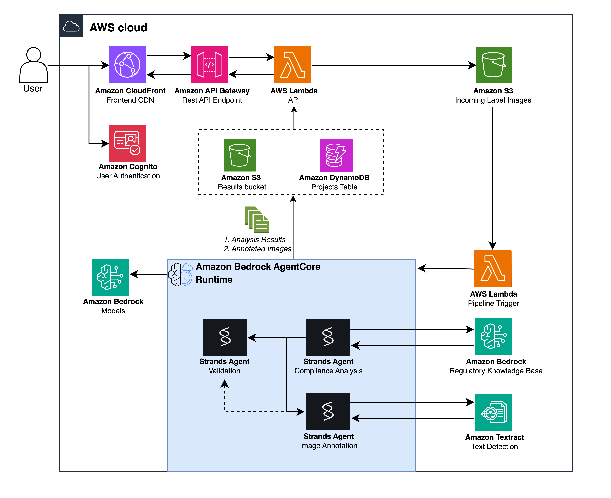
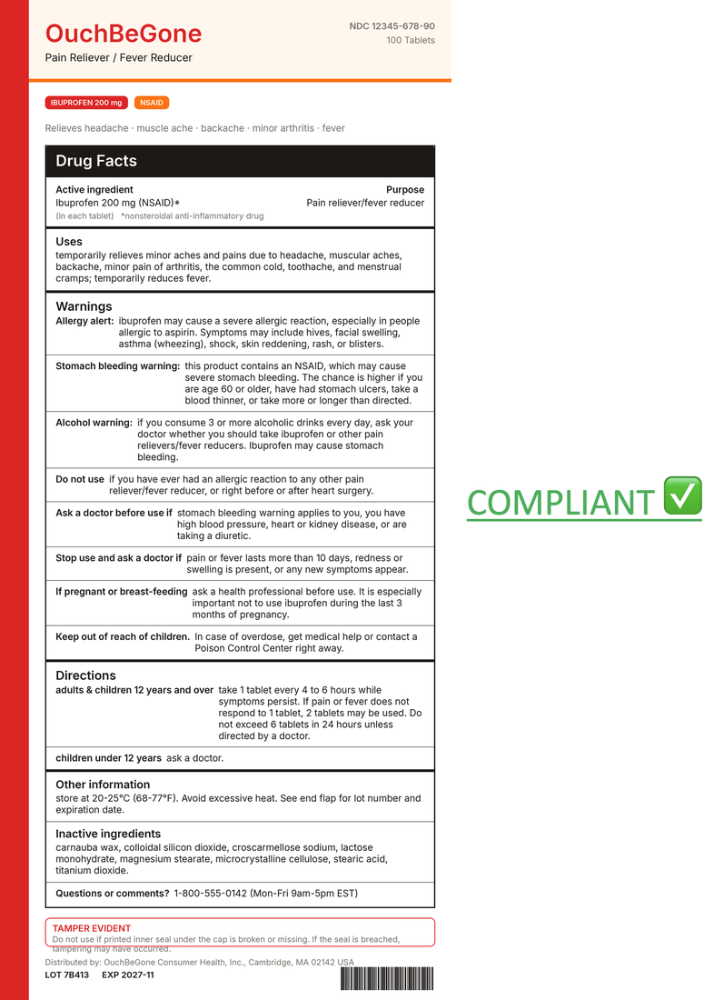
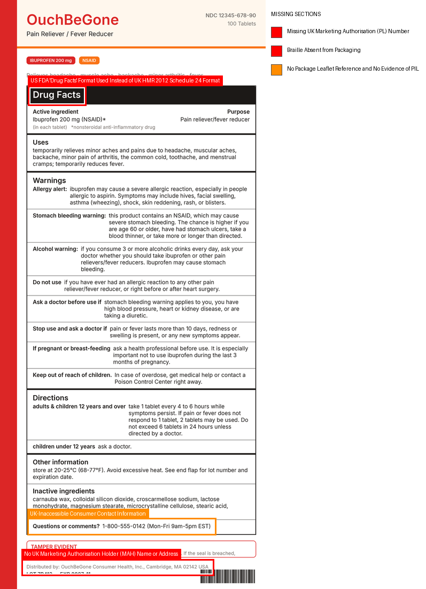
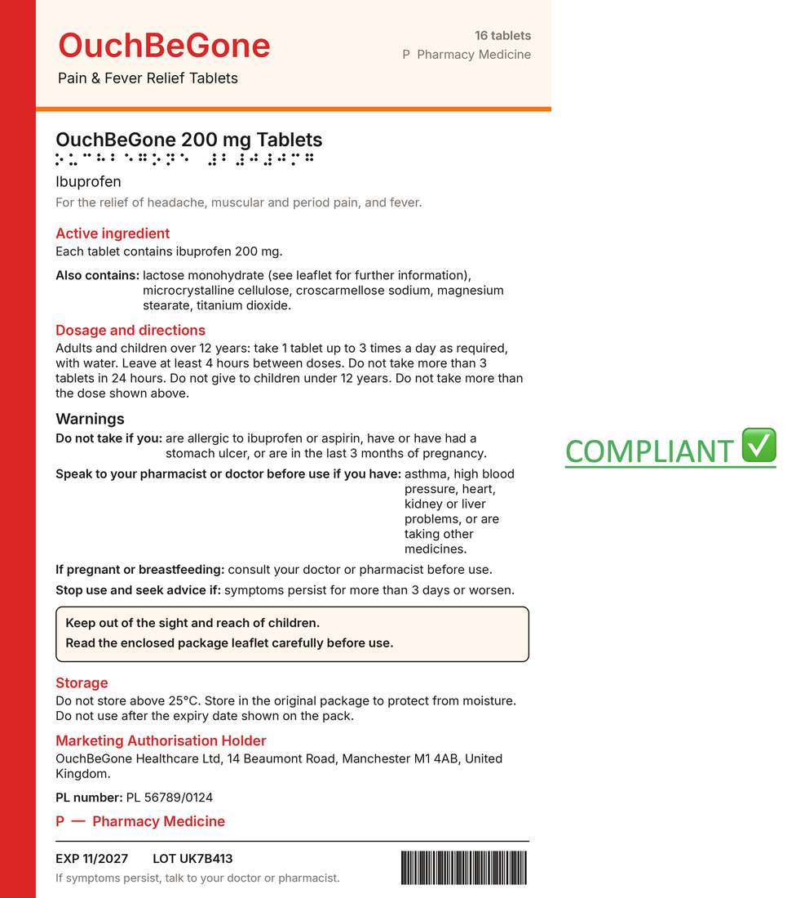
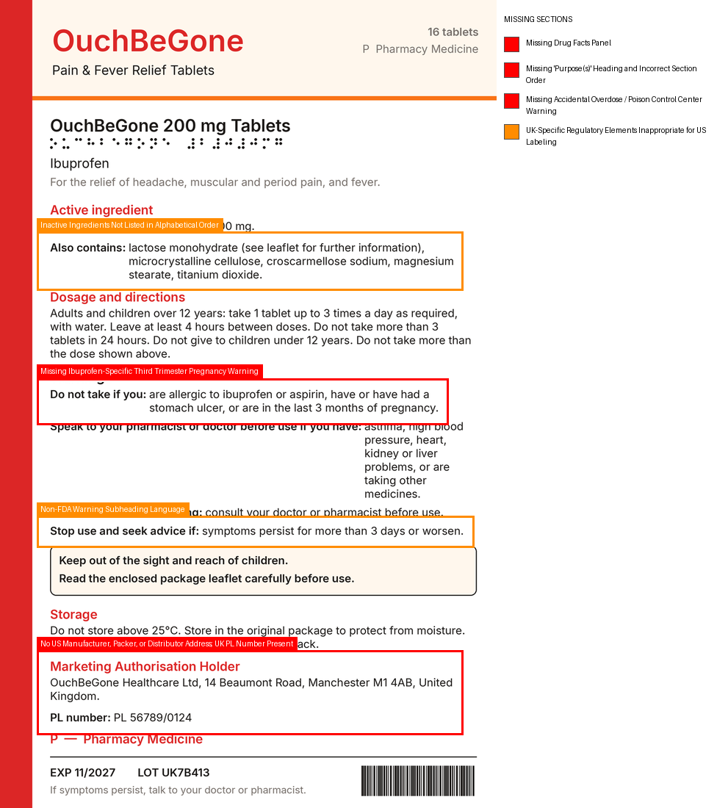

# PharmaLabel: Pharmaceutical Label Compliance Agent

An AI-powered medicine label compliance analysis system built on Amazon Web Services (AWS). Upload an over-the-counter (OTC) medicine label image, and a multi-agent pipeline automatically analyzes it against U.S. Food and Drug Administration (FDA) or UK Medicines and Healthcare products Regulatory Agency (MHRA) regulatory requirements, visually annotates violations, validates the results, and produces a compliance report.

## Introduction

Pharmaceutical companies must verify that OTC medicine labels comply with regional regulatory requirements such as FDA 21 CFR (Code of Federal Regulations) Part 201 in the United States or MHRA Human Medicines Regulations 2012 in the United Kingdom. Manual compliance review is time-consuming and error-prone.

This solution demonstrates how to build an automated compliance analysis system using Amazon Bedrock, a fully managed service for building generative AI applications. The system uses Amazon Bedrock (including Amazon Bedrock AgentCore and Knowledge Bases features) and vision-capable foundation models (large, pre-trained AI models that can be adapted to many tasks) to analyze medicine label images, identify regulatory violations, and generate annotated reports with visual annotations mapped to specific label regions.

## Disclaimer

This content is provided for demonstration and educational purposes only as a public code sample. It has not undergone a production security review and should not be deployed to production environments without additional security testing and hardening appropriate to your use case.

This solution analyzes medicine labels against regulatory requirements for illustrative purposes only. It does not guarantee, certify, or ensure compliance with FDA, MHRA, or any other regulation or standard. Compliance results are AI-generated, may be inaccurate or inconsistent between runs, and must be independently validated by qualified regulatory professionals.

## Architecture



## Security

This solution follows AWS Lambda best practices by using AWS Identity and Access Management (IAM) roles for authentication rather than storing credentials in environment variables. AWS Lambda environment variables contain only resource identifiers (bucket names, table names, Amazon CloudFront URLs), with no secrets, application programming interface (API) keys, or passwords. All service-to-service authentication is handled through IAM roles with least-privilege policies.

User access to the API is gated by **Amazon Cognito**: every Amazon API Gateway route requires a valid Cognito JSON Web Token (JWT), obtained through the OAuth 2.0 Authorization Code flow with Proof Key for Code Exchange (PKCE) via the Cognito Hosted user interface (UI), so the API rejects unauthenticated callers. Self sign-up is disabled and the only user is created from the `admin_email` provided at deploy time; credentials are delivered by email and never stored in the repository.

## How It Works

1. **Upload** a medicine label image through the web dashboard.
2. **Agent 1 (Compliance Analysis)** reads the label image using the Anthropic Claude Sonnet foundation model through Amazon Bedrock with vision capabilities, retrieves relevant regulations from a knowledge base in Amazon Bedrock using Retrieval-Augmented Generation (RAG), a technique that supplies the model with relevant external documents at query time, and produces a structured compliance report with violations categorized by severity.
3. **Agent 2 (Visual Annotation)** maps each violation to the label image by drawing colored bounding boxes on existing content issues and listing missing sections in a sidebar panel. It uses Amazon Textract coordinates for precise placement.
4. **Agent 3 (Validation)** uses the Claude model's vision capabilities through Amazon Bedrock to verify that every violation has a corresponding annotation and no false positives exist. If validation fails, Agent 2 re-annotates using specific feedback from the validator.
5. **View results** in the dashboard: annotated image, violation list, and compliance score.

The pipeline retries up to 3 times if validation rejects the annotated image. If no attempt is fully approved, the best attempt (the one with the fewest issues) is selected as the final output.

## Prerequisites

- **AWS Command Line Interface (AWS CLI)** configured with credentials that have admin-level permissions
- **AWS Cloud Development Kit (AWS CDK) v2** installed globally: `npm install -g aws-cdk`
- **Python 3.12+**
- **Amazon Bedrock model access** enabled in your AWS account for the following models:
  - Anthropic Claude Sonnet 4.6 (`anthropic.claude-sonnet-4-6`) - used by Agent 1 for compliance analysis
  - Anthropic Claude Opus 4.7 (`anthropic.claude-opus-4-7`) - used by Agents 2 and 3 for annotation and validation
  - Amazon Titan Text Embeddings V2 model from the Amazon Titan family (`amazon.titan-embed-text-v2:0`) available through Amazon Bedrock - used for document embeddings in the knowledge base

> To enable model access, go to the [Amazon Bedrock console](https://console.aws.amazon.com/bedrock/), navigate to Model access, and request access for the models listed above. Note: The deployment uses cross-region inference profiles (`us.anthropic.claude-*`) which route requests to available capacity within the US region.

## Deployment

> **Cost Notice:** This solution deploys AWS resources that incur charges, including AWS Lambda functions, Amazon DynamoDB tables, Amazon S3 storage, Amazon CloudFront distributions, Amazon Bedrock model usage, and Amazon OpenSearch Serverless. Review the [AWS Pricing Calculator](https://calculator.aws/#/) to estimate costs for your usage.

> **Region:** The stack deploys to `us-east-1` by default. The agents use US cross-region inference profiles (`us.anthropic.claude-*`) which require a US region.

```bash
# Create a virtual environment
python -m venv .venv
# Activate the virtual environment
source .venv/bin/activate

# Install CDK dependencies
pip install -r requirements.txt

# Install agent runtime dependencies (cross-compiled for Linux ARM64)
pip install \
  --platform manylinux2014_aarch64 \
  --implementation cp \
  --python-version 3.12 \
  --only-binary=:all: \
  --target agent_package/ \
  -r agent_runtime_requirements.txt

# Install custom resource dependencies
pip install -r custom_resources/runtime_resource_policy/requirements.txt -t custom_resources/runtime_resource_policy
pip install -r custom_resources/aoss_index_creator/requirements.txt -t custom_resources/aoss_index_creator

# Bootstrap CDK (first time only, per account/region)
cdk bootstrap

# Deploy the stack.
# An admin email is REQUIRED: the app is protected by Amazon Cognito, and this
# address becomes the initial (and only) user. Cognito emails it a temporary
# password. Deployment fails fast if no valid email is provided.
cdk deploy -c admin_email=you@example.com
```

> **Note:** The `--platform manylinux2014_aarch64` flag is designed to download native dependencies (like Pillow) as pre-built Linux ARM64 binaries, regardless of the local machine's OS or architecture. This works on macOS (Intel/Apple Silicon), Windows, and Linux x86/ARM.

Deployment takes approximately 10-15 minutes. Verify deployment by confirming the stack status:

```bash
aws cloudformation describe-stacks --stack-name PharmaLabelStack --query "Stacks[0].StackStatus"
```

The output should be `"CREATE_COMPLETE"`.

### Authentication (required)

Access to the app is gated by **Amazon Cognito**: the API rejects any
unauthenticated request, so only your provisioned user can use the solution.

- The `admin_email` you pass to `cdk deploy` is the **only** user. Self sign-up is
  disabled, so no one else can register.
- **Deployment will not proceed without a valid `admin_email`**. There is no
  unauthenticated deployment path.
- After deployment, Cognito sends a **temporary password** to that email
  (subject similar to "Your temporary password"). Check spam if it doesn't
  arrive within a few minutes.
- On first visit you'll be redirected to the AWS-hosted login page. Sign in with
  your email and the temporary password; you'll be prompted to set a permanent
  password. Multi-factor authentication (MFA) is optional (deployers may make it required in the stack).
- No credentials are stored in this repository; they are generated per
  deployment and delivered to your email.

> **Email delivery note:** By default the user pool uses Cognito's built-in
> email (low daily send quota), which is sufficient for the single demo user.
> For higher volume, configure Amazon Simple Email Service (Amazon SES) on the user pool.

### Monitoring alerts (one-time confirmation)

The stack provisions Amazon CloudWatch alarms (AWS Lambda errors and the
asynchronous dead-letter queue, a holding queue for messages that fail
processing) that notify an Amazon Simple Notification Service (Amazon SNS)
topic, and subscribes the same `admin_email` as the alarm owner. After
deployment, that address receives a **"Subscription Confirmation"** email from
Amazon SNS. **Click the confirmation link once** to start receiving alarm
notifications. Until confirmed, alarms still fire in Amazon CloudWatch but no
email is delivered.

So a first deployment sends **two** emails to `admin_email`: the Cognito
temporary password and the SNS subscription confirmation.

## Usage

1. Copy the **FrontendUrl** from the deployment output.
2. In a browser, navigate to the **FrontendUrl**. You'll be redirected to the Cognito login page. Sign in with your email and the temporary password from your inbox (you'll set a permanent password on first login).
3. Choose **New Analysis**.
4. Enter a project name.
5. Select a regulatory region (US FDA or UK MHRA).
6. Choose **Create Project**.
7. Upload a medicine label image (JPG or PNG).
8. Review the preview image.
9. Verify the file information is correct.
10. Choose **Start Analysis**.
11. Watch the pipeline progress through its stages (typically 5-10 minutes).
12. View the annotated image.
13. Review the violation list with severity levels.
14. Check the compliance score.
15. (Optional) Download the annotated image.

### Managing Knowledge Base Documents

Go to **Settings > Knowledge Base Documents** to:
- View documents currently in the knowledge base for each region
- Upload additional regulatory documents (PDF, DOC, DOCX, TXT)
- Delete documents (changes are synced to the knowledge base automatically)

### Re-evaluating a Label

From a completed project, choose **Re-upload Label** to run a new analysis. All evaluations are saved in the project history, and you can compare any two evaluations side-by-side.

## Project Structure

```
├── cdk_stack/
│   └── pharmalabel_stack.py            # CDK infrastructure (all AWS resources)
├── agent_package/                      # AgentCore Runtime code
│   ├── orchestrator.py                 # Pipeline orchestrator (entrypoint)
│   ├── agent1_compliance.py            # Compliance analysis agent
│   ├── agent2_annotation.py            # Visual annotation agent
│   ├── agent3_validation.py            # Validation agent
│   └── steering_hooks.py               # Strands plugins for tool ordering and structure validation
├── lambda_functions/
│   ├── frontend_api/                   # Upload, status polling, project create/read/update/delete (CRUD)
│   ├── document_management/            # Knowledge base document upload, delete, download, sync
│   └── trigger/                        # Amazon S3 event triggers Amazon Bedrock AgentCore Runtime invocation
├── custom_resources/
│   ├── runtime_resource_policy/        # Sets resource policy on Amazon Bedrock AgentCore runtime
│   └── aoss_index_creator/             # Creates vector index in Amazon OpenSearch Serverless
├── frontend/                           # Static web frontend (served via Amazon CloudFront)
├── kb_documents/                       # Seed regulatory documents (FDA + MHRA)
├── app.py                              # CDK app entrypoint
└── requirements.txt                    # CDK Python dependencies
```

## Supported Regulatory Regions

| Region | Regulation | Coverage | Source |
|--------|-----------|----------|--------|
| US | FDA 21 CFR Part 201 | Drug Facts panel, active/inactive ingredients, warnings, directions, dosage, marketing claims | [FDA Guidance Documents](https://www.fda.gov/regulatory-information/search-fda-guidance-documents) |
| UK | MHRA Human Medicines Regulations 2012 | Patient information leaflet, product characteristics, labeling requirements | [Proprietary Association of Great Britain (PAGB) Packaging Code](https://www.pagb.co.uk/advice-guidance/packaging-code-for-medicines/) |

The regulatory documents are stored in the `kb_documents/` directory (2 documents for US FDA, 1 for UK MHRA) and are automatically uploaded to the knowledge base during deployment.

## Testing

The project includes a comprehensive test suite covering unit tests, integration tests (with moto for AWS service simulation), and CDK infrastructure assertions.

```bash
# Create a virtual environment (if not already done)
python -m venv .venv
# Activate the virtual environment (if not already done)
source .venv/bin/activate

# Install test dependencies
pip install -r tests/requirements-test.txt

# Run all tests
pytest tests/
```

### What the tests cover

- **Steering hooks:** verifies that the behavioral guardrails (tool ordering, data structure validation, status consistency) correctly block or allow tool calls
- **Orchestrator:** tests the retry state machine, Amazon S3 key extraction, best-attempt selection, and error wrapping
- **AWS Lambda handlers:** validates request routing, input validation, presigned URL generation, CRUD operations, and cross-origin resource sharing (CORS) handling
- **Agent tools:** tests image annotation drawing, Amazon Textract coordinate conversion, and text wrapping
- **CDK stack:** asserts correct resource counts, DynamoDB key schema, AWS Lambda architectures, and security configurations

## Cleanup

> **Warning:** Running `cdk destroy` will permanently delete all data including uploaded medicine labels, project records, and custom regulatory documents. Export any data you need to retain before proceeding.

To remove all deployed resources:

```bash
cdk destroy -c admin_email=you@example.com
```

> **Note:** The `-c admin_email=...` context flag is required for `cdk destroy` (and any other cdk command, such as `cdk diff` or `cdk synth`), not just `cdk deploy`. The CDK app synthesizes the stack on every command and fails fast if a valid `admin_email` is not provided. The value is only used to look up the existing stack during a destroy, so any valid email works.

Running `cdk destroy` will remove the following AWS resources: AWS Lambda functions (frontend API, document management, trigger, and custom resource handlers for OpenSearch index creation, AgentCore runtime resource policy, and knowledge base ingestion), Amazon DynamoDB table (projects), Amazon S3 buckets (incoming labels, processed results, knowledge base, frontend hosting, access logs), Amazon CloudFront distributions, Amazon Cognito user pool (including the admin user), Amazon OpenSearch Serverless collection, Amazon Bedrock knowledge base, AgentCore Runtime, API Gateway HTTP API, the monitoring resources (Amazon SNS alarm topic, Amazon Simple Queue Service (Amazon SQS) dead-letter queue, and Amazon CloudWatch alarms), and all associated IAM roles and policies.

## Example Results

The `example_cases/` folder contains annotated output from the pipeline, demonstrating how the system behaves when a label is evaluated against its own region versus a foreign regulatory framework.

> **Note:** The labels used in these examples are artificially generated fictional products created for demonstration purposes only. They do not represent real medicines.

> **Note:** Results are generated by AI and may vary between runs. The specific violations flagged, severity ratings, and annotation placements can differ each time the pipeline is executed.

### FDA-Compliant Label

| Evaluated Against US FDA (✅ Compliant) | Evaluated Against UK MHRA (❌ Violations) |
|:---:|:---:|
|  |  |

### MHRA-Compliant Label

| Evaluated Against UK MHRA (✅ Compliant) | Evaluated Against US FDA (❌ Violations) |
|:---:|:---:|
|  |  |

These examples illustrate that a label fully compliant in one jurisdiction will typically fail in another due to differing structural requirements (e.g., FDA's Drug Facts panel format vs. MHRA's Patient Information Leaflet expectations).

## Conclusion

This solution demonstrates how to build an AI-powered regulatory compliance system using Amazon Bedrock AgentCore with vision capabilities. The multi-agent architecture combines compliance analysis, visual annotation, and validation to produce accurate, actionable reports.

Key benefits include:

- Automated compliance checking against FDA and MHRA regulations
- Visual annotations that map violations to specific label regions
- Validation loop that helps verify annotation accuracy

To extend this solution, consider adding support for additional regulatory regions, integrating with document management systems, or building approval workflows for compliance teams.

## License

This library is licensed under the MIT-0 License. See the [LICENSE](LICENSE) file.
