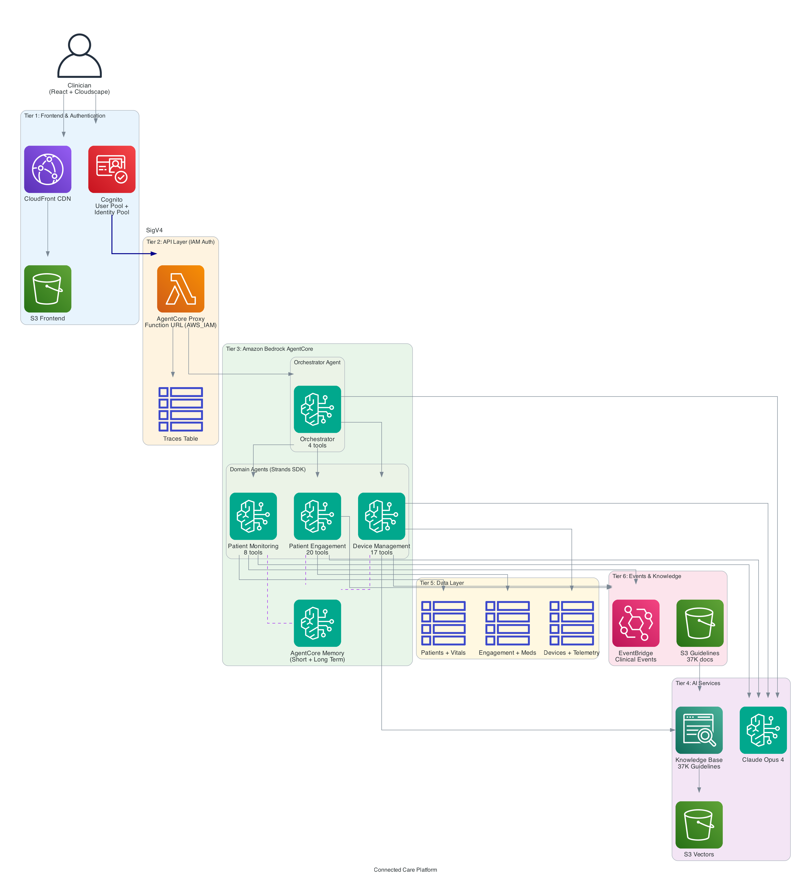

# Connected Care Platform

A multi-agent clinical decision support system built on Amazon Bedrock AgentCore. The platform demonstrates how AI agents can subtly integrate into existing hospital workflows — augmenting clinical decision-making without replacing the systems clinicians already use.

The core idea: hospitals define clinical decision workflows based on their requirements. When a workflow needs new capabilities, new tools and data sources are added to the appropriate domain agent. The agents, orchestration, and workflows are designed to embed into existing EHR and hospital systems as an intelligence layer.



## How It Works

The system is organized in layers:

- **Presentation Layer** — A React + Cloudscape demo UI for interacting with the agents. In production, this layer would be replaced by SMART on FHIR widgets embedded in the hospital's EHR, ambient EHR alerts, or voice interfaces. The UI exists purely for demonstration.

- **Orchestration Layer** — The Orchestrator Agent is the heart of the system. It receives queries, determines intent, selects the appropriate clinical decision workflow, and coordinates multi-step execution across domain agents. For single-domain queries, it routes directly to the right agent.

- **Domain Agents** — Three specialized worker agents, each owning a clinical domain:
  - **Patient Monitoring Agent** (10 tools) — Vitals, trends, deterioration detection, alert triage
  - **Device Management Agent** (18 tools) — Fleet health, smart beds, telemetry, clinical guidelines KB
  - **Patient Engagement Agent** (20 tools) — Medications, appointments, care coordination, nurse workload

- **Tool & Aggregation Layer** — Each agent's tools are Python functions that query, aggregate, and reason over data from multiple sources. Tools are purely additive — new features mean new tools, never modifying existing ones.

- **Data Layer** — DynamoDB tables holding patient records, device telemetry, medications, appointments, and more. In production, these would be replaced or supplemented by connections to EHR systems (Epic, Cerner via FHIR R4), IoT device streams, pharmacy systems, and other hospital data sources.

## Clinical Decision Workflows

The platform ships with twelve clinical decision workflows. Cross-module workflows coordinate multiple domain agents in a defined sequence. Single-agent workflows route to the appropriate specialist agent.

**WF-01: Fall Detection & Root Cause Investigation**
When a patient fall is detected, this workflow confirms the event using sensor data, retrieves device diagnostics to rule out false positives, analyzes the patient's pre-fall clinical context (vitals, medications, orthostatic risk), and initiates the care response protocol including care team notification and incident documentation.

**WF-02: Medication-Device-Vitals Correlation**
When a vital sign anomaly is observed, this workflow determines whether the cause is a medication side effect, a device malfunction, or an independent clinical event. It characterizes the anomaly, cross-references recent medication changes and known side effects, verifies device accuracy, and delivers a correlation report to the prescribing physician.

**WF-03: Patient Deterioration Cascade**
When an early warning score triggers, this workflow validates that the deterioration signal is real (not a device artifact), assembles the full clinical context for a rapid response briefing, and activates the rapid response protocol — paging the care team, pre-ordering labs, and notifying family per patient preferences.

**WF-04: Device Failure Patient Impact Assessment**
When a monitoring device fails, this workflow identifies all patients dependent on that device, assesses the clinical risk of the monitoring gap for each patient, locates and evaluates replacement devices, and notifies care teams with per-patient risk assessments and replacement logistics.

**WF-05: Post-Discharge Remote Monitoring Activation**
When a patient is discharged, this workflow retrieves the discharge plan, provisions and configures appropriate home monitoring devices, activates personalized alert thresholds based on the patient's conditions, and onboards the patient with training materials and caregiver access via their preferred communication channel.

**WF-06: Vital Sign Early Warning**
Detects subtle vital sign trends that individually look normal but collectively indicate a patient heading toward a critical event. Catches slowly declining patients 30-60 minutes before traditional threshold alerts would fire.

**WF-07: Predictive Maintenance**
Predicts which devices are likely to fail in the coming 7, 14, or 30 days based on telemetry patterns, usage hours, and maintenance history. Prioritizes maintenance scheduling by patient dependency and clinical risk.

**WF-08: Appointment No-Show Prediction**
Evaluates upcoming appointments for no-show risk based on patient history, communication patterns, and engagement signals. Triggers proactive outreach for high-risk patients to reduce missed appointments.

**WF-09: Bed Exit Fall Risk Assessment**
When a smart bed detects a patient getting up, this workflow correlates current vitals, recent medications, and time of day to assess fall risk in real time — shifting from reactive investigation after a fall to proactive intervention before one happens.

**WF-10: Pressure Injury Prevention**
Monitors smart bed pressure sensors to detect when patients have not been repositioned on schedule. Escalates based on Braden score, active pressure zones, and comorbidities. Pressure injuries are CMS "never events" — automated tracking replaces paper-based turning schedules.

**WF-12: Alert Triage & Fatigue Management**
Intercepts every alert before it reaches a nurse. Suppresses device noise and repeat threshold breaches, bundles related alerts, and escalates critical findings. Reduces alert volume by 60-80% while ensuring critical alerts are never suppressed.

**WF-13: Nurse Workload Query**
Gives nurses and charge nurses real-time visibility into alert load, suppressed alerts, team workload distribution, and cognitive load scores. Identifies overloaded nurses before burnout affects patient care.

## Tech Stack

| Component | Technology |
|-----------|-----------|
| Agent Framework | [Strands Agents SDK](https://github.com/strands-agents/sdk-python) (Python) |
| Agent Runtime | Amazon Bedrock AgentCore Runtime (serverless, session-isolated) |
| Reasoning Model | Claude Sonnet 4 (domain agents), Claude Opus 4 (orchestrator) |
| Agent Memory | Amazon Bedrock AgentCore Memory (summaries, preferences, semantic facts) |
| Observability | Amazon Bedrock AgentCore Observability (step-level execution tracing) |
| Knowledge Base | Amazon Bedrock Knowledge Base + S3 Vectors (37K clinical guidelines) |
| Data | Amazon DynamoDB (13 tables, PAY_PER_REQUEST) |
| Events | Amazon EventBridge |
| Auth | Amazon Cognito User Pool + Identity Pool → IAM SigV4 |
| API | AWS Lambda Function URL (authType: AWS_IAM) |
| Frontend | React 18 + TypeScript + Cloudscape Design System (demo only) |
| Voice | Amazon Nova Sonic (real-time bidirectional), Alexa Skills Kit (optional) |
| Hosting | Amazon CloudFront + S3 |
| IaC | AWS CDK (TypeScript), 5 stacks |

## Deployment

### Prerequisites

- AWS account with Bedrock model access enabled for Claude and Titan Embed V2 in your target region
- Node.js 18+, Python 3.12+, Docker running, AWS CLI configured
- CDK bootstrapped: `cdk bootstrap aws://ACCOUNT_ID/REGION`

### Deploy

```bash
git clone <repo-url>
cd connected-care-platform
pip install bedrock-agentcore boto3
./scripts/deploy.sh
```

### Custom Prefix & Region

All resources are named with a configurable prefix (default: `connected-care`):

```bash
./scripts/deploy.sh --prefix=acme-health --region=us-west-2 --full
```

This creates resources like `acme-health-patients`, `acme-health-agent-api`, etc. Multiple isolated deployments can coexist in the same account using different prefixes.

See **[DEPLOYMENT.md](DEPLOYMENT.md)** for full configuration options, multi-environment setup, and troubleshooting.

### What Gets Created

| Stack | Resources |
|-------|-----------|
| PatientMonitoringAgentStack | DynamoDB (patients, vitals), EventBridge bus, S3 frontend bucket, seed Lambda |
| DeviceManagementAgentStack | DynamoDB (devices, telemetry, assignments, work orders), seed Lambda |
| PatientEngagementAgentStack | DynamoDB (engagement profiles, medications, appointments, adherence, communications, care plans), seed Lambda |
| OrchestratorAgentStack | WebSocket API, connections table |
| ConnectedCareAgentCoreStack | 4 AgentCore Runtimes, Lambda Function URL, Cognito auth, CloudFront, traces table, nurse tables |

### Cleanup

```bash
cd infrastructure && npx cdk destroy --all --force
python scripts/utils/reset-memory.py          # Delete AgentCore Memory
# Delete Knowledge Base manually via Bedrock console if created
```

## Test Queries

**Single-agent queries** (routed by the orchestrator to the right agent):
- "List all patients and their risk levels"
- "Show vitals for patient P-10001"
- "What is the fleet health summary?"
- "Show medications for patient P-10001"

**Cross-module workflows** (orchestrator coordinates multiple agents):
- "Patient P-10001 experienced a fall in ICU-412. Investigate the root cause." (WF-01)
- "Patient P-10001 has an anomalous blood pressure reading. Is it medication, device, or clinical?" (WF-02)
- "Patient P-10001 is deteriorating. Activate the deterioration cascade." (WF-03)
- "Device D-4001 has failed in ICU-412. What's the patient impact?" (WF-04)
- "Discharge patient P-10004 and set up remote monitoring." (WF-05)
- "What is the current fall risk for patient P-10001?" (WF-09)
- "Which patients need repositioning right now?" (WF-10)
- "How many alerts were suppressed in the last hour?" (WF-12)
- "What is the alert load for Maria Santos?" (WF-13)

## Project Structure

```
connected-care-platform/
  agents/
    patient-monitoring/        # 10 tools — vitals, trends, deterioration, alert triage
    device-management/         # 18 tools — fleet, telemetry, smart beds, KB search
    patient-engagement/        # 20 tools — meds, appointments, nurse workload
    orchestrator/              # 5 tools — invokes domain agents, executes workflows
      workflows/               # Clinical decision workflow definitions (WF-01 through WF-05)
    shared/                    # Memory helper, tracing utilities
  agentcore-proxy/             # Lambda Function URL handler (IAM auth, traces, voice summarization)
  alexa-skill/                 # Alexa voice interface (optional)
  nova-sonic-server/           # Amazon Nova Sonic real-time voice server
  frontend/                    # React + Cloudscape demo UI
  infrastructure/              # CDK stacks (TypeScript)
  scripts/
    deploy.sh                  # One-command deployment
    setup/                     # Memory, Knowledge Base, guidelines download
    seed/                      # Demo data seeding
    utils/                     # Memory management, architecture diagram generation
```

## Seed Data

The platform ships with synthetic data for 5 patients and 20 devices across ICU and floor rooms:

| Patient | Room | Conditions | Risk |
|---------|------|-----------|------|
| P-10001 Margaret Chen | ICU-412 | CHF, Type 2 Diabetes, CKD Stage 3 | Critical |
| P-10002 James Rodriguez | Floor3-308 | Hypertension, Post-CABG | Moderate |
| P-10003 Aisha Patel | Floor2-215 | Type 1 Diabetes, Asthma | Moderate |
| P-10004 Robert Kim | Floor1-102 | Appendectomy Recovery | Stable |
| P-10005 Linda Okafor | Floor1-118 | Mild Pneumonia | Stable |
