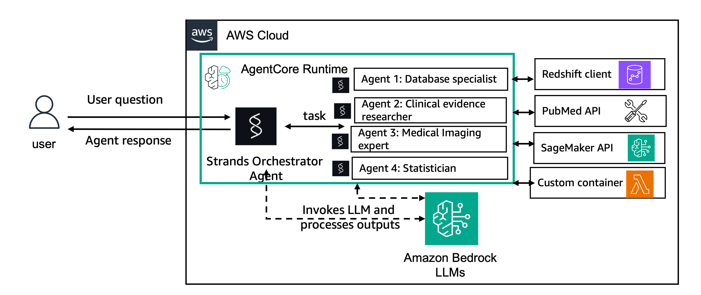

# Cancer Biomarker Discovery with Strands Agents And Bedrock AgentCore

This implementation demonstrates how to replicate the cancer biomarker discovery multi-agent system using Strands agents and deployment with Amazon Bedrock AgentCore.

## Architecture Overview



## Specialized Agents

### 1. Biomarker Database Analyst
- **Tools**: `get_database_schema`, `query_biomarker_database`, `refine_sql_query`
- **Capabilities**: SQL generation, database queries, schema analysis

### 2. Statistician Agent  
- **Tools**: `perform_survival_analysis`, `create_bar_chart`
- **Capabilities**: Survival analysis, statistical modeling, data visualization

### 3. Clinical Evidence Researcher
- **Tools**: `search_pubmed`
- **Capabilities**: Literature search, evidence synthesis, citation analysis

### 4. Medical Imaging Expert
- **Tools**: `process_medical_images`
- **Capabilities**: Image processing, radiomics analysis, biomarker extraction

## Setup Instructions

### 1. Deploy Infrastructure
```bash
# Deploy the original CloudFormation stack (no changes needed)
aws cloudformation deploy --template-file agent_build.yaml --stack-name biomarker-agents
```

### 2. Install Strands SDK and Bedrock AgentCore
```bash
pip install strands-agents strands-agents-tools boto3 bedrock-agentcore bedrock-agentcore-starter-toolkit
```

### 3. Notebooks

In these sample notebooks you will explore how agentic workflows powered by Strands framework and large language models on Amazon Bedrock can enhance complex oncology research. You will learn how AI-driven agents leverage planning, tool-use, and self-reflection to transform intricate research queries into actionable insights. You will deploy the agents to Bedrock AgentCore Runtime. 

## Prerequisites

- Amazon SageMaker Studio with JupyterLab environment or a SageMaker Notebook environment.

## Setup Instructions

1. These notebooks were designed to run with Amazon SageMaker Studio. To use Studio, you will need to setup a SageMaker Domain. For instructions on how to onboard to a Sagemaker domain, refer to this [link](https://docs.aws.amazon.com/sagemaker/latest/dg/gs-studio-onboard.html).
2. With the SageMaker domain created, you have to create a **JupyterLab space**. We recommend an instance size of **ml.t3.large** and at least **50 GB** of storage.

## Usage Instructions

1. On SageMaker Studio, open the JupyterLab environment.
2. Clone this repository or manually import all files from this project into your workspace.
3. To setup the environment, first run notebook [00-setup_environment.ipynb](00-setup_environment.ipynb).
4. Notebooks 1 to 5 are typically executed in order, but you can also run them independently.
5. Follow the instructions on each notebook to run the cells. Some of the notebooks will have a Setup section in the beginning with additional installation instructions.
